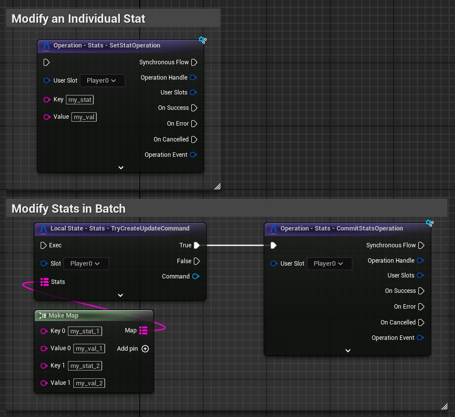
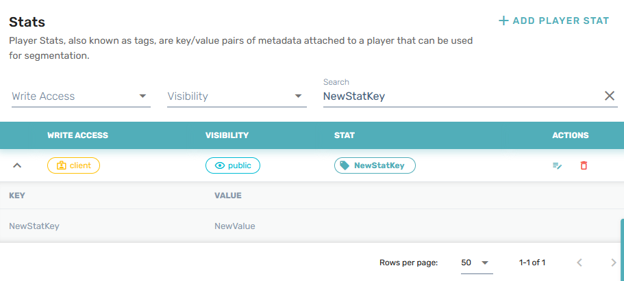
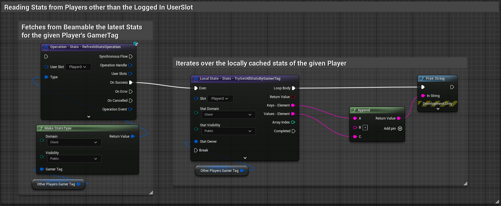

# Stats

The Beamable SDK Stats feature allows player to track a variety of built-in and custom player stat variables with configurable visibility levels. Two main use cases are:

- **Data Store**- can hold key/value pairs associated with a particular user.
- **Targeting**-  These key/value pairs can be used by other Beamable systems for various things (Announcement Campaings, Matchmaking and others).

There are two important specifiers of each stat: Visibility and Domain.

Visibility, in Unreal represented by enum `EBeamStatsVisibility`, it describes who can see stat:

- `private`- Visible only to owning User and Backend.
- `public`- Visible to any User.

Domain, in Unreal represented by enum `EBeamStatsDomain`, it describes if stat can be retrieved from game itself or does it require using microservices:

- `client`- Can be accessed from both the **Unreal** and **Microservices**.
- `game`- Cannot be accessed from **Unreal** directly, it can still be accessed via **Microservice** using `ClientCallable` calls.

# Getting Started

In order to create write to a `client`/`public` stat from a client we use the `Set Stat Operation` for individual stat changes. For batching multiple stat changes use the `TryCreateUpdateCommand` to begin building a set of stat changes for the given `UserSlot` which are later commited via the `Commit Stats Operation`.

These operations are backed by the `UBeamRuntimeSubsystem`. This is how it looks like in [Blueprints](../runtime-systems/blueprints.md):

You can check if it's working in the Beamable Portal:

- Set aside the `Gamertag/UserId` from the Unreal Engine logs.
- Click `Open Portal` in Beamable window.
- Go to `Engage->Players` and search for the player via `Gamertag/UserId`.
- Go to `Stats` and search for `NewStatKey`.
- You should see that it exists with correct value.

View of the stats in the Beamable Portal

# Batching updates
In this example there is created a new `UpdateCommand` and committed right away. For better performance and reduced calls to Beamable, it is encouraged to:

- Create `UpdateCommand`
- Use the other functions in the `UBeamStatsSubsystem` to set up as many changes as possible.
- Commit.

When it is possible (and desirable) for your game, this flow reduces the overall latency your players experience and reduces the number of API calls you make to Beamable.

# Reading Other Player's Public Stats
You might want to read public stats of some other player to display information about them in your UI. To do that, you can use the following `Operation` and `Local State` calls. 

# Stats Keys & Values
We do not enforce limitations on stat-keys or values. However, we do *highly recommend* the following guidelines for project organization and performance reasons.

- For Keys:
	- 8-20 characters are ideal (purely for human ergonomics).
	- Keeping them under a few hundred characters is best for performance.
	- Use enforce-able and recognizable patterns for your keys.
		- Bad: `CharacterTalents` and `LoadoutForCharacter`
		- Good: `CHAR_Talents` and `CHAR_Loadout`
	- Keeping your project organized is key (no pun intended).
- For Values:
	- Values should be no more than a few hundred characters long.
	- If you need larger complex data structures, we recommend you use [Storage Objects](../microservices/microservices.md#micro-storages) instead.

In our DB, we index on keys for faster reading; the bigger the key sizes, the larger the index grows. Keeping the index smaller, leads to better performance in both reading and writing.