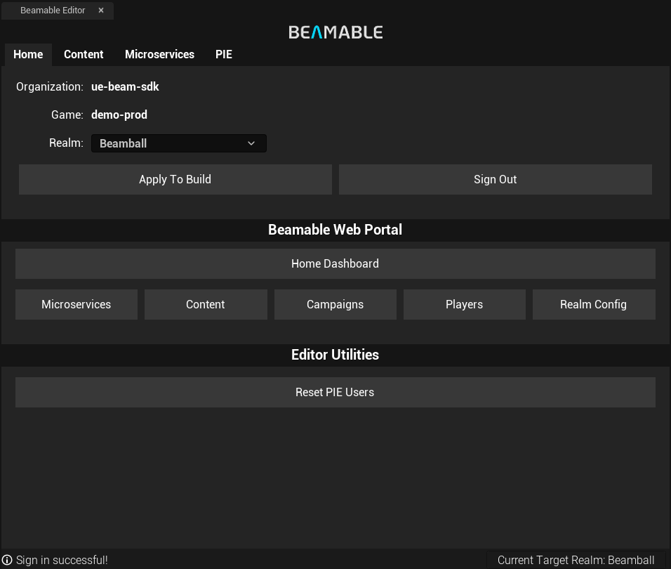
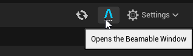

# Editor Systems Overview

Beamable Unreal SDK provides a set of editor systems that help you manage multiple aspects of your game integration. These systems are designed to integrate seamlessly with the Unreal Engine editor, allowing you to access Beamable features directly from the editor.

# The Beamable Editor Panel

The Beamable Editor Panel is the main interface for interacting with Beamable features in the Unreal Engine editor.It provides access to various tools and settings that allow you to manage your game integration, including:

* **Home**: A dashboard that provides an overview of your Beamable project, including current realm and quick access to the Portal.
* **Beamable Content Editor**: A tool for managing your game content, including assets, blueprints, and other resources.
* **Microservices**: A system for managing and run local microservices that can extend the functionality of your game.
* **PIE Settings**: A set of settings that allow you to configure your game for Play In Editor (PIE) mode, including player profiles and custom play presets.

## Accessing the Beamable Editor Panel
To open the Beamable Editor Panel, go to the **Beamable** icon in the right side of the Unreal Engine editor toolbar and click on" it. This will open the Beamable Editor Panel, where you can access all the available features and settings.

## Home Section
The Home section allows you to select the current realm for your project and provides quick access to the Beamable Portal. The realm selection is located at the top of the panel, and you can switch between different realms as needed. By using the **Apply to Build** button, you can apply the selected realm to your current build configuration. 

In the same section, you can also find the **Home Dashboard** button, which will open the Beamable Portal in your web browser, allowing you to manage your project settings and resources online. There's also other shortcuts to the Portal specific sections, such as the **Microservices** and **Content**.

## Other Sections
You will find specific documentation for each of the editor systems in the following pages:

- [Content](../beamable-services/content.md): A tool for managing your game content,
- [Microservices](../microservices/microservices.md): A system for managing and running local microservices,
- [PIE Settings](pie-settings.md): A set of settings that allow you to configure