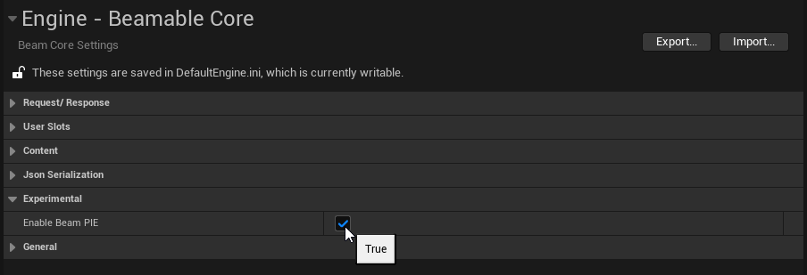
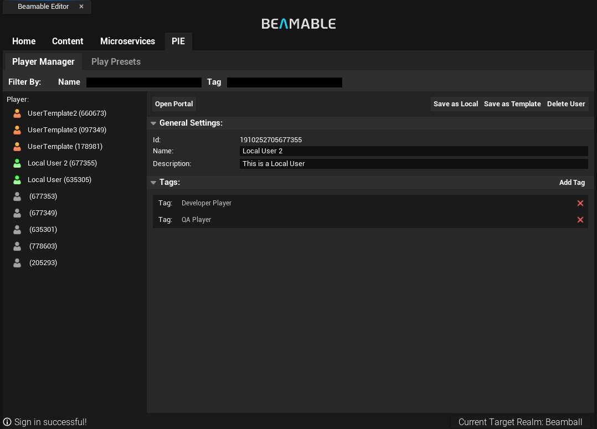
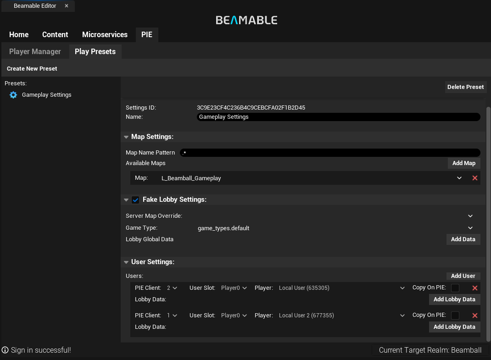
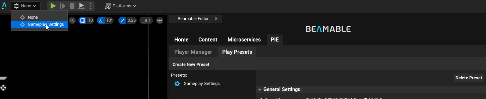
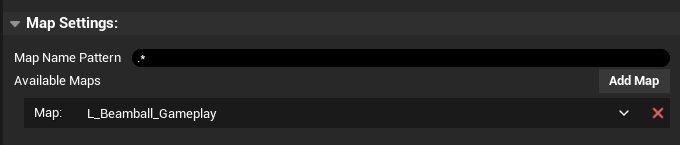
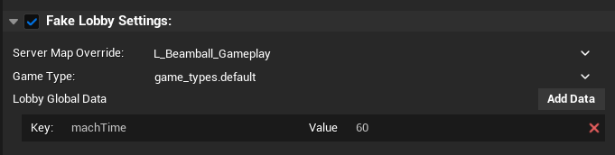
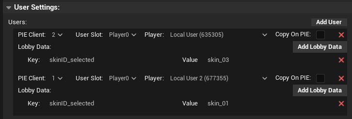

# PIE Settings

The new Beamable PIE Settings provide a flexible way to configure your game for Play In Editor (PIE). With this system, you can create, capture, and save player profiles for use at runtime, as well as define custom play presets directly within your Unreal projects.

This enables you to test your game across multiple configurations and entry points without repeatedly changing project settings. You can even simulate custom lobbies inside **Gameplay Levels** while overriding both per-player and global settings.

!!! warning "PIE Settings are Experimental"
    PIE Settings are currently marked as Experimental under `Project Settings > Engine > Beamable Core` and are disabled by default.
    To enable them, go to the Beamable Core section in the Unreal Engine editor settings. Once enabled, restart the editor and the PIE Settings UI will be available. 

    

## Player Manager
The Player Manager lets you manage player profiles and settings for your game. It provides an easy-to-use interface to create, capture (from PIE), and save player profiles that can be used at runtime.

Profiles with a name become available in Play Presets, making it simple to switch between different players during development and testing.

### Capturing and Saving Players
Whenever you run the game in the editor with PIE, the Player Manager records any logged-in players. This creates a new profile in the list, which can be inspected using the Open Portal button.

Player profiles can then be saved as either Local or Template, making them reusable in Play Presets:

* **Local (Green)**: Saved locally in your `.beamable/temp` folder. Useful for personal testing and development.
* **Template (Orange)**: Saved in your `.beamable` folder and can be committed to version control. Intended as shared templates so the whole team can start from the same baseline.
* **Captured (Grey)**: Per-session captured players are unsaved and cleared during the editor initialization.

!!! warning "Player Profile Names and Descriptions"
    Always give saved player profiles a name, as only named profiles will appear in Play Presets.
    You can also add descriptions and tags to profiles to provide extra context for testing scenarios.

## Play Presets
Play Presets let you define how your game should run in PIE. You can create, edit, and delete presets from the Play Presets section of the PIE Settings. This allows you to test different scenarios and entry points without modifying global project settings. Each preset can specify:

* In which maps can the preset be used
* Whether it should create a lobby for the PIE session
* Which players will be logged into the session (and be placed into the lobby, if creating one)

## Creating and Using Play Presets
To create a new Play Preset, click the **Create New Preset** button. You can then configure the preset with the desired settings. Once created, you can select a preset from tuhe dropdown men in the Main Toolbar UI to apply it to the current map.

!!! warning "IMPORTANT"
When "None" is selected, the entire system is disabled; including the automatic Beamable SDK initialization._

### Map Settings
Play Presets can be configured to apply to specific maps or a list of maps which match the name rule requirement (Regex). This allows you to have different presets for different levels or game modes. You can specify the maps in the **Available Maps** list of the preset editor and/or add a name rule in the Map Name Pattern in case you have a lot of maps.

### Fake Lobbies
Play Presets can be configured to initialize lobbies for PIE, allowing you to test multiplayer scenarios with real Beamable accounts **_directly in PIE from the Gameplay Level_**. This is especially useful when testing games that use the **Gameplay Level** as the entry point, since it ensures the initialization of Beamable systems and lobby setup. Normally, this initialization would occur in earlier Levels, such as the **Main Boot Level** (Main Menu/Title Screen/etc...).  

!!! warning "Tight Integration with Beamable Realtime Multiplayer Systems"
    Play Presets' PIE Lobby feature is tightly integrated with the Beamable Runtime Multiplayer Systems, having some requirements in your scenes to work properly. For more information, check the [Realtime Multiplayer Overview](../realtime-multiplayer/realtime-multiplayer-overview.md) page.

In the PIE Lobby Settings you can configure:

- **Enable/Disable**: checkbox in the header enables or disables the PIE Lobby simulation for this preset.
- **Server Map Override**: map that will be used as the server map for the PIE Lobby. This overrides the default server map defined in the Unreal Project Settings.
- **Game Type**: Game Type content that will be used for the PIE Lobby Scene. If there is a federation configured here, the federation does run too.
- **Lobby Global Data**: Custom Global Key-Value pairs that will be used to initialize the PIE Lobby. This data is available in the Gameplay Scene and can be used to simulate different scenarios.

### User Settings
The User Settings section allows you to configure per-player settings for the users that will be automatically logged in this session. The mapping goes as follows:

- **PIE Client**: Starts at 1~X. X is the `Number of Players` you define in Unreal's own Play Mode Settings.
- **User Slot**: For each PIE client, you can define a user for each of configured `Runtime User Slots`.

For the most part, adding users will configure this correctly. We also do validation before PIE starts to ensure that the selected `Play Preset` is compatible with the defined UE PIE settings themselves.

When selecting players, a few things are relevant:

- You can check `Copy on PIE` in order to get a new user with Stats and Inventory copied from the selected user account. This is useful when you want to keep a consistent starting state so you can test things (think of keeping users at various progression points in your game).
- **Shared Users** will always `Copy on PIE`. This is because Shared Users are meant a workflow baseline. The recommendation is that design leads can leverage this to enforce in-house workflows, training and on-boarding.
- **Users from realms other than your current one** will also always `Copy on PIE`. This is because BeamPIE cannot sign in with a user from another realm into a different one. So we copy it instead.

When Fake Lobbies are enabled, the Add Lobby Data will be available to add custom Key-Value pairs that will be used to initialize the per-player key-value store lobby itself. This data is accessible in the Gameplay Level and can be used to simulate various scenarios such as the selection of which skin the player chose or many other parameters that would get put into the lobby either via Federation or Matchmaking/Lobby systems themselves.

!!! warning "Player Profiles"
    Notice that only named profiles will appear in Play Presets to be selected.
