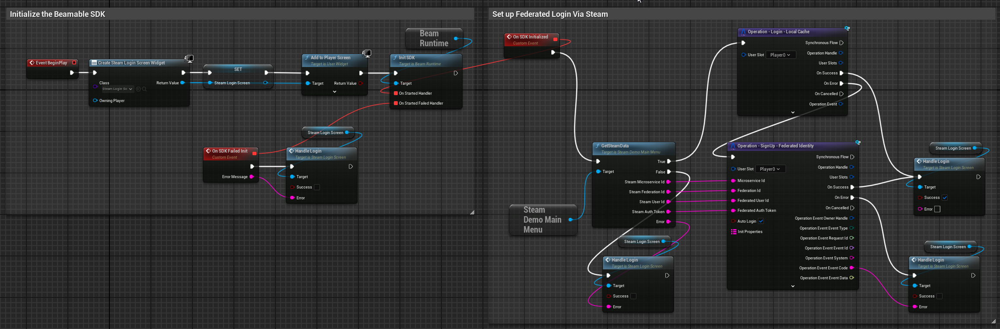
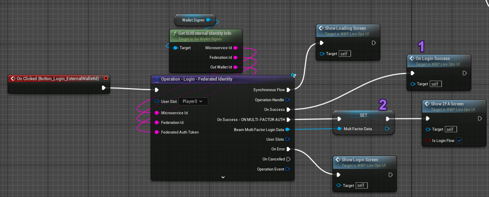
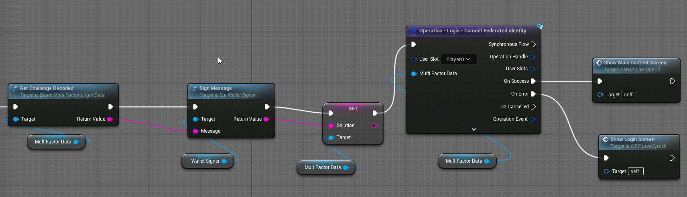

# Federated Login
Login Federation is Beamable's approach to integrating 3rd Party Authentication with various platforms. You can find working examples of this federation in both [Steam](../../samples/steam-demo.md) and [Discord](../../samples/discord-demo.md) Samples.

This Federation is always [invoked In-Band](federation.md#federation-calls) and via the `Login_____`,  `SignUp____` and `Attach____` functions of the `UBeamRuntime` subsystem class.

Its interface has a single function called **Authenticate** with the following signature:

```csharp
public async Promise<FederatedAuthenticationResponse> Authenticate(string token, string challenge, string solution);
```

The purpose of this function is:
> Map a 3rd Party token to a Unique Identifier for the user within the 3rd Party.

Most of the time, you achieve this by doing the following:

1. \[**Game Client**]: Use the 3rd Party Client SDK to get a token of sorts.
	1. See our [Steam](../../samples/steam-demo.md) and [Discord](../../samples/discord-demo.md) Samples for examples of this.
2. \[**Game Client**]: Invoke a `Login`/`SignUp`/`Attach` **Operation** and pass the following parameters:
	1. **MicroserviceName**: this is the name of the Microservice (the **csproj** file name, in the default case).
	2. **IdentityNamespace**: this is the Federation's **[Federation Id](../concepts/federation.md#federation-id)**. Passing this in informs Beamable which federated login to invoke as part of the account creation/attach flow.
	3. **IdentityUserId**: this is the 3rd Party's `UserId` for the user trying to login. We use this to determine if there's already a Beamable account mapped to this 3rd Party Id.
	4. **IdentityAuthToken**: this is a token that for the user that can be used by the `Authenticate` function to map it back to a `UserId`.

After this, the flow goes into your `Authenticate` function. What that function should do, depends on whether or not you are implementing 2FA or not.

## Federated Login - without 2FA

### Setting up the Client

In the client:

- Initialize the SDK.
- Use the `Sign-Up - Federated Identy` node with `Auto Login` passing in:
    - The Microservice's Id.
    - The Federation's Id.
    - The User Id _**of the Federated 3rd Party user**_ (this would be the user's Steam Id, for example).
    - A token that can be used to authenticate this user's account with the Federated 3rd Party.

It looks like this:



### Writing the Microservice
Semantically, there are two ways the `Authenticate` function can be called:

- **Account Creation Time**: When using **`Login - Federated Identity` or `Sign-Up - Federated Identity` operations**. 
- **Account Attach Time**: When using **`Attach - Federated Identity` operation**. 

In both cases, what you want to do is:

1. Use the 3rd Party's APIs or C# SDKs to validate the provided `token`.
2. Use the 3rd Party's APIs or C# SDKs to get the `UserId` for that `token`'s user.
3. Return `UserId` the `FederatedAuthenticationResponse` .

The main different between both cases is that:

- **Account Creation Time**: `Context.UserId` is `0`; as at this time, no account exists.
- **Account Attach Time**: `Context.UserId` is a valid `GamerTag`; as you are adding an identity to an existing account.

For non-MFA flows (which are most of the Store and Console login flows) this is all that is needed. Here's an example from our [Steam Demo](../../samples/steam-demo.md).

```csharp
public async Promise<FederatedAuthenticationResponse> Authenticate(string token, string challenge, string solution)
{
    // No user made the request, which means we are trying to sign in.
	var isLogin = _requestContext.UserId == 0L;
	
	// A user made the request which means we are trying to attach the identity to the user.
	var isAttach = _requestContext.UserId != 0L;	
	
	// Get the token and use whatever 3rd Party SDK to fetch the user's id and return it
	return new FederatedAuthenticationResponse { user_id = my3rdPartyId, };	
}

```

## Federated Login - Multi-Factor Authentication

### Setting up the Client

In the client, we start by invoking our `Login - Federated Identity` operation. This operation has a sub-event that gets invoked when the microservice responds with a `challenge` string we need to solve. The SDK provides you a `UBeamMultiFactorLoginData` object you can store and carry around your game state so that your player can solve the challenge.

Here's an example from our Sui-Wallet integration showcase.



Once the player has solved the challenge, you can send it to the Microservice by calling `Login - Commit Federated Identity`. You can see an example below where we sign the challenge before sending over the solution to our microservice.



The `Login - Federated Identity` operation's Success/Error flows will run **_after_** the Success/Error flows of the `Login - Commit Federated Identity` operation.

### Writing the Microservice

Semantically, there are an additional two ways that the Authenticate function can be called:

- **Without a `challenge`/`solution`**: This is the first part of the flow. 
	- Here, your function should generate a `challenge` and return it in the `FederatedAuthenticationResponse`.
	- The `UserId` in `FederatedAuthenticatedResponse` should be empty in this first step.
	- 3rd Party SDK's that support/require 2FA will typically provide you a function to generate said challenge.
	- The `challenge` is sent back to the client who should then solve it.
	- After solving the challenge, the client must invoke `Login`/`Attach` again, but now passing in the `challenge` and `solution`.
- **With a `challenge`/`solution`**: This is the second part of the flow.
	- If the `solution` is not empty, the `Authenticate` function should validate it against the `challenge`.
	- If successful, the function should then return a valid `UserId` in `FederatedAuthenticationResponse`.

The implementation looks something like this:

```csharp
public async Promise<FederatedAuthenticationResponse> Authenticate(string token, string challenge, string solution)
{
	// No user made the request, which means we are trying to sign in.
	var isLogin = _requestContext.UserId == 0L;
	
	// A user made the request which means we are trying to attach the identity to the user.
	var isAttach = _requestContext.UserId != 0L;				
	
	// Handle the case where we are asking for a challenge to solve (`solution` is empty). 
	if(string.IsNullOrEmpty(solution))
	{
		// Return some challenge the user is expected to solve.
		// The `user_id` in the response is NOT set.
		return new FederatedAuthenticationResponse
		{
			challenge = $"Some Challenge", // The actual challenge people will need to solve
			challenge_ttl = 10 // Some duration for the challenge
		};
	}

	// Handle the case where the user has provided the challenge AND the solution
	if (!string.IsNullOrEmpty(challenge) && !string.IsNullOrEmpty(solution))
	{
		// My code that validates the provided solution against the challenge.		
		return new FederatedAuthenticationResponse
		{
			user_id = UserIdInThirdParty 
		};
	}
	
	// We should never get here in a Multi-Factor Flow
	throw new Exception();
}

```

Keep in mind that if you need multiple `challenge/solution` back-and-forths between the client and the server you can do that by encoding the step in the challenge and parsing the challenge string in the client to decide at which point in the chain of `challenge/solution` flow you are (this is relevant in very rare cases). 