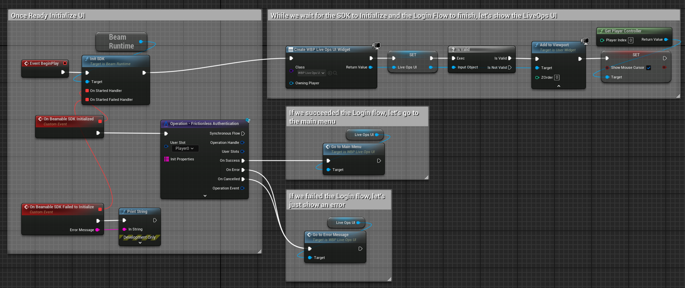

# Federated Player Init
Player Init Federation allows you to define logic that runs whenever a new player is created in a realm. This enables you to define your players's starting state BEFORE your login call completes.

To setup this federation in a microservice, you'll need to do the following in your Microservice:
```csharp
// This federation ONLY works with the "default" Federation ID
// and it DOES NOT support multiple implementations of itself.
[FederationId("default")]
public class DefaultPlayerInit : IFederationId;

// Implement this interface.
[Microservice("MyService")]
public class MyService : Microservice, IFederatedPlayerInit<DefaultPlayerInit>
```

Here's what an example implementation looks like:

```csharp
public async Promise<PlayerInitResult> CreatePlayer(Account account, Dictionary<string, string> properties)
{
    // Get the gamertag for the user that was just created in this realm.
    var gamerTagInRealm = account.gamerTags
        .First(a => a.projectId == Context.Pid).gamerTag;

    // Prepare to make requests on this user's behalf
    var user = AssumeNewUser(gamerTagInRealm);
    
    // Make requests as this user to set their starting level
    await user.Services.Stats.SetStat(StatsDomainType.Client, StatsAccessType.Public, gamerTagInRealm, "MyStartingLevel", "1");

    // Return a blank result
    return new PlayerInitResult() { result = "" };
}
```

## Setting up the Client

From Unreal, this federation is triggered by any of the `Operation - Sign-Up` calls OR `Operation - Login - Frictionless` (see [Identity](../beamable-services/identity.md)). The code in this federation will have already run by the time these operations are completed.

The `Account account` argument also contains valid email (in case of `Sign Up - Email`) and External Identity (in case of `Sign Up - Federated Identity`). This can be used to prefill stat/inventory values for the user based on the identity they used to sign up among other things.

The `Dictionary<string, string> properties` argument in the Federation's C# Code is filled by the client. Aside from a few reserved properties listed below, you can pass in any values via the `InitProperies` parameter of the relevant operations.


| Reserved Property                   | Available in Operations  | Notes                                                                                                                                                                                                               |
| ----------------------------------- | ------------------------ | ------------------------------------------------------------------------------------------------------------------------------------------------------------------------------------------------------------------- |
| `__beam_game_project_version__`     | `ALL`                    | Your Game Client's Version Number                                                                                                                                                                                   |
| `__beam_sdk_version__`              | `ALL`                    | The Beamable SDK's Version in the being used in this game client                                                                                                                                                    |
| `__beam_ue_engine_version__`        | `ALL`                    | The UE Engine version that built this Game Client                                                                                                                                                                   |
| **Specific to each Sign-Up Type**                                                                                                                                                                                                                                                      |
| `__beam_user_email__`               | `Email And Password`     | The email used in the sign-up or being attached.                                                                                                                                                                    |
| `__beam_user_password__`            | `Email And Password`     | The password used in the sign-up or being attached.                                                                                                                                                                 |
| `__beam_3rd_party_user_id__`        | `Federated`              | The Federated UserId -- for example, the user's SteamId.                                                                                                                                                            |
| `__beam_3rd_party_auth_token__`     | `Federated`              | The Federated Auth Token -- for example, the user's Steam Auth Token provided by the Steam SDK                                                                                                                      |

In most cases, this is used to define a set of initial stats, currencies or items for a player. These will be available client-side when the operation completes.

In Blueprints, all you need to do is create a new account using `Login - Frictionless` or any of the `Sign-Up` operations.



As you can see, defining the initial state of your players using custom logic in this federation makes this initial state transparent to client logic. 

A few ideas on how to leverage this:

- Use `Game Client Versions` to define account initialization logic over time.
- Use `Content` or `MicroStorages` to build more advanced segmented starting state logic.
- Use information in the `Account account` paramter and `Dictionary<string, string> properties` to define different starting states. Ie.: you could use this to implement "console exclusive items" for example.

## Examples

You can see an example of this federation in the following samples:

-  [Beamball Demo](../../samples/beamball/beamball-demo.md) sample.
-  [LiveOps Demo](../../samples/live-ops-demo.md) sample.
