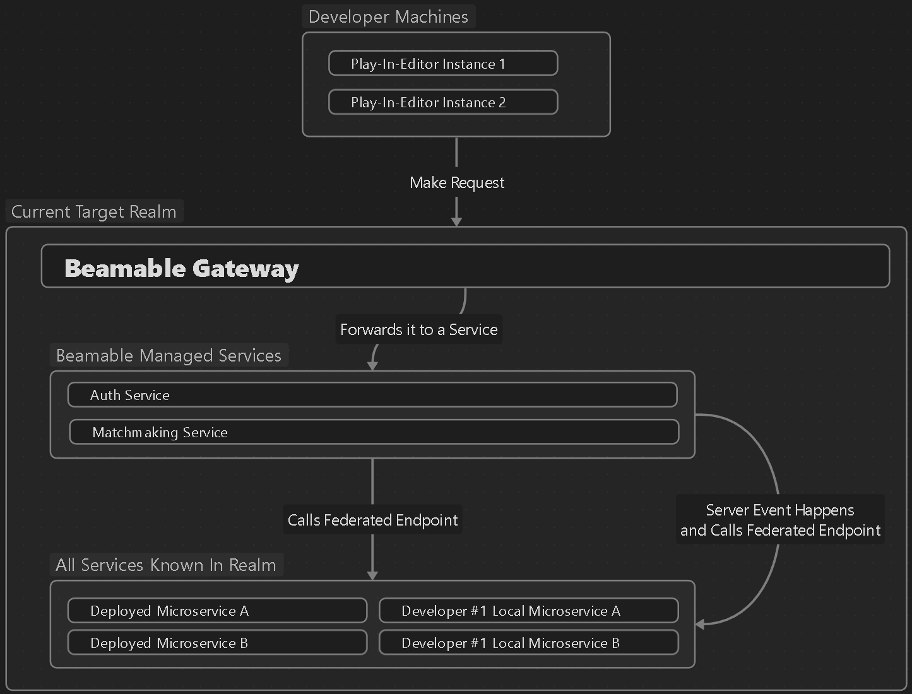

# Federation

**Federations** are similar to the idea of server-side callbacks or webhooks, but are slightly expanded in use. They are Beamable's approach to extending, or sometimes delegating, the behavior of its Managed Services to microservices or third parties.

Here are a few example use cases that Federations as a concept means to solve:

- Implementing third-party Auth Integrations with other Identity Providers
- Customizing Initial Player Account States
- Integrating Beamable Inventory with Steam Inventory or Web3 Wallets
- Integrating with Game Server Orchestrators such as Edgegap, Agones or even a custom stack
- Etc...

Most implementations of Server-Side Callbacks are fire-and-forget (similar to a webhook). **Federations**, however, don't need to be fire-and-forget. Most **Federations** are calls made to your microservice that happen as part of a particular flow, often with things happening ***before*** and/or ***after the federated call finishes***.

Here is a high-level diagram of Federations:



Each **Federation** has its own semantics, usage guidelines, performance characteristics, and constraints, described in its individual page.

## Federation ID
Federations are delegate methods in your microservice that the Beamable backend calls at specific points in various flows, to perform tasks that would otherwise be entirely internal to the Beamable backend. A Federation Id is a unique `string` value that designates a specific implementation of Federation.

The combination of the **Federation Id** and the **Federation Type** is comparable to a function name/pointer assigned to an Unreal delegate; in the sense that it is used by the Beamable backend to know which implementation of a federation in your microservice it should talk to, if any.

Examples:

- `IFederatedLogin` would have different implementations for Steam and Epic auth integration
- `IFederatedLogin<SteamId>` and `IFederatedLogin<EpicId>` are the two interfaces you will need to implement
- `SteamId` carries `[FederationId("steam")]`; `EpicId` carries `[FederationId("epic")]` — Beamable uses these strings to route each request to the correct implementation

`FederationId` values are the mechanism Beamable uses to select the correct Federation implementation when your microservice provides more than one of the same type. This is the `FederationId` parameter passed to `LoginFederatedOperation`, `SignUpFederatedOperation`, and `AttachFederatedOperation` on `UBeamRuntime`.

## Adding/Removing federations
Federations are tied to interfaces implemented in your `Microservice` inherited class — these Federations and their IDs are automatically validated by a C# Analyzer that will tell you if you're missing things. To add one, simply implement its Federation and recompile the microservice project.

```csharp
// FederationIds.cs
[FederationId("cool")]
public class CoolId : IFederationId;

[FederationId("edgegap")]
public class EdgegapId : IFederationId;

// MyMicroservice.cool.cs
public partial class MyMicroservice : IFederatedLogin<CoolId> { }
// MyMicroservice.edgegap.cs
public partial class MyMicroservice : IFederatedGameServer<EdgegapId> { }
```

After adding any Federation, your IDE will likely complain that you are not implementing the functions of the interfaces above; most IDEs will then offer you the option of generating the function signatures for those interfaces. After that, all you have to do is write the code for it.

Take a look at each individual Federation's docs page for more information on use-cases and usage guidelines.

## Workflows for developing federations

Most Federations are inside complex application paths. Therefore, you need a way to iterate on them locally, much like how you do with `Callables` (see [Microservices](../microservices/microservices.md#common-developer-workflows)).

The selected [Microservice Target](../microservices/microservices.md#microservice-routing-and-microservice-target) defines which running microservice instance will handle the federated call. These get the same semantics as `Callables` routing. If any Federation does not support or requires additional configuration for local testing, it'll be specified in their documentation.

!!! warning "What about PROD?!"
	By default, production realm disallows ***any and all routing to microservices that are not the deployed ones***. In other words, if you run a local microservice while in a Prod realm, by default, it CANNOT steal any traffic from the service that is deployed.


