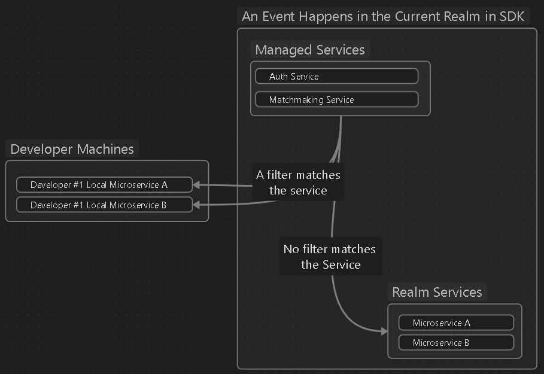
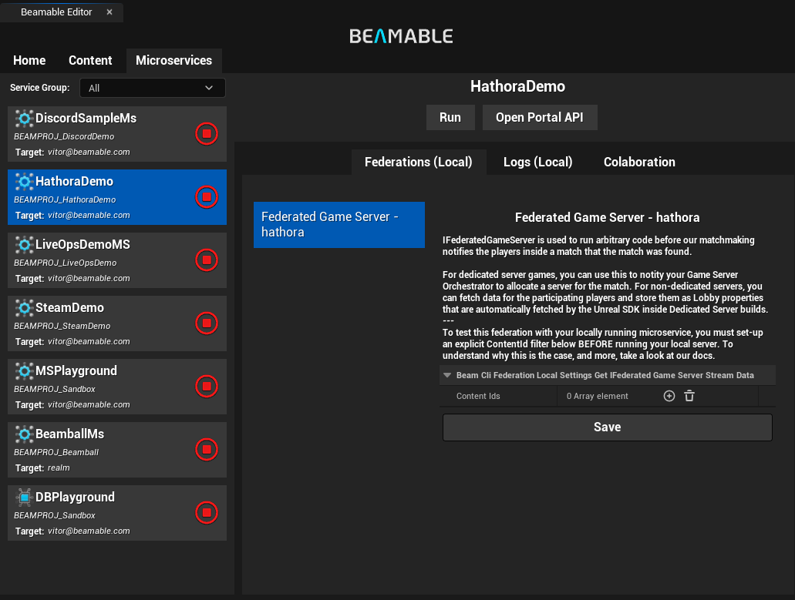

# Federation

**Federations** are similar to the idea of server-side callbacks or webhooks, but are slightly expanded in use. They are Beamable's approach to extending, or sometimes delegating, the behavior of its Managed Services to microservices or third parties.

Here are a few example use cases that Federations as a concept means to solve:

- Implementing third-party Auth Integrations with other Identity Providers
- Customizing Initial Player Account States
- Integrating Beamable Inventory with Steam Inventory or Web3 Wallets
- Integrating with Game Server Orchestrators such as Hathora, Agones or even a custom stack

Most implementations of Server-Side Callbacks are fire-and-forget (similar to a webhook). **Federations**, however, do not need to be fire-and-forget. Most **Federations** are calls made to your microservice that happen as part of a particular flow, often with things happening ***before*** and/or ***after the Federated call finishes***.

Here is a high-level diagram of what federations are:


Each of the provided **Federations** has its own semantics, usage guidelines, performance characteristics, and constraints described in their individual pages.

## Federation calls
There are two types of **Federation Calls** the Beamable Backend makes:

- **In-Band Federation Calls**
- **Out-of-Band Federation Calls**

**In-Band Federations** are any Federation call that **is in the path of a request originating from a game's client or real-time game server**. Examples of these are `IFederatedLogin`, `IFederatedInventory` or `IFederatedGameServer` (when called via the Lobby system's `ProvisionGameServer` from a client).


**Out-of-Band Federations** are any Federation calls that **are triggered by some server event that originates from inside the Beamable's Managed Services**. The most obvious example is `IFederatedGameServer` (when called for each match found as part of a matchmaking queue tick).



For more information about the workflow implications of the difference between both **Federation Call** types, see [below.](#workflows-for-developing-federations)

## Federation ID
Federations can be thought of as delegates called by the Beamable server at particular points of various flows. Federation Ids are unique `string`-based identifiers that uniquely identify a particular implementation of a federation.

The combination of the **Federation Id** and the **Federation Type** is comparable to a function name/pointer assigned to an Unreal delegate; in the sense that it is used by the Beamable backend to know which implementation of a federation in your microservice it should talk to, if any.

Examples:

- `IFederatedLogin` would have different implementations for Steam and Epic auth integration
- `IFederatedLogin<SteamId>` and `IFederatedLogin<EpicId>` are the two interfaces to implement
- `SteamId` carries `[FederationId("steam")]`; `EpicId` carries `[FederationId("epic")]` — Beamable uses these strings to route each request to the correct implementation

In other words, an id is a unique `string` that you pass along in specific places depending on the federation to **choose between one or more federations if any should be used**.

## Adding/Removing federations
Federations are tied to interfaces implemented in your `Microservice` inherited class — these federations and its IDs are automatically validated by a C# Analyzer that will tell you if you are missing things. To add one, implement its federation and recompile the microservice project.

```csharp
// FederationIds.cs
[FederationId("cool")]
public class CoolId : IFederationId;

[FederationId("hathora")]
public class HathoraId : IFederationId;

// MyMicroservice.cool.cs
public partial class MyMicroservice : IFederatedLogin<CoolId> { }
// MyMicroservice.hathora.cs
public partial class MyMicroservice : IFederatedGameServer<HathoraId> { }
```

After adding any federation, your IDE will likely complain that you are not implementing the functions of the interfaces above; most IDEs will then offer you the option of generating the function signatures for those interfaces. After that, all you have to do is write the code for it.

Take a look at each individual federation docs page for more information on use cases and usage guidelines.

## Workflows for developing federations
Most federations are inside complex application paths. Thus, you need a way to iterate on them locally, much like how you do with `Callables` (see [Microservices](../microservices/microservices.md#common-developer-workflows)). This is why the SDK differentiates between In-Band calls to Federations and Out-of-Band calls to Federations.

For **In-Band Calls** that reach a federated endpoint, the selected [Microservice Target](../microservices/microservices.md#microservice-routing-and-microservice-target) defines which running microservice instance will handle the federated call. In other words, you do not have to think about them. These get the same semantics as `Callables` routing.

**Out-of-Band Calls** however do not originate in the client or gameplay server, so PIE's selected [Microservice Target](../microservices/microservices.md#microservice-routing-and-microservice-target) is not accessible. To solve that problem, out-of-band calls use semantic filtering logic to "steal" traffic from the realm's service.

!!! warning "What about PROD?!"
	By default, production realm disallows ***any and all routing to microservices that are not the deployed ones***. In other words, if you run a local microservice while in a production realm it CANNOT steal any traffic from the service that is deployed; be it **in-band** or **out-of-band**.

To configure these filters, you can use the **Local - Federations** tab of your **[Microservice Inspector](../microservices/microservices.md#microservice-window)**. The filters, when out-of-band calls can be made to a particular federated endpoint, are described in each federation's own pages (for an example, [see here](federated-game-server.md)).



