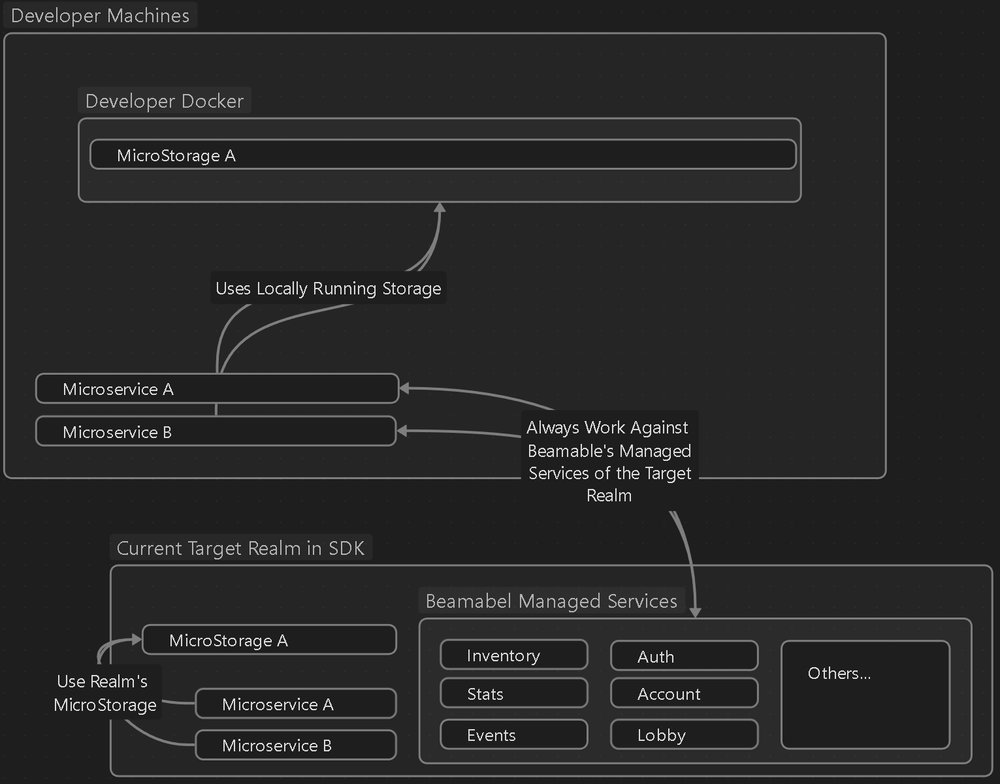
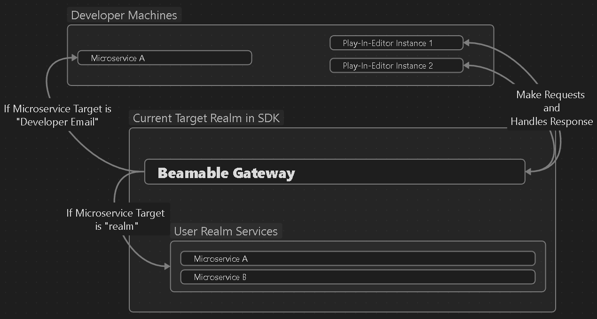
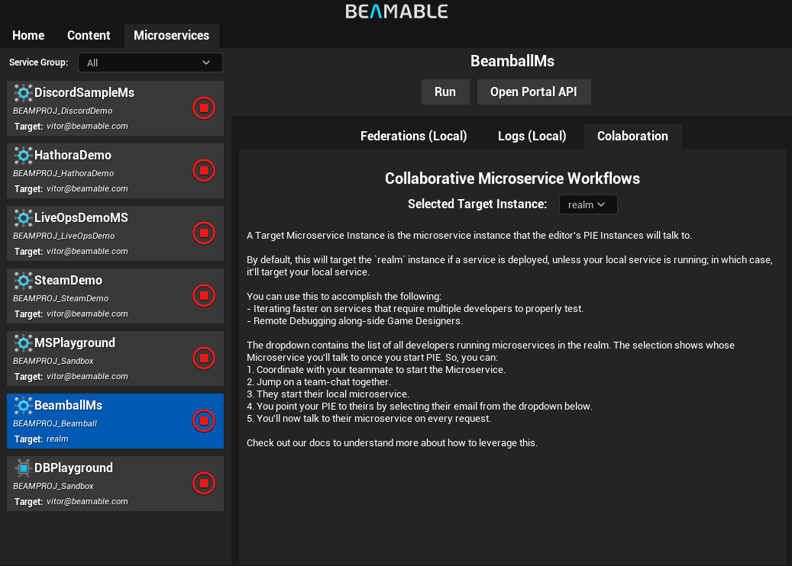

# Beamable Microservices
Beamable Microservices are Beamable's Cloud Code solution. These are written in C# and come with a set of development tools that are tightly integrated with the UE Editor and Beamable CLI.

This page explains the high-to-low-level concepts of Microservices and to what end they can be used. For setup instructions, see the [getting started guide](setting-microservices.md).

## Why this approach to Cloud-Code?
Many cloud-code solutions sacrifice flexibility, cost-efficiency, performance, or developer experience in exchange for simplifying the simple case. The goal is to focus on the complex cases while keeping the simple case easy to work with.

The SDK achieves this through the following architecture:



The Microservice is:

- An easy-to-write server that provides a set of APIs you, the Game-Maker, create
- Locally debuggable (really, just press Debug on Rider). [Collaboratively too](#collaborative-debugging)
- Deployed as a Docker container that you can customize
- Promotable between Realms via the Portal or the CLI (CI/CD folks rejoice)

Under the hood, microservices are a wrapper around a custom WebSocket protocol and Job Scheduler with a set of layered APIs you can use to easily write the simple cases and peel back to write the complex cases.

It solves or helps with all the listed items above and the amount of code you actually need to write to expose an Endpoint your game can call is:

```csharp
[ClientCallable]
public int Add(int a, int b)
{
    return a + b;
}
```

## Microservice Window
The Microservice Window enables developers to start/stop local services, to read local service logs while in PIE and to configure local server settings for the collaborative workflow and for federations all through the Unreal Editor.


The left side of the window provides you a list of all services in your project with a set of filters based on **Service Groups**. The right side is the **Details Panel**.

!!! note "Service Groups"
	In very rare cases, a project may require a non-trivial amount of services/storages. For Beamable's own internal development this is true (Beamable has microservices for each sample).

	In cases like these, a line can be added to the `csproj` file of each service to assign them to groups. These can then be used by the CLI's `project` pallet as filters while also being used as a filter in this window. The line to be added to the `BeamableSettings` **PropertyGroup** : `<BeamServiceGroup>SomeGroupId</BeamServiceGroup>`

	There are no restrictions on group names other than that `BEAMPROJ_` is a reserved prefix.

### The Details Panel
The Details panel provides a detailed view of the microservices and access to a few features:

- Start/Stop the service in your local machine
- Display [logs](../../../cli/guides/ms-logging.md) for the service running on your local machine
- Open the Beamable Portal targeting **your local service**
- [Configure which **Microservice Target** the Play-in-Editor sessions will target](#collaborative-debugging)
- [Configure Federation-specific settings](../federation/federation.md)


## Microservice Coding
Microservices are developed in C# and in their own solution. They inherit from the `Microservice` base class and are `partial` by default. Inside each Microservice class, you can annotate instance methods with the following attributes to various effects:

- `Callable`: This is the equivalent of a public endpoint. Any non-authenticated caller is allowed to invoke this function via a request. In Unreal, these will not require a `FUserSlot` (authenticated user).
- `ClientCallable`: This is equivalent to an authenticated request. Any authenticated user in the same realm as the microservice is able to run this.
- `AdminOnlyCallable`: These are similar to `ClientCallables` but requires the user to have admin privileges. They are useful for making utility endpoints called by internal developer tools.
- `ServerCallable`: This is equivalent to a trusted-server request. It requires authentication in the form of a Signed Request. Primarily, these are callable from your game's Dedicated Server builds.
- `Federated Endpoints`: [Federations](../federation/federation.md) generate routes implicitly and **do not need any `Callable` attributes**.

Inside the method body, you can access properties inherited from the `Microservice` base class. Here are the most relevant:

- `Context`: This field of the Microservice class has information about the request.
	- `Context.Cid` | `Context.Pid`: Contain the relevant realm information for the microservice.
	- `Context.UserId`: Contains the `GamerTag` for the account making the call. This is `0` for non-authenticated endpoints such as `Callables` and `ServerCallables`.
	- `Context.Body`: Contains the raw body (typically JSON) of the request, if any; which can be useful if you want to do your own parsing.
- `Services`: This field of the Microservice class gives you access to Beamable's Services from your microservice.
	- `Services.Inventory`: Access the inventory service...
	- `Services.Stats`: Access the stats service...
	- So on and so forth...

!!! warning "Logging and Microservices"
	The SDK provides ways to dynamically change the current log-level for deployed services. Also, `BeamableLogger` is the correct way to log things from within your Microservice code.

For more on writing microservice functions, see the [Microservices CLI guide](../../../cli/guides/microservices.md).

## Constraints on Callable Functions
The CLI generates Unreal bindings that allow your Unreal code to call your microservice much like an API call to Beamable. To generate these bindings, there are *some* restrictions on what types can and can't be on method signatures for `Callables`.

Each `Callable` generates at least two `UObject` classes, one representing request's input parameters and another representing the response type. It also generates a function inside the generated `UBeamMicroserviceNameApi` subsystem (and accompanying Blueprint nodes).

### Signature Constraints
When declaring `Callable` functions, you should be aware of a few limitations regarding its signatures.

- No `void` return.
- Can be `async` or not.
- Cannot return container types directly
	- `List<>` / `Dictionary<string,>`
	- Wrap it in a struct/class instead
- No overloading of `Callables`.
	- This is because each of these must map to a unique route so name things accordingly
	- Non-`Callable` functions can be overloaded just fine.
- Avoid calling `Callable` functions from other `Callable` functions.
	- For code-reuse in the Microservice, write non-`Callable` static functions and call them inside the `Callable` body.
- Must be an instance method (no `static` keyword).
	- Currently, every request is handled by a unique instance of the Microservice class
	- This also means that it is highly discouraged to put member fields in the instance itself
- If you are using [Federations](../federation/federation.md), you should be aware that each federation introduces certain reserved routes that you are then NOT allowed to use

Keep in mind that only a few things actually affect the shape of any particular `Callable`'s generated client code. This means that different signatures can effectively represent the same endpoint.

**The lists below all produce the same exposed API and generated client code:**

- For primitive types:
	- `public int PotatoAdd()`
	- `public Promise<int> PotatoAdd()`
	- `public Task<int> PotatoAdd()`
	- `public async Promise<int> PotatoAdd()`
	- `public async Task<int> PotatoAdd()`
- For complex types:
	- `public MyCustomType PotatoAdd()`
	- `public Promise<MyCustomType> MyCustomFunction(int arg1)`
	- `public Task<MyCustomType> MyCustomFunction(int arg1)`
	- `public async Promise<MyCustomType> MyCustomFunction(int arg1)`
	- `public async Task<MyCustomType> MyCustomFunction(int arg1)`

### Type Constraints
When you write types in C# and use them in `Callable` method signatures, you should keep in mind how these types map to the underlying UE `UObjects` and functions. The table below explains that mapping.

| In UE                                                     | In C# Microservices                                                         | Notes                                                                                                                                                                                                               |
| --------------------------------------------------------- | --------------------------------------------------------------------------- | ------------------------------------------------------------------------------------------------------------------------------------------------------------------------------------------------------------------- |
| **Primitive Types**                                       |                                                                             |                                                                                                                                                                                                                     |
| `uint8` , `int32` , and `int64`                           | `byte`, `int` and `long`.                                                   |                                                                                                                                                                                                                     |
| `float`  and `double`                                     | `float` and `double`.                                                       |                                                                                                                                                                                                                     |
| `bool`                                                    | `bool`                                                                      |                                                                                                                                                                                                                     |
| **Unreal Types**                                          |                                                                             |                                                                                                                                                                                                                     |
| `FString`                                                 | `string`                                                                    |                                                                                                                                                                                                                     |
| `TArray<>`                                                | `List<>` or `T[]`                                                           | Any `TArray<SomeType>` will serialize normally as long as `SomeType` also respects the constraints here.                                                                                                            |
| `TMap<FString, >`                                         | `Dictionary<string,>`                                                       | Only `FString` keys are supported. The values can be any supported type.                                                                                                                                  |
| **Beamable Types**                                        |                                                                             |                                                                                                                                                                                                                     |
| `FBeamArray` and `FBeamMap`                               | Any nested container such as `List<List<>>` or `Dictionary<string, List<>>` | These are used because <br>nesting containers directly ( `TArray<TArray<>>` / `TMap<,TMap<>>`) breaks Blueprint Support. These get generated to maintain that support.                                              |
| A new UObject implementing `IBeamJsonSerializableUObject` | Any C# Class Type                                                           | The fields of the C# class must also adhere to the constraints in this table.<br><br>If used in multiple `Callables` the generated type will be shared (the code generator can identify that the same type is being used) |

A few things to note:

- Unreal's lack of Namespaces in Blueprint-Compatible-land makes auto-generated code pretty verbose
	- When using these APIs, use `auto` liberally *but carefully*.
- The code for **all** microservices in the solution is generated at once
	- This means that, if you have multiple Microservices, you cannot generate a single service's bindings
	- This is also a result of the Namespaces constraint

!!! note "Semantic Type Support"
	You can use the `BeamGamerTag` and `ContentRef` and other C# declarations of Semantic Types which will generate the appropriate type in UE, such as `FBeamGamerTag` and `FBeamContentId`.

## Customizing the Generated Code
The Microservice Client's code generation allows for a few different ways to customize its output. Here's an outline of the intended use-cases and how to do it.

### Replacement Types

It can sometimes be useful to hand-write a type that would be otherwise generated by the Microservice Client code generation. These use-cases are things like:

- Changing the generated type from a `UCLASS` to a `USTRUCT`.
- Adding utility functions to the generated type
- Writing custom serialization/deserialization logic (you'd have to modify the C# serialization too)
- Etc...

To do that, use the CLI to register replacement types so that code generation skips a particular schema and uses a type you define instead.

#### Adding a Replacement Type

1. Write your replacement type inside your Unreal Project.
   1. This must exist inside the `______MicroserviceClients/CustomReplacementTypes` module.
   2. If you don't have the `____MicroserviceClients` yet, just generate the microservice client code once via `dotnet beam project generate-client "."`.
   3. When writing the replacement type, look at the other generated code to see how to use the `UBeamJsonUtils` library to write the serialization logic.
2. Use `dotnet beam project add-replacement-type` to add the created type.
   1. The `reference-id` argument is the OpenAPI ReferenceId for the type you want to replace. You can find this inside the `beam_openApi.json` file that lives in your microservice's `bin` directory. `ReferenceIds` are any of the json property names under the `components.schemas.<ReferenceId>` sub-object of this JSON file.
   2. The `replacement-type` argument is the name of the replacement type you've written.
   3. The `engine-import` argument is the `"#include \"FileName.h\""` string for the type.
   4. The `optional-replacement-type` argument is the name for the `FBeamOptional` wrapper for the replacement type you've written (this type is automatically generated – you don't need to write it).
   5. The project name is your UnrealProject's name (the `.uproject` file name).

Here's an example:

```bash
dotnet beam project add-replacement-type \
   --reference-id=MyMicroservice.MyType \
   --replacement-type=FMyType \
   --optional-replacement-type=FOptionalMyType \
   --engine-import="#include \"MyType.h\""
   --project-name=MyUnrealProject
```

If you don't pass in the arguments, the command functions as a wizard, guiding you through the process.

### Skip Callable Generation

Some microservices may contain `Callables` that are not supposed to be callable from a client (dedicated server or otherwise), such as Admin Utilities. You can skip the generation of any callable by using the `flags:CallableFlags.SkipGenerateClientFiles` argument for the various `[Callable]` attributes. This will prevent the generation of the Unreal Request/Response types for that particular `Callable`.

!!! note "Non-Request/Response Types — Schemas"
    If `TypeA` is used inside `CallableA(TypeA paramA)` signature and nowhere else, when you `SkipGenerateClientFiles` to that callable, `TypeA` will no longer be generated. However, if `TypeA` is also used in `CallableB(TypeA paramA)` that does NOT have `SkipGenerateClientFiles`, `TypeA` will be generated (unless you flag it with `[BeamGenerateSchema]`). In other words, as long as a single usage in `Callable` signatures is found, these schemas are generated automatically.

## Making Requests on Behalf of Users
It is quite a common case that a Microservice needs to use one of Beamable's many APIs on behalf of a particular user. This lets you reuse those APIs (usually written in a client-facing way) for multiple users. A practical example:

> At the end of a MOBA match, you'll need to update player stats gathered during the match or process their account's new Experience or Rank. For this, you can make a `ServerCallable` called `ProcessMatchResults` and pass in information from your dedicated server whenever the match is over.

To make requests on behalf of users, the SDK provides the `AssumeNewUser` function. It gives you back a `UserRequestDataHandler` that has fields like `Context` and `Services`. Making API calls from this `assumedUser.Services.Stats` instance as opposed to the usual `this.Services` will make the request on behalf of the user.

## Multiple Microservices and Organizing Code
The first impulse a lot of people have is to separate microservices semantically; one-per-feature. **This is NOT recommended.** Here's why:

- Having a lot of microservices will increase your cost for no benefit (_in most cases_)
- Having a lot of microservices increases project complexity (that impacts development costs)
- Having a lot of microservices makes you add latency to things that otherwise wouldn't have it (cross-microservice communication is possible but rarely actually needed)
- Having a lot of microservices increases deployment times

The key metric you should use to consider creating additional microservices is ***different load profiles at runtime***. At a _very_ high level, if you have a set of features with similar expected load profiles, you can keep them together as the auto-scaling will work uniformly to handle the increased load. If you have services with "spike-y" load profiles (either in memory usage or CPU), then consider putting each of them in their own service so that they can be scaled up/down independently and faster than your other larger services.

> **Game Maker**: "If I have 5 features in a single Microservices, how do I organize my `Callable` functions?"
>
> **Beamable**: "You can create new parts of the `partial` Microservice type. You can declare utility static functions as well and make most `____Callable` just forward the call along."

These are **reasonable defaults** that give you generally good runtime scalability for a low cost and provide a simple developer experience. You should always keep an eye on your service's behavior for optimization opportunities as you observe its behavior under load.

## Microservice Routing and Microservice Target
When you make a request to a microservice, you're not directly talking to your service. Your request comes in via Beamable's Gateway service, and that service figures out to which running Microservice instance it will forward that request.

This allows us to integrate microservices running in your local machine "as though they" are part of the realm: requests made from your editor's PIE instance can choose a **Microservice Target**.



Here's where you can change your **Microservice Target**.


## Common Developer Workflows
There are a few different ways to work with Microservices in Unreal, each with their own advantages and disadvantages. These are NOT how-to guides, they are high-level descriptions to help you get a feel regarding how to work with Beamable and how its tools can be used to work alone and as a team.

### Designing the API
If you're in the very early stages of solving a problem, you just want to get the features to work. Here's a workflow that doesn't require you to open Unreal at all, allowing you to focus only on getting your `Callables` to work!

Here are the steps:

1. Write your `Callable`'s code in your IDE.
2. Press the Debug or Run button on the IDE.
3. Wait for the Service to Start.
	1. The service will print out `Service ready for traffic.`
4. The service prints out a Portal URL for you or you can use the `dotnet beam project open-swagger MicroserviceName` command to open the Portal.
5. From that page, you can make requests to your service as though your own developer account was a player in your realm.
6. Iterate quickly.

This allows you to get services that might have complex logic working first and integrating them into Unreal later. [Keep in mind the type restrictions on method signatures mentioned here](#constraints-on-callable-functions).

### Integrating with Unreal
Whenever it becomes preferable or necessary (see [Federations](../federation/federation.md)) to test the microservice directly from Unreal's PIE mode, you can generate bindings for your `Callable` types and use them inside your game's code.

> Run the `dotnet beam project generate-client "."` command manually to generate these bindings. This command regenerates your client bindings AND run Unreal's `Regenerate Project Files` utility for you.

The CLI generates both C++ and Blueprint Bindings for every microservice `Callable`.

!!! info "IMPORTANT: Using the generated code in UE"
	The generated code exist inside a `__________MicroserviceClients` plugin. So, you should add this plugin as a dependency to any project/plugin you have from which you want to make calls to your microservices (don't forget to add it to `Target.cs` files as needed). Also, call `________MicroserviceClients.AddMicroserviceClients(this)` on any of the `Build.cs` files you have and want to communicate with a microservice.

Once you have these, you can:

1. Write code that uses the bindings to communicate with your service.
2. Recompile your UE editor (or Blueprint).
3. Run/Debug your local microservice (via the Microservice Window, IDE or `dotnet beam project run`).
4. Run PIE and hit the point where you call your microservice.
5. See your local service's `Callable`'s be hit.

If you are using [Federations](../federation/federation.md), there are a few particulars of this workflow of which you should be aware. If not, the above works as described.

### Deploying to a Realm
Once you have things working locally, you'll likely want to make the Microservice available to other team members working on the realm. If you just push your code up, other team members would also have to run the service locally and that might not always be desirable.

Therefore, publish the services to the appropriate realm.

!!! info "Which realm?"
	How you wish to manage realms is a team-specific decision as there are cost implications per-microservice instance running in any realm to consider against how your team likes to work.

	 The Beamable UE team prefers the "team members are responsible not to break other team members environment"-approach. Test things thoroughly and then publish to your `dev` realm (where everybody is).

	Another strategy might be to have a `designer-dev` that lives between `staging` and `dev` that should be more stable and then you push to `dev` first and eventually promote it to `designer-dev`. Again, this is for your lead and team to discuss and decide how you wish to work.

	Finally, you can also choose a `one realm per developer` approach though that introduces a lot of workflow overhead. Though, there are team-specific cases where that might be a valid approach.

Deploying services for the UE integration is 100% CLI-based. See the [Microservice Deployment guide](../../../cli/guides/ms-deployment.md).

!!! info "Why no Deploy Editor UI?"
	If demand warrants it, a deploy UI may be added. However, deploying services is mostly done by engineers and CI/CD pipelines; opening the UE Editor for this adds little value to the workflow.

### Collaborative Debugging
This one is pretty unique to Beamable's Microservices.

Imagine the following:

- You have a service published in a realm with your designer working and testing against it
- The designer does something that reveals a bug in your service
- It is unclear what causes it exactly and but the designer can repro it consistently by playing in PIE

Now, the usual flow for handling this situation would be similar to this:

- Make a ticket
- Live with the bug while a ticket/task finds its way to an engineer, impacting designer productivity
- Hope the engineer can repro it as consistently as the designer... or do it at all
- Try to fix it in the future

Or... you could instead use Beamable's Collaborative Debugging workflow:

- As the engineer, hop on a voice chat with the designer and make sure you're in the same realm as them
- As the engineer, boot up your local service with a debugger attached and a breakpoint
- As the designer, open the editor and the **Microservice Window's Collaboration tab** for the service and select your engineer's email from the drop-down
- As the designer, enter PIE and do what you do to repro the bug
- As the engineer, observe your (conditional or data) breakpoint is hit or read your additional `BeamableLogger` log lines.
- Quickly diagnose the issue and unblock the designer

For smaller teams that like to move fast and can rely on lots of direct communication between designers and engineers, this workflow is a **massive improvement to the current available alternatives**.


<center>Collaboration Tab of the Microservice Window</center>

## Micro Storages
Beamable Microservices allow you to store data in Beamable's own managed services such as `Stats`(Per-Player key-value stores) and `Inventory` (Per-Player fungible and non-fungible data tracking). However, there are cases where you want to control your own data-model and database. It might be necessary to hit your performance targets OR maybe it just makes your particular problem simpler to solve (instead of trying to fit it into the default stores).

For those cases, Beamable offers a `MicroStorage`. This is a wrapper around a database that you can write to from your microservices. At the moment, only `MongoDB` is supported. Like Microservices, these are scoped by realm as well (as in, data from Realm A is only visible in Realm A). [Micro Storages](../microservices/microservices.md#micro-storages).

!!! note "Relevancy for API Design and Client-Code Generation"
	While there's no compilation problem in using types declared in the `MicroStorage` project as part of the signatures of `Callable` functions, avoid exposing these types in Callable functions.

	 While it can be simpler and faster to prototype this way, the post-release implications of doing that are all very bad. It makes it harder to modify your internal schema and makes it harder to introduce new behavior without doing data-migrations.

	  **`Callables` should have unique request/response types for better long-term maintainability and flexibility**.

### Local Development Implications
While you can develop microservices without Docker being run (except for its publishing step), you cannot do the same for `Microservices` that use `MicroStorages`. This is because the local running service expects there to be a locally running `MongoDB` instance it'll use as the Database.

To make sure the above is true, the SDK runs `MongoDB`'s official container in your local Docker instance. This is managed automatically on startup of the microservice BUT does introduce a dependency on Docker for local iterative development.
