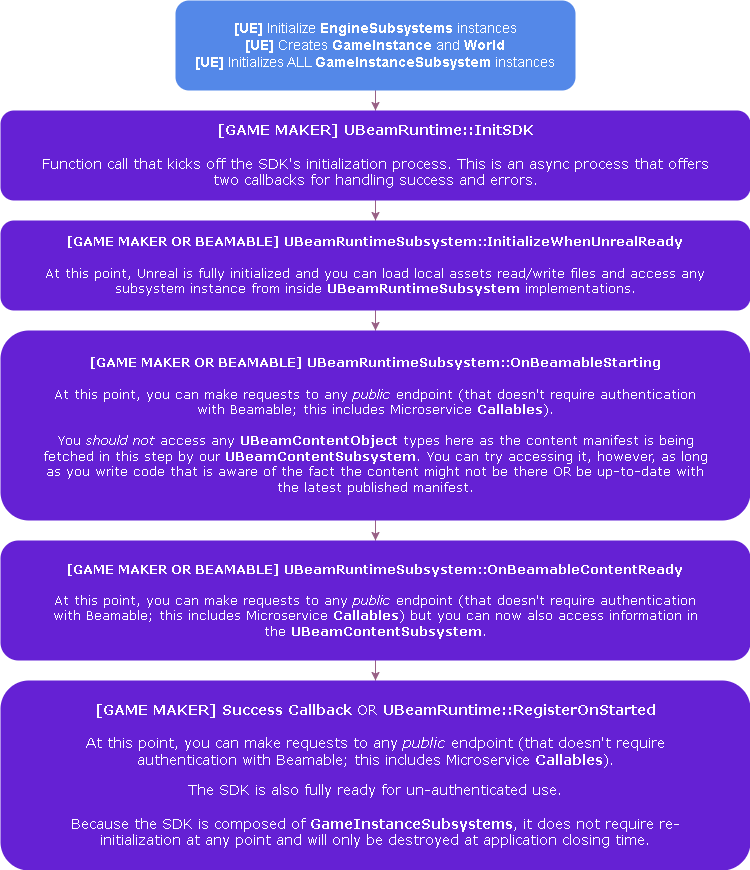
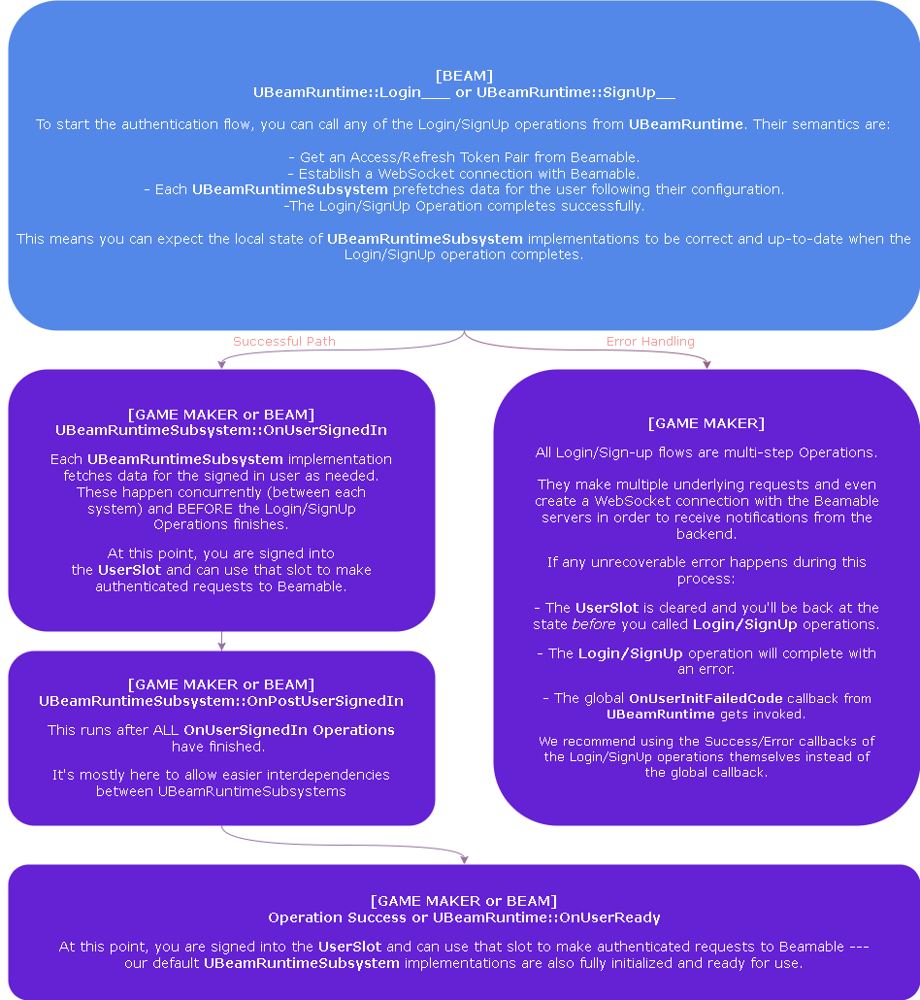

# SDK Technical Overview

The Beamable SDK is a collection of custom UE `Engine`, `Editor` and `GameInstance` Subsystems.
If you are not familiar with Unreal Subsystems, you can [take a look at their docs here](https://dev.epicgames.com/documentation/en-us/unreal-engine/programming-subsystems-in-unreal-engine).

**Game-Maker Code** (as in, code the Beamable customer writes) can take advantage of various guarantees we provide by understanding how these subsystems work.

The SDK's Plugin is divided into several modules:

- **BeamableCore** contains the `UEngineSubsystem` implementations shared between `Editor` and `Runtime` executing environments. It also contains the `UBeamContentObject` schema definitions for our [content system](beamable-services/content.md).
- **BeamableCoreRuntime** contains the `UBeamRuntime` and `UBeamRuntimeSubsystem` implementations and manage the SDK lifecycle at runtime (during PIE and in packaged clients).
- **BeamableCoreEditor** and **BeamableCoreRuntimeEditor** contains `UBeamEditor` and our editor integration code: custom BlueprintNodes, PropertyCustomizations, etc...

For any technical lead (making system-level decisions), effective use of Beamable and the Unreal SDK requires you to understand a few core concepts. So, after reading this document, you'll want to start here:

- [**Content**](beamable-services/content.md) is how you define your game's configuration --- balancing data, currency and item definitions, etc... Most of our systems depend on Content so, its a good place to start.
- [**Identity**](beamable-services/identity.md) the various ways you can manage a player's account and login flows.
- [**Microservices**](microservices/microservices.md) are our version of cloud-code --- but also much more.
- [**Federation**](federation/federation.md) are effectively exposed hooks in our backend's various features that you can hook into with custom behavior. You can leverage this for integrating with third-party authentication, initial player state and a lot more. 

Aside from those core concepts, the links below explain some of our higher-level systems.

- [**Stats**](beamable-services/stats.md) and [**Inventory**](beamable-services/inventory.md) are our general-case player-data stores. You can use these to store player-related data and implement a variety of features.
- [**Matchmaking**](beamable-services/matchmaking.md), [**Lobbies**](beamable-services/lobbies.md), [**Friends**](beamable-services/friends.md) and [**Parties**](beamable-services/parties.md) are part of our suite of services for real-time multiplayer games.
- [**Stores**](beamable-services/stores.md), [**Leaderboards**](beamable-services/leaderboards.md) and [**Announcements**](beamable-services/announcements.md) are part of our suite of services to help with live-ops meta-game engagement.

## Beamable Runtime SDK
`UBeamRuntime` is the entry point for the Beamable SDK at runtime (PIE, packaged game clients and dedicated servers). It is a `GameInstanceSubsystem` and follows its lifecycle rules. It is responsible for a couple of things:

- It controls the SDK's runtime initialization flow.
- It controls the various SDK's user \[un\]-authentication flows.
- It controls `UBeamRuntimeSubsystems'` lifecycle with respect to the SDK's initialization flow itself and `FUserSlot` authentication.

The image below describes how the SDK's lifecycle injects itself into UE's lifecycle:

The next image shows a high-level description of the authentication flows supported by the SDK:

**_We highly recommend that every engineer working with Beamable understand this lifecycle!_** It should enable them to make the best use and decisions when designing systems with or on top of Beamable. 

### Beamable Runtime Subsystems
`BeamRuntimeSubsystems` are stateful subsystems that aim to provide an extendable baseline of some Beamable functionality. They are built on top of our auto-generated lower-level API (`UBeam____Api` classes) to make it simpler to leverage our APIs; that way:

1. You don't have to set up the common case.
2. You can use them and their extension points for variations of the common case.
3. You can use them as reference implementations to implement your own custom use cases.

These are handwritten and maintained by the Beamable SDK team. Here's a few examples:

- `UBeamStatsSubsystem`: This enables you to store arbitrary key-value pairs associated to a player's account.
- `UBeamInventorySubsystem`: This provides builder functions around our Inventory APIs that allows you to combine what would be multiple API requests into a single batched inventory update. It also receives inventory notifications coming from the server and keeps your in-memory player state in sync.
- `UBeamMatchmakingSubsystem`: This provides you a stateful way of joining/canceling a matchmaking queue and receiving updates when a match is found.

These systems make use of the various `UBeamRuntimeSubsystem` callbacks to keep their state correct and expose callbacks and configuration options for **Game-Maker Code** to run with semantically relevant guarantees. Coupled with [Federations](federation/federation.md), these guarantees can be leveraged to greatly simplify the complexity of client implementations --- usually reducing the complexity and cost of your game's systems implementation.   

All of our [Blueprint](runtime-systems/blueprints.md) nodes, except our **Low-Level** ones, are backed by these sub-system implementations.

If the exposed hooks on these are not enough for your use case and constraints, as a user you can create your own `UBeamRuntimeSubsystem`. The SDK does not obfuscate its inner-workings from you so you can use the existing `UBeamRuntimeSubsystems` as a reference to understand how to create your own. The documentation in [Lower Level SDK](runtime-systems/lower-level.md) and [Operations & Waits](runtime-systems/operations-and-waits.md) can also be useful when implementing your own `UBeamRuntimeSubsystems`. 

#### Advanced - Disabling Runtime Subsystems

You can also opt out of these entirely by adding them to `UBeamCoreSettings` 's property: `ManuallyInitializedRuntimeSubsystems`. All subsystems in this list, and any other subsystem that depends on it, are not automatically initialized by the SDK. For example, if `UBeamInventorySubsystem` is in this list, this system will not be usable until you manually initialize it. 

You can leverage the above to:

- Delay initialization of subsystems to a later point to reduce startup times.
- Remove our implementation of a set of systems so that you can use your own implementation of those systems without paying the overhead of our default implementations.
- Disable systems that you do not want to use to reduce the SDK's request overhead.

Keep in mind that the simplest way is to build your features *on top of* these subsystems instead of replacing them.
However, there are complex cases where it may be easier to make your own system *instead of* these subsystems. 
That's why we allow you to enable/disable systems with this granularity.

#### Advanced - Beyond the Hooks and Modifications to the SDK

In line with our philosophy that tools should enable you to do what you need, we distribute the SDK with the source code so that you can edit it if you need to do so. The code is kept organized and commented (as best as we can) to try and make modifications to it feasible. We do this for a few different reasons: 

- **Owning Dependencies**: It is the philosophy of the UE team here at Beamable that dependencies should be managed explicitly and, whenever possible, be included in your VCS. Since the Beamable SDK is a huge dependency of your project, we want you to have as much control over it as possible.
- **Visibility**: We also believe that, while you shouldn't depend directly on internals of the SDK, having access to them can inform better system design choices. You shouldn't be afraid to take a look at the details of how we implement our `UBeamRuntimeSubsystem`s as it can be informative when designing custom systems on top of Beamable yourself.  
- **Debuggability**: Having the source for the SDK means you can investigate it, find issues stemming from incorrect usage or bugs in the SDK, in which case you can report them to us but **_are not tied to our release schedule to get the fix for it_**. 

We are all for helping you get a head start in development, but if at any point our systems aren't helping you should be free to adjust them easily or replace them. 

I should make a disclaimer though: **_IF YOU MODIFY THE SDK, YOU ARE TAKING OWNERSHIP OF MAKING THAT MODIFICATION WORK WITH THE REST OF THE SDK_**. Our Pro-Support will gladly help you investigate and in future versions of the SDK we might even ship a generalization of what you need based on data that stems from that process, but we hope you understand that we cannot guarantee any modification you make will work out of the box, with itself or future versions of the SDK --- only you can do that. Still, sometimes this risk and cost _can_ be worth it. So, we trust tech-leads and senior engineers to evaluate that correctly and go for it when appropriate for their case. 
