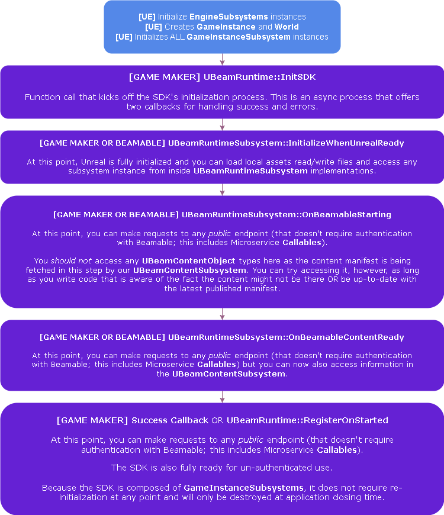
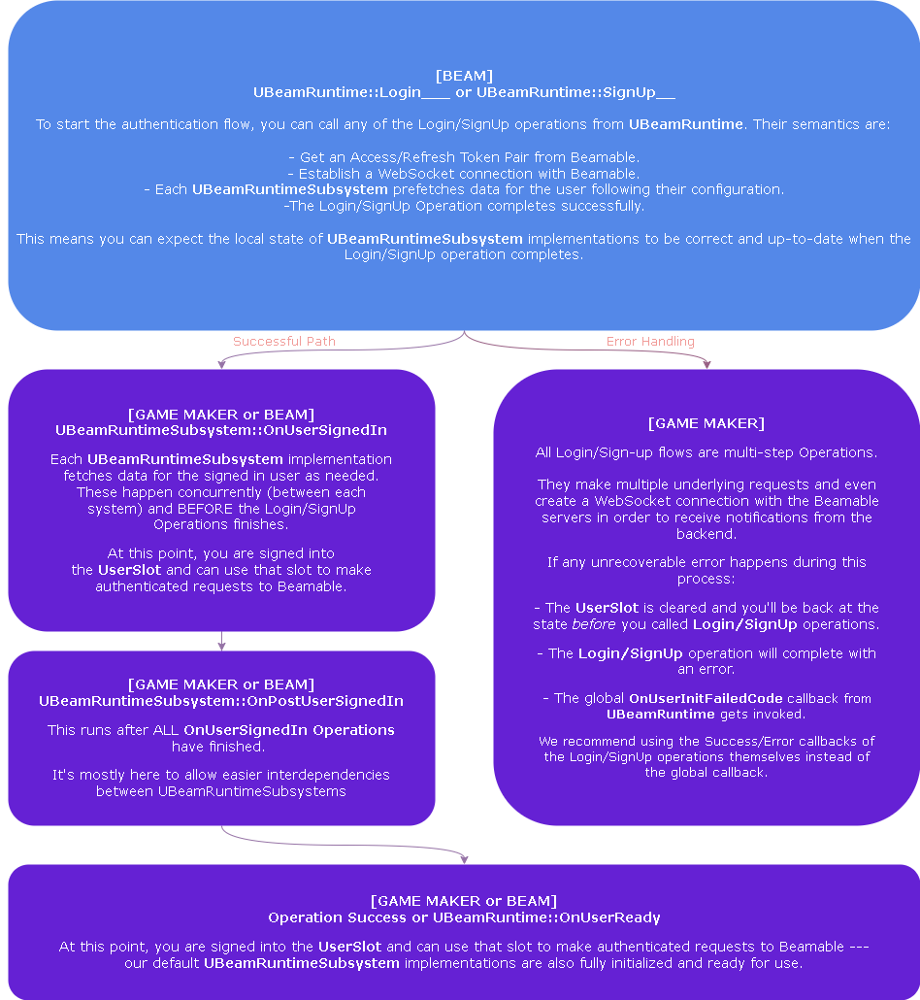

# SDK Technical Overview

The Beamable SDK is a collection of custom UE `Engine`, `Editor` and `GameInstance` Subsystems.
If you are not familiar with Unreal Subsystems, see the [Unreal Engine Programming Subsystems documentation](https://dev.epicgames.com/documentation/en-us/unreal-engine/programming-subsystems-in-unreal-engine).

**Game-Maker Code** (as in, code the Beamable customer writes) can take advantage of various guarantees the SDK provides by understanding how these subsystems work.

### Plugin Modules
The SDK's Plugin is divided into several modules:

- **BeamableCore** contains the `UEngineSubsystem` implementations shared between `Editor` and `Runtime` executing environments. It also contains the `UBeamContentObject` schema definitions for the [content system](beamable-services/content.md).
- **BeamableCoreRuntime** contains the `UBeamRuntime` and `UBeamRuntimeSubsystem` implementations and manages the SDK lifecycle at runtime (during PIE and in packaged clients).
- **BeamableCoreEditor** and **BeamableCoreRuntimeEditor** contain `UBeamEditor` and the editor integration code: custom BlueprintNodes, PropertyCustomizations, etc.

### Core Concepts

For any technical lead making system-level decisions, effective use of Beamable and the Beamable Unreal SDK requires you to understand a few core concepts. So, after reading this document, you'll want to start here:

- [**Content**](beamable-services/content.md): how you define your game's configuration — balancing data, currency and item definitions, etc. Most SDK systems depend on Content, so it is a good place to start
- [**Identity**](beamable-services/identity.md): the various ways you can manage a player's account and login flows
- [**Microservices**](microservices/microservices.md): Beamable's version of cloud-code — but also much more
- [**Federation**](federation/federation.md): extension points in Beamable backend services that delegate specific actions to your microservices, such as third-party authentication

Aside from those core concepts, the links below explain some of the higher-level systems.

- [**Stats**](beamable-services/stats.md) and [**Inventory**](beamable-services/inventory.md) are the general-case player-data stores. These can be used to store player-related data and implement a variety of features
- [**Matchmaking**](beamable-services/matchmaking.md), [**Lobbies**](beamable-services/lobbies.md), [**Friends**](beamable-services/friends.md) and [**Parties**](beamable-services/parties.md) are all part of the suite of services for real-time multiplayer games
- [**Stores**](beamable-services/stores.md), [**Leaderboards**](beamable-services/leaderboards.md) and [**Announcements**](beamable-services/announcements.md) are all part of the suite of services for live-ops meta-game engagement

## Beamable Runtime SDK
`UBeamRuntime` is the entry point for the Beamable SDK at runtime (PIE, packaged game clients, and dedicated servers). It is a `GameInstanceSubsystem` and follows its lifecycle rules. It is responsible for a couple of things:

- Controls the SDK's runtime initialization flow
- Controls the various SDK's user \[un\]-authentication flows
- Controls `UBeamRuntimeSubsystems'` lifecycle with respect to the SDK's initialization flow itself and `FUserSlot` authentication.

The image below describes how the SDK's lifecycle injects itself into UE's lifecycle:

The next image shows a high-level description of the authentication flows supported by the SDK:

**_Every engineer working with Beamable should understand this lifecycle._** It should enable them to make the best use and decisions when designing systems with or on top of Beamable.

### Beamable Runtime Subsystems
`BeamRuntimeSubsystems` are stateful subsystems that aim to provide an extendable baseline of some Beamable functionality. They are built on top of the auto-generated lower-level API (`UBeam____Api` classes) to make it simpler to leverage the SDK's APIs so that:

1. You don't have to set up the common case.
2. You can use them and their extension points for variations of the common case.
3. You can use them as reference implementations to implement your own custom use cases.

These are handwritten and maintained by the Beamable SDK team. Here are a few examples:

- `UBeamStatsSubsystem`: enables you to store arbitrary key-value pairs associated to a player's account.
- `UBeamInventorySubsystem`: provides builder functions around the Inventory APIs that allow you to combine what would be multiple API requests into a single batched inventory update. It also receives inventory notifications coming from the server and keeps in-memory player state in sync.
- `UBeamMatchmakingSubsystem`: provides a stateful way of joining/canceling a matchmaking queue and receiving updates when a match is found.

These systems make use of the various `UBeamRuntimeSubsystem` callbacks to keep their state correct and expose callbacks and configuration options for **Game-Maker Code** to run with semantically relevant guarantees. Coupled with [Federations](federation/federation.md), these guarantees can be leveraged to greatly simplify the complexity of client implementations — usually reducing the complexity and cost of your game's systems implementation.

All [Blueprint](runtime-systems/blueprints.md) nodes, except the **Low-Level** ones, are backed by these subsystem implementations.

If the exposed hooks on these are not enough for your use case and constraints, you can create your own `UBeamRuntimeSubsystem`. The SDK does not obfuscate its inner-workings from you so you can use the existing `UBeamRuntimeSubsystems` as a reference to understand how to create your own. The documentation on [Lower Level SDK](runtime-systems/lower-level.md) and [Operations & Waits](runtime-systems/operations-and-waits.md) can also be useful when implementing your own `UBeamRuntimeSubsystems`.

#### Advanced - Disabling Runtime Subsystems

You can also opt out of these entirely by adding them to `UBeamCoreSettings` 's property: `ManuallyInitializedRuntimeSubsystems`. All subsystems in this list, and any other subsystem that depends on it, are not automatically initialized by the SDK. For example, if `UBeamInventorySubsystem` is in this list, this system will not be usable until you manually initialize it.

You can leverage the above to:

- Delay initialization of subsystems to a later point to reduce startup times
- Replace the SDK's default implementation of a system with your own, avoiding its overhead
- Disable systems that you do not want to use to reduce the SDK's request overhead

Keep in mind that the simplest way is to build your features *on top of* these subsystems instead of replacing them.
However, there are complex cases where it may be easier to make your own system *instead of* these subsystems.
This is why the SDK allows enabling and disabling systems at this granularity.

#### Advanced - Beyond Hooks and SDK Modifications

The Beamable Unreal SDK ships with full source code so you can edit it when needed. The code is organized and commented to make modifications feasible, for a few reasons:

- **Owning Dependencies**: The Beamable UE team's philosophy is that dependencies should be managed explicitly and, whenever possible, committed to your VCS. Since the Beamable SDK is a significant dependency of your project, we want you to have as much control over it as possible
- **Visibility**: SDK internals are subject to change, so avoid depending on them directly — but having access to them can better inform design choices. You can use the details of `UBeamRuntimeSubsystem` implementations as guides when designing custom systems on top of Beamable.
- **Debuggability**: Having the SDK source lets you investigate it, find issues stemming from incorrect usage or SDK bugs, and report them to Beamable

The goal is to help you get a head start in development, but if the SDK's systems are not working for you, you are free to adjust or replace them.

!!! warning "Disclaimer"
    **_IF YOU MODIFY THE SDK, YOU ARE TAKING OWNERSHIP OF MAKING THAT MODIFICATION WORK WITH THE REST OF THE SDK_**.

    Beamable Pro-Support can help you investigate, and future SDK versions may even ship a generalization of what you need based on that process — but there is no guarantee that any modification will work out of the box with itself or future versions of the SDK.

    Still, sometimes this risk and cost _can_ be worth it. Tech leads and senior engineers are best positioned to evaluate that trade-off and proceed when it makes sense for their project.
