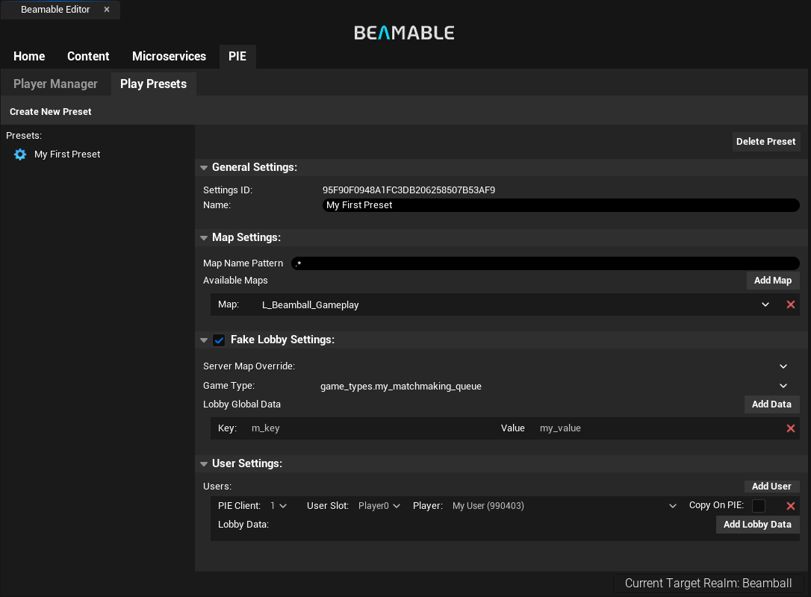
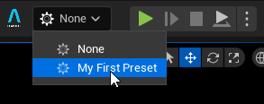
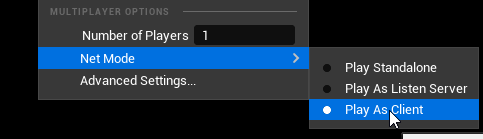
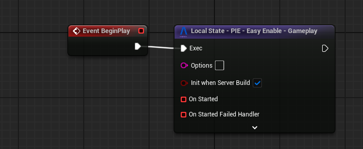
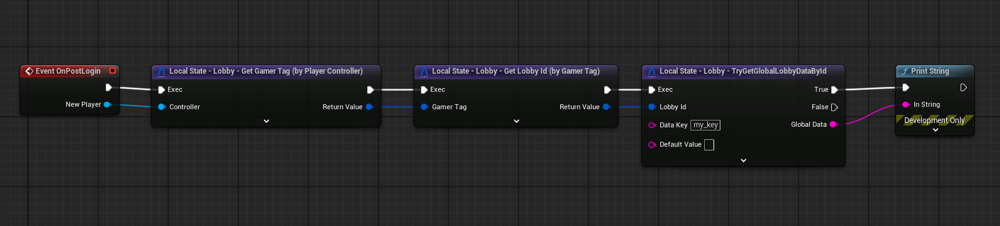
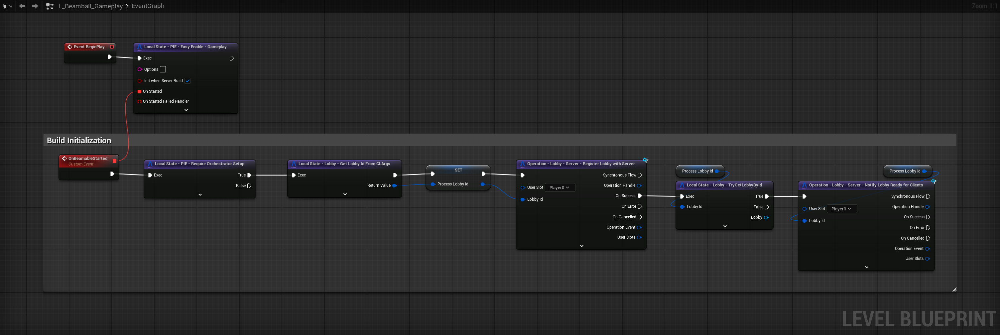

# Realtime Multiplayer Overview

There are multiple ways to design real-time multiplayer games: dedicated servers, listen servers in addition to deterministic approaches (such as lockstep or rollback based ones). Unreal has baked in workflows and utilities for the first two. The Beamable Unreal SDK currently only dedicated servers officially, though you can probably get listen servers to work too. <!-- TODO(@drewbleam): "listen servers"??? -->

## Dedicated Servers in Unreal with Beamable

Beamable integrates with Unreal's Gameplay Framework in a couple of different ways; none of those are via an **OnlineSubsystem**. 

!!! note "Why no Online Subsystem?"
     Because Beamable's approach to Cloud Code (custom code to extend backend functionality) does not mesh well with those interfaces --- you'd end up either losing a lot of Beamable's most useful functionality OR gaining a non-trivial amount of complexity to use it. Therefore, the Beamable SDK provides you with utilities to make dedicated server games itself.

Instead, here are the main components of which you need to be aware:

- **[Matchmaking](../beamable-services/matchmaking.md)**: Beamable provides you with a Matchmaking system out of the box that covers simple Matchmaking cases. It is useful during early development and also in production depending on your game's needs. [Beamable's Microservices](../microservices/microservices.md) allow you to implement or integrate with more specialized Matchmaking solutions should your game need it.
- **[Lobbies](../beamable-services/lobbies.md)**: [Beamable's Matchmaking](../beamable-services/matchmaking.md) generates, for each match found, a Lobby structure of players. Lobbies are closest to what Unreal's OnlineSubsystem calls a "**Session**". Lobbies can also be created by players themselves.
- **[Server Provisioning](../federation/federated-game-server.md)**: Beamable's approach to Cloud Code, [Microservices](../microservices/microservices.md), allows you to hook into certain processes that the Beamable Backend does; we call that **Federation**. For example, Game Server Federations can be used to run arbitrary code **after the matchmaking has created the lobby** but **before the clients are notified the match was found**. This allows you to fill the lobby with relevant data for your match, provision a server, wait for the server to spin up and then allow our Backend to notify the clients. This flow significantly simplifies client and server code around this connection flow.
- **[Game Server Authentication](code-multiplayer.md)**: It is pretty important that you implement Unreal's **PreLoginAsync** at some point before you ship a game. The Beamable SDK's **UBeamLobbySubsystem** provides you with utilities to validate that the user trying to connect _is in fact in a lobby the game server is managing and is a valid player_. 
- **[PIE Support](../editor-systems/pie-settings.md)**: Anyone that has worked in multiplayer games knows about the challenge of maintaining a good workflow in PIE --- this is because code written for the gameplay makes all sorts of assumptions about the game state: it usually assumes clients are already logged in and SDKs are initialized, it assumes that a Lobby (or Session) already exists, it'll read data from that Lobby/Session as part of its initialization and systems and so on... the Beamable SDK's **BeamPIE** system gives you these guarantees in PIE with a single Blueprint node; among other things, this is an extremely useful tool throughout all stages of development.
- **[Local and Remote Multiplayer](../runtime-systems/user-slots.md)**: If your game needs BOTH multiple local players per-client AND remote play, the Beamable SDK also supports that via the User Slot system. Each Client has multiple **Runtime User Slots**: **Player0**, **Player1**, etc... In clients, these map to UE's own **LocalPlayerIndex**; this mapping is implicit and index-based. You can tell the Beamable SDK about your game's **RuntimeUserSlots** in `Project Settings > Engine >  Beamable Core`. If your game does NOT support local + remote multiplayer, then this is not relevant and the SDK's defaults will work for you. 

You can see an example of a working implementation of these in the **[Beamball Sample](../../samples/beamball/beamball-demo.md)**.

!!! warning "Does Beamable host our Game Servers?"
    Beamable does not provide Game Server Orchestration. This means that, while we have Lobbies, Matchmaking and can find matches between players, we do NOT run the actual Game Server. For this, we partner with other companies and provide a simple way to integrate our Matchmaking and Lobbies with them (this is **[Game Server Federation](../federation/federated-game-server.md)**).

### Relevant Architecture Terminology
This documentation uses a few terms to refer to common parts of the architecture of a Dedicated Server Game.

- **Main Boot Level**: Refers to the Level in which your Client applications start. This usually maps to your title/main menu screens.
- **Waiting Room Level**: Some games will boot the server in a "Waiting Room Level" while players connect before performing a **Server Travel** to take all the clients to the actual gameplay map. We'll call this the Waiting Room Level.
- **Gameplay Level**: This is the Level in which gameplay happens. During development, your designers and gameplay engineers need to enter this level directly using PIE.  
- **Game Server Orchestrator** or just **Orchestrator**: whatever tech is running your actual Game Servers; Hathora, Agones, GameLyft and others exist in this space.

There _**are**_ other ways to arrange and organize server-authoritative games but most games do something at least similar to this, and, Unreal helps you more if you are close to this. 

## Getting Started - Setting up Gameplay Levels and a PIE Setting
This guide explains how to leverage our SDK's **[PIE Support](../editor-systems/pie-settings.md)** to set up your Gameplay Level so you can start experimenting with Beamable immediately.

Example of PIE Settings for a gameplay level

1. Enable the Beam PIE in your `Project Settings > Engine > Beamable Core`.
2. Restart your Editor.
3. Create a Game Type content using the **Beamable Window - Content** tab. Name it `my_matchmaking_queue`.
4. Go to the **Beamable Window - PIE** tab.
5. Use the **Player Manager** to create a User and set its name to `My User`.
6. Use the **Play Presets** window to create a `My First Preset`.
   1. In **Map Settings**:
      1. Choose your Gameplay Level from the dropdown of Allowed Maps. This will make this preset available for use when you have this map open in the editor.
   2. Toggle the **PIE Lobby Settings** on.
      1. Choose the `my_matchmaking_queue` game type from the dropdown.
      2. Add a `my_key` and `my_value` to the Global Lobby Data.  
   3. In **User Settings**:
      1. Add a User and select the `My User` you created previously.
      2. Verify `Copy on PIE` is disabled.

Now that you have a preset, you can set up your Gameplay Level to use it:

1. Open your **Gameplay Level**.
2. Next to the PIE Start button, you have a Beamable dropdown. Select the `My First Preset` option from it.

3. Change Unreal's Playmode settings to be: **Play as Client** and **Number of Players = 1** (to match the number of users in the PIE Lobby).

4. Open your Gameplay Level's **Level Blueprint**.
    1. In its **Begin Play**, add a `Local State - PIE - Easy Enable` node **_as the first thing it does_**.

At this point, `BeamPIE` is configured. The next couple of steps are here so you can see that the Preset you configured actually created the lobby with the data you defined.

Create and/or open your **_GameMode_** Blueprint for this level.

1. In its **Post Login**, add a `Local State - Lobby - Get Gamer Tag (by Player Controller)` and pass in the **NewPlayer**.
2. Then add a `Local State - Lobby - Get Lobby Id by Gamer Tag` to get the Lobby Id for this player.
3. Then add a `Local State - Lobby - TryGetGlobalLobbyDataById` passing in the Lobby Id and `my_key`.
4. Finally, add a `Print String` node that prints the returned value (it should be `my_value`).
5. Don't forget to set this `Game Mode` in UE's `World Settings > Game Mode Override`.

If you enter PIE now, here's what happens under the hood:

- The Beamable SDK's Easy PIE node will move the server to a development-only **Waiting Room Level** and wait for all PIE clients to connect.
- All PIE clients log in with their mapped users (the ones you configured in your `Play Preset`).
- The PIE server instance keeps trying to create a lobby with the mapped users until it succeeds.
- The PIE clients wait until they become aware they were put into the Lobby.
- Once the Lobby is created and all PIE clients are aware that they are in the lobby, our Waiting Room **Server Travels** back to the Gameplay Level you started in, taking all clients with them --- this time, the `Easy Enable` node does nothing.

!!! warning "Iteration Time"
     This is the quick setup way. There is a way to avoid the need for this **Waiting Room** but it requires C++ and a custom **Game Instance** --- this is outlined in our [C++ Real-Time Multiplayer Guide](code-multiplayer.md#making-beam-pie-faster).

The above process guarantees two things:

- The SDK in both Clients and Servers is guaranteed to be in the same state they'd be if you had entered the Gameplay Level via your normal flows (starting from the **Main Boot Level**): the Beamable SDK is fully initialized in both Server and each Client.
- Every code/blueprint running AFTER the Game Mode's **PostLogin** is guaranteed to have no differences between the PIE flow and the Main Boot Level one.

And... the above guarantees allow you to just use Beamable with much less PIE-specific code.

## Integrating with Game Mode Callbacks & Others
There are several overridable functions and events the Game Mode class exposes to you. There is a very important constraint affecting them:

> Callbacks that happen before the **Player Controller** is fully created (before `PostLogin`), cannot interact with the Beamable SDK and do NOT have the guarantee the SDK is ready.

This is because initializing the SDK is an Asynchronous Process and takes time --- so there's no way we can tell Unreal to wait until the SDK is initialized to then run `Begin Play`. From `PostLogin` forward, you can make use of the SDK; Content is ready, the Lobby information is available and so on...

!!! warning "World Actors"
    If you have Blueprints in your Level Actor that need to access data inside the Lobby to be initialized, don't use `Begin Play` -- instead, call a function on it from a point where you have the guarantee the SDK is initialized and ready for use.

If you'd like to see an example of this, take a look at our [Beamball Demo](../../samples/beamball/beamball-demo.md).

## Preparing a Build for your Game Server Orchestrator
This section explains what you need to do before you generate a build to upload to any Game Server Orchestrator such as Hathora, GameLyft or Agones. This explanation is Blueprint-based, an equivalent C++ explanation is described in our [C++ Real-Time Multiplayer Guide](code-multiplayer.md).

### Setting Up your Gameplay Level's Level Blueprint

#### **Step 1 - Turn on Init on Server Build**
Beamable provides you with an option in its `Local State - PIE - Easy Enable - Gameplay` node called `Init when Server Build`:

- When playing inside PIE, turning on this option makes no difference.
- In the actual server build you'll upload, that essentially turns the node into an `InitSDK` call.
- In client builds, this node does nothing at all in any case.

You must also create and bind `Custom Events` to the `OnStarted` and `OnStartedFailedHandler`.

This makes it so that the server build will initialize the SDK once it starts.

#### **Step 2 - Extract Information from Orchestrator**
When configuring a build with your Orchestrator, they will typically allow you to pass in CLArgs or set Environment Vars for the running Game Server process. You'll need to set up the following ones:

| Value        | CLArg/EnvVar                                                                                                                                                                                                                                                                                                                                    |
| ------------ | ----------------------------------------------------------------------------------------------------------------------------------------------------------------------------------------------------------------------------------------------------------------------------------------------------------------------------------------------- |
| Realm Secret | **CLArg**: `beamable-realm-secret` **EnvVar**: `BEAMABLE_REALM_SECRET`  This is a **high-security token** that can be found in: `Portal -> Games -> Any Realm (...) -> Project Secret` OR by running `dotnet beam config secret` from your project root.  Be very careful with this and DON'T commit it to your version control. |
| CID          | **CLArg**: `beamable-customer-override` **EnvVar**: `BEAMABLE_CUSTOMER_OVERRIDE`  This is mostly here so you can point our Sample builds to your organization; has little bearing on your own games.                                                                                                                                   |
| PID          | **CLArg**: `beamable-realm-override` **EnvVar**: `BEAMABLE_REALM_OVERRIDE`  This defines with which of your realms the server will attempt to communicate. Make sure this matches the Realm Secret.                                                                                                                                    |

We can't tell you how to do this exactly, but for every Orchestrator we know how, you'll be able to see it in our **[Beamball Demo](../../samples/beamball/beamball-demo.md)**.

In addition to this, inside the Game Server initialization logic, you'll need to do some things to map the Beamable Lobby to this running instance of the game server. There are two strategies to do this:

##### **One Lobby Per Process**
The most common way Orchestrators such as Hathora, GameLyft or Agones pass information to the running process is via Command Line Arguments or Environment Variables. If you are only ever running one Lobby per-game-server-process, we recommend passing in the lobby id this way.

For this case, the Beamable SDK expects either the `CLArg: BeamableDedicatedServerInstanceLobbyId` or the `EnvVar: BEAMABLE_DEDICATED_SERVER_INSTANCE_LOBBY_ID` to be set and contain the Lobby Id for the match. If they do, you can use `Local State - Lobby - Get Lobby Id From CLArgs` to get this value.

Each orchestrator has their own way of allowing you to define CLArgs and EnvVars that it'll pass into the running game-server process --- please refer to your chosen orchestrator's documentation about how to pass these along; you can also refer to our [Beamball Demo](../../samples/beamball/beamball-demo.md) to see how we do this with Hathora (as per Hathora docs, involves a `Dockerfile` and a `sh` script).

##### **Multiple Lobby Per Process**
If you are planning on having multiple lobbies per-game-server-process, your orchestrator will either:

- Give you an SDK that allows you to receive notifications whenever a lobby is assigned to a running process.
- Give you an endpoint you can periodically call to check if new lobbies have been assigned to the running process.

Either way, at that point, your orchestrator will have provided you the Lobby Id.

#### **Step 3 - Register the Lobby with the SDK Running in the Game Server**
Now that we know what the Lobby Id is, we need to register this lobby with the Beamable SDK. "Registering a Lobby with the SDK" means that the SDK will fetch the lobby's information and set up the necessary mapping between each user in the lobby and Unreal's Gameplay framework types (`FUniqueNetIdRepl`).

To do this, you can call `Operation - Lobby - Server - Register Lobby with Server`.

#### **Step 4 - Prepare for Gameplay and Notify Clients they can Connect**
Once the lobby is registered, you can use `Local State - Lobby - TryGetLobbyById` (and `Local State - Lobby - TryGetLobbyPlayerDataById` and `Local State - Lobby - TryGetLobbyGlobalDataById`) to read data from the Lobby to initialize your game server.

This initialization can be preloading assets, making requests to microservices and so on...

Once this is done and you are ready to accept client connections, you should call `Operation - Lobby - Server - Notify Lobby Ready for Clients`. This signals your awaiting **Game Server Federation's `CreateGameServer` implementation** that the game server is ready to accept client connections --- allowing it to complete so that Beamable notifies all players in the Lobby forwarding the connection information to them.

After these steps are completed, you'll begin receiving connections --- in UE, handling player connection and initialization is done in a Game Mode implementation (see [here](#preparing-a-build-for-your-game-server-orchestrator)). 

Example of Level Blueprint for a Game Server Build

## What's next?

With this, you are set up to begin experimenting with your gameplay systems in PIE. In early development, we recommend using this to figure out which Key-Value pairs you'll need in the Beamable Lobby structure. This should allow you to work on your gameplay development directly in PIE before doing the work to integrate with your **[Game Server Orchestrator using our Federation system](../federation/federated-game-server.md)**. 

When you decide to implement **Game Server Authentication**, take a look at our **[C++ Real-Time Multiplayer docs](code-multiplayer.md)** --- Unreal does not allow for a BP-only authentication flow (it needs **PreLoginAsync** which is a C++ only callback in the Game Mode). 

   

