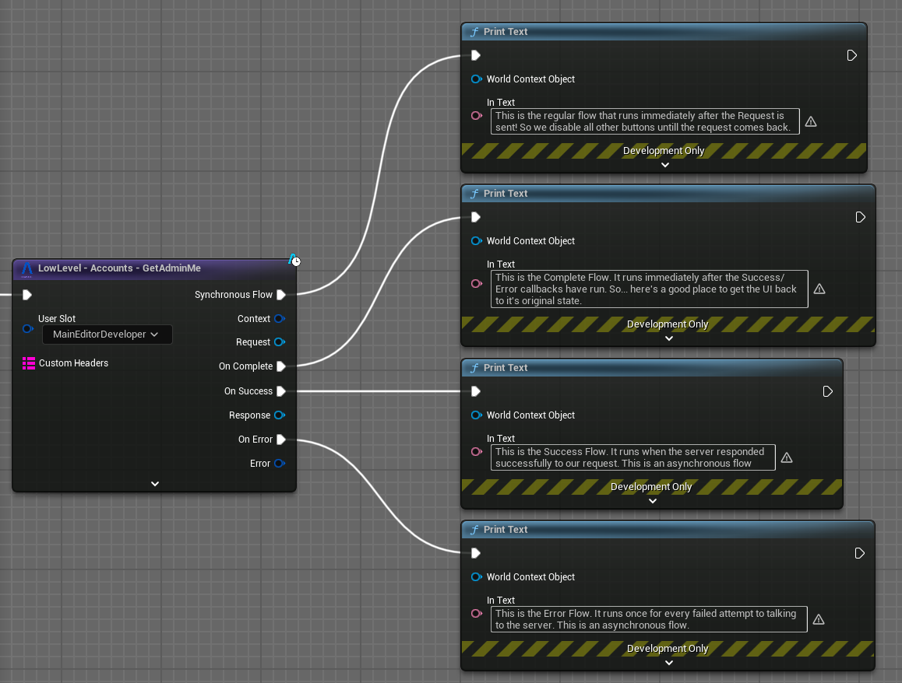
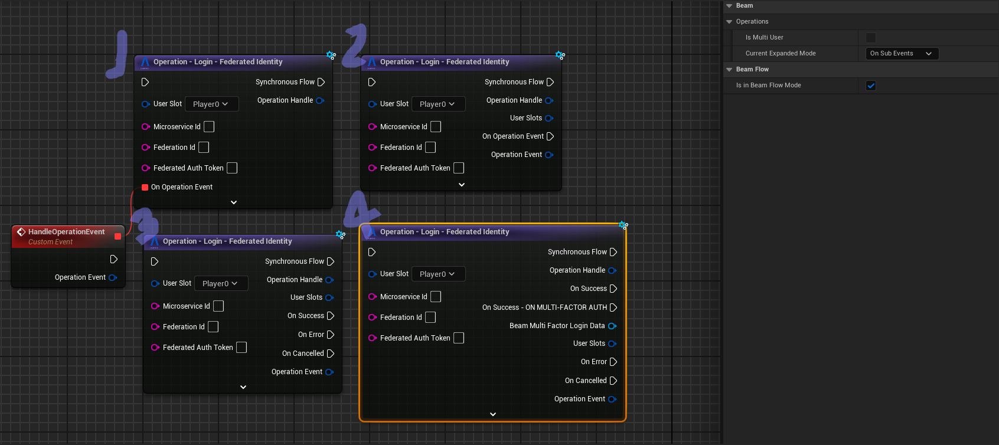
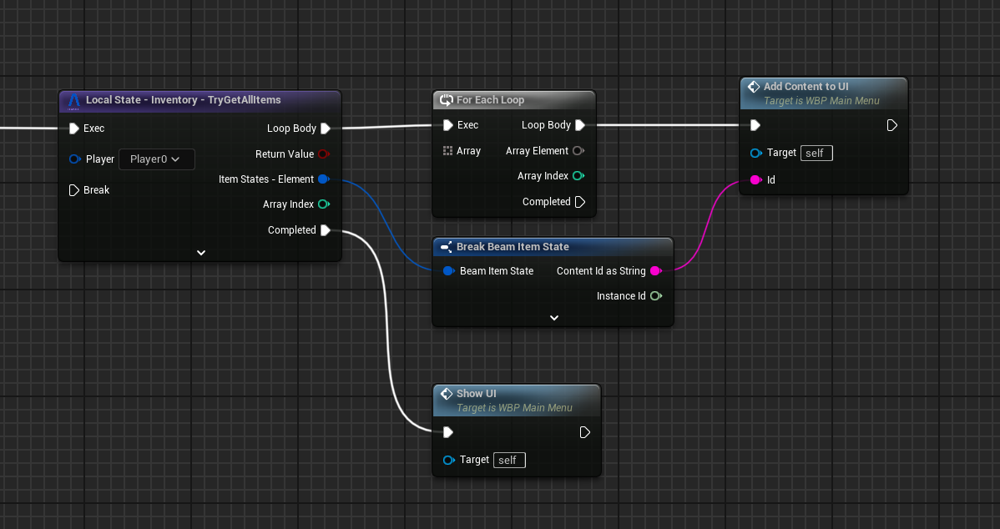
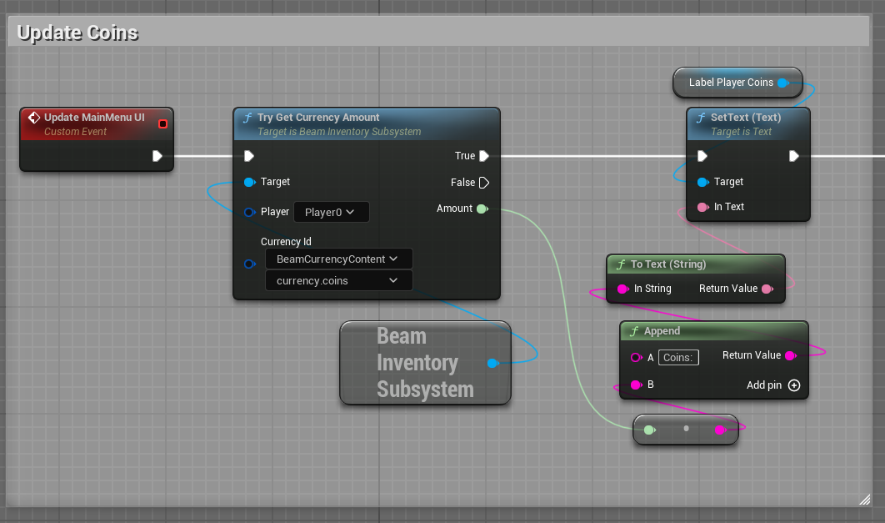

# Beamable Blueprint Systems

Beamable provides several types of Blueprint nodes to interact with its systems. These are organized into four main categories: `Low Level`, `Local State`, `Events Bind` and `Operation`. Each category serves different purposes and complexity levels in your game development workflow.

## Low Level Blueprints

`Low Level` Blueprints provide direct access to Beamable's APIs. These nodes make raw API calls to Beamable's backend. They are typically used when you need precise control over the behavior or when building custom systems on top of Beamable's foundation.

Common use cases include:

- Direct API requests
- Customized behaviours not captured by our `UBeamRuntimeSubsystem` implementations

## Operation Blueprints

`Operations` provide high-level Blueprint nodes for asynchronous communication with Beamable services. It's designed to simplify common game operations. These nodes combine multiple low-level operations into single, easy-to-use nodes that handle complex workflows automatically. They're perfect for rapid development and standard game features.

Sample of a Operator Blueprint Node that encapsulate the Purchase Operation for a Listing from the Skin Store.

Operation nodes can be configured in the following ways:

1. **No BeamFlow Mode**: removes all the output pins and reveal the `Delegate` input pin handler for the operation.
2. **BeamFlow + OnCompleted**: exposes a single `Flow` output pin that allows you to handle Success/Failure/Cancelled and any sub-events in the same way.
3. **BeamFlow + Success/Error/Cancelled**: exposes one `Flow` output pin for each of Success/Failure/Cancelled.
4. **BeamFlow + OnSubEvents**: exposes one `Flow` output pin for each of Success/Failure/Cancelled **_PLUS_** a single `Flow` output pin for each sub-event emitted by the operation. Sub-events are calls to the Operation `Delegate` that do not complete the operation (the semantics of each sub-event is explained on their tooltip).

Common use cases include:

- Player Authentication flows
- Inventory transactions
- Leaderboard operations
- Friends and Parties operations
- Matchmaking & Lobby operations
- Fetching the latest state from the Beamable backend

## Local State Blueprints

`Local State` Blueprints manage the player's in-memory (locally cached) version of the data associated with players. None of these are asynchronous operations and are meant to be used to read in-memory state and display it in UI or use in your own systems built on top of Beamable's systems.

Sample of a Local State Blueprint Node that returns the local cached state of the player's Items of the Inventory.

There are two different kinds of `Local State` nodes: a single-output version and a `for-each-style` version. These aim to cover most common ways to read this data from subsystems and display them in UI or make gameplay-related decisions based on them.

Common use cases include:

- Access Player stats
- Player inventory management including items and currencies
- Access all local cached data of the Beamable `UBeamRuntimeSubsystem` implementations 

## Events Bind

Each of our subsystems also have an `Events - Bind` node that exposes all events that subsystem emits for binding.

Sample of a Blueprint Event Node called when the Local State of the Inventory is Updated.

You can see in the `Details` view that you can configure:

- Which events exposed by the Inventory `UBeamRuntimeSubsystem`.
- If we expose them as `Delegate` input pins or as `Flow` output execution pins.
- If we expose the `Unbind` input flow pin.

Common usages of these are in UIs with the following pattern:

We also provide `Unbind` nodes for cases where the above pattern isn't possible or desirable. In this node, you can select which events you are unbinding:

Common Use Cases:

- Notifying the player that a Match was found
- Reconfiguring a part of the UI whenever an inventory item changed
- So on...

## Other Utilities
We also provide additional utility Blueprint nodes such as:

- Direct access to Beamable Subsystems (e.g., Identity, Inventory, Stats)
- Event nodes for handling various system events
- Iterator nodes for processing collections of data
- Helper nodes for common operations and data transformations

Sample of a Blueprint graph that access athe Beamable Inventory Subsystem and retrieve a currency amount from the local cached state

## Node Customization
Multiple Blueprint nodes can be modified in their `Detail` panel. These configurations allow you to change the pin layout of the node for cases where one layout or another is more beneficial.

