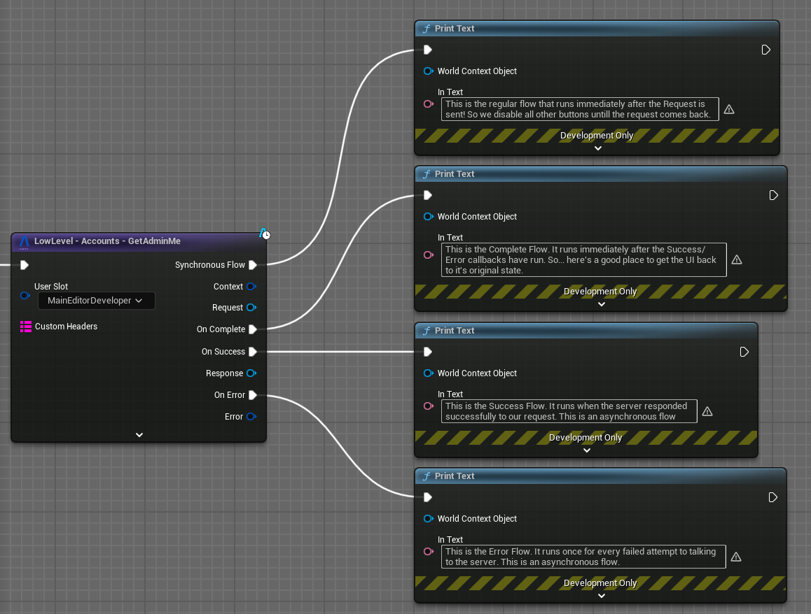
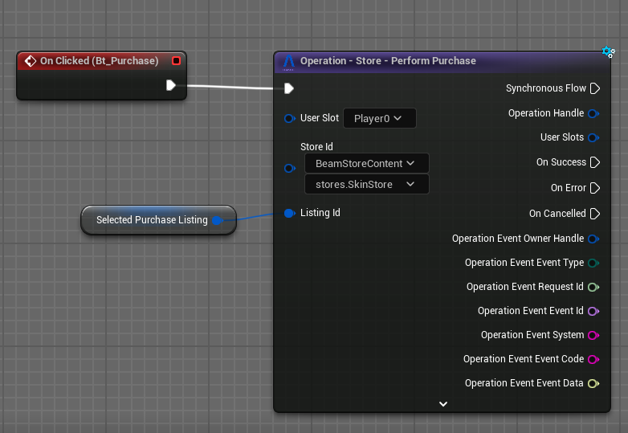
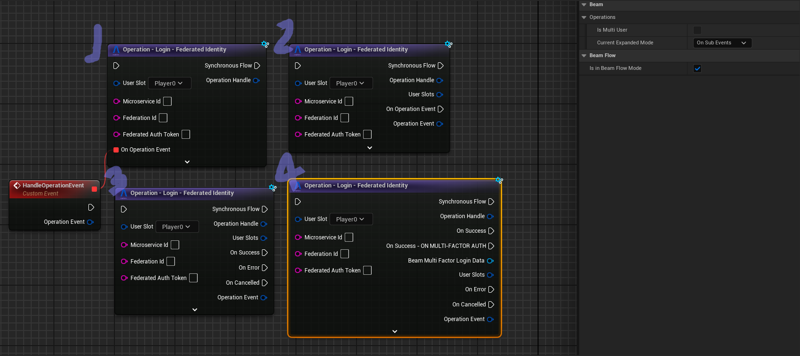
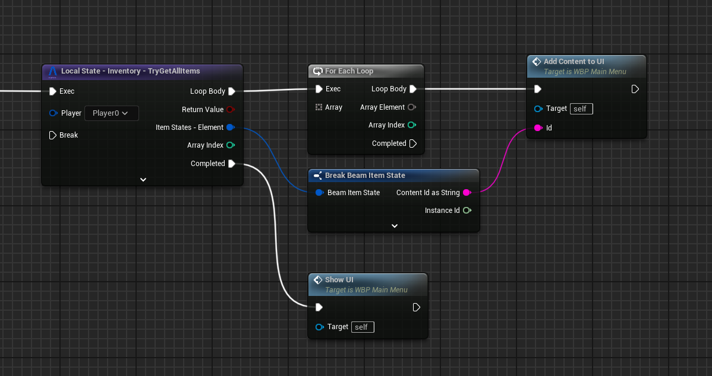
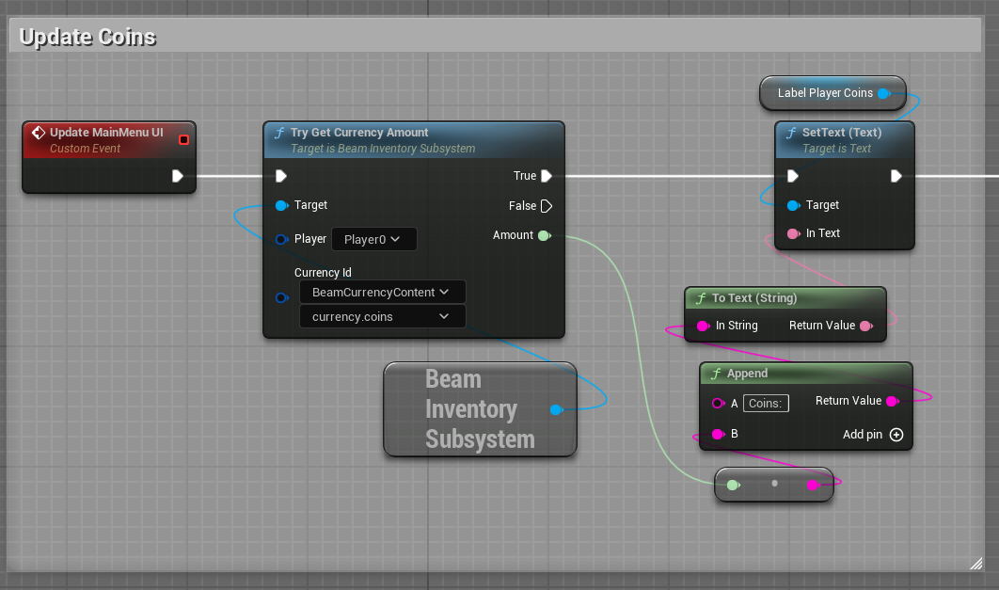

# Beamable Blueprint systems

Beamable provides several types of Blueprint nodes to interact with its systems. These are organized into four main categories: `Low Level`, `Local State`, `Events Bind`, and `Operation`. Each category serves different purposes and complexity levels in your game development workflow. These are all "blueprint syntactic sugar" for the various usage patterns of their backing C++ functions.

!!! note "Navigating to C++ Code"
    All special Blueprint nodes link back to the appropriate C++ function via `Right-Click on Node > Go to Definition` or `Double-Click on Node`.

    To make sure this works, verify that:

    - `Editor Preferences > Blueprint Editor Settings > Navigate to Native Functions from Call Nodes` is `true` (this should be `true` by default)

    - Also select your IDE in `Editor Preferences > Source Code > Source Code Editor` (this may or may not be automatically set depending on your choice of IDE)

## Low level Blueprints

`Low Level` Blueprints provide direct access to Beamable's APIs. These nodes make raw API calls to Beamable's backend. They are typically used when you need precise control over the behavior or when building custom systems on top of Beamable's foundation.

Common use cases include:

- Direct API requests
- Customized behaviors not captured by `UBeamRuntimeSubsystem` implementations

## Operation Blueprints

`Operations` provide high-level Blueprint nodes for asynchronous communication with Beamable services. They are designed to simplify common game development tasks by combining multiple low-level operations into single, easy-to-use nodes that handle complex workflows automatically. They are well suited to rapid development and standard game features.

<figure markdown="span">
  
  <figcaption>Sample of an Operator Blueprint Node that encapsulates the Purchase Operation for a Listing from the Skin Store.</figcaption>
</figure>

### Configuring operation nodes
Operation nodes can be configured in the following ways:

1. **No BeamFlow Mode**: removes all output pins and reveals the `Delegate` input pin handler for the operation
2. **BeamFlow + OnCompleted**: exposes a single `Flow` output pin that allows you to handle Success/Failure/Cancelled and any sub-events in the same way
3. **BeamFlow + Success/Error/Cancelled**: exposes one `Flow` output pin for each of Success/Failure/Cancelled
4. **BeamFlow + OnSubEvents**: exposes one `Flow` output pin for each of Success/Failure/Cancelled **_PLUS_** a single `Flow` output pin for each sub-event emitted by the operation. Sub-events are calls to the Operation `Delegate` that do not complete the operation (the semantics of each sub-event are explained on their tooltip)

**Common use cases include**:

- Player Authentication flows
- Inventory transactions
- Leaderboard operations
- Friends and Parties operations
- Matchmaking & Lobby operations
- Fetching the latest state from the Beamable backend

## Local state Blueprints

`Local State` Blueprints manage the player's in-memory (locally cached) version of the data associated with players. None of these are asynchronous operations. They are meant to be used to read in-memory state and display it in UI or for use in your own systems, built on top of Beamable's systems.

<figure markdown="span">
  
  <figcaption>Sample of a Local State Blueprint Node that returns the local cached state of the player's Items of the Inventory.</figcaption>
</figure>

There are two different kinds of `Local State` nodes: a single-output version and a `for-each-style` version. These aim to cover most common ways to read this data from subsystems and display them in UI or make gameplay-related decisions based on them.

**Common use cases include**:

- Access Player stats
- Player inventory management including items and currencies
- Access all local cached data of the Beamable `UBeamRuntimeSubsystem` implementations

## Events bind

Each subsystem also has an `Events - Bind` node that exposes all events that subsystem emits for binding.

<figure markdown="span">
  
  <figcaption>Sample of a Blueprint Event Node called when the Local State of the Inventory is Updated.</figcaption>
</figure>

In the `Details` view you can configure:

- Which events are exposed by the Inventory `UBeamRuntimeSubsystem`
- Whether to expose them as `Delegate` or `Flow` pins
- Whether to expose the `Unbind` pin

Common usages of these are in UIs with the following pattern:

The SDK also provides `Unbind` nodes for cases where the above pattern is not possible or desirable. In this node, you can select which events you are unbinding:

**Common use cases include**:

- Notifying the player that a Match was found
- Reconfiguring a part of the UI whenever an inventory item changed

## Other utilities
The SDK also provides additional utility Blueprint nodes such as:

- Direct access to Beamable Subsystems (e.g., Identity, Inventory, Stats)
- Event nodes for handling various system events
- Iterator nodes for processing collections of data
- Helper nodes for common operations and data transformations

<figure markdown="span">
  
  <figcaption>Sample of a Blueprint graph that accesses the Beamable Inventory Subsystem and retrieves a currency amount from the local cached state.</figcaption>
</figure>

## Node customization
Multiple Blueprint nodes can be modified in their `Detail` panel. These configurations allow you to change the pin layout of the node for cases where one layout or another is more beneficial.

