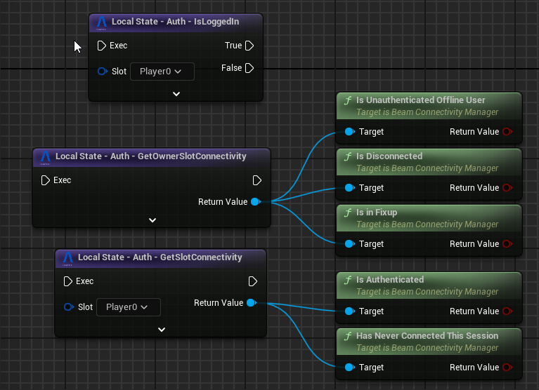

# Connectivity Management

Games with live services require access to the internet and an open connection to the backend. In the Beamable SDK, an `FUserSlot` is considered **_connected_**:

> When there's a signed-in user and the WebSocket connection (see `UBeamNotifications` and `UBeamRuntime`) for that user is alive.

The semantics above are also what our servers use to keep track of any user's online status (relevant to our real-time services like [Matchmaking](../beamable-services/matchmaking.md) and [Lobbies](../beamable-services/lobbies.md)).

## Thinking about Connectivity

The Beamable SDK provides a `UBeamConnectivityManager` class that keeps the connectivity state for any logged-in `FUserSlot`. 
- For games that have only a single _local_ player, you can use `UBeamRuntime::GetOwnerSlotConnectivity` to access the correct manager by default. 

- For games with multiple _local_ players, you can get the managers from `UBeamRuntime::GetSlotConnectivity` for each user (for the most part, they shouldn't differ in status).

In Blueprints, we have a few [special nodes](blueprints.md) for accessing this data:

After a user is logged into a `FUserSlot`, losing the connection to the Beamable backend (due to internet access loss or otherwise) will have the `UBeamConnectivityManager` go into the `CONN_Offline` state. 

**The details of this process are:**

- The WebSocket connection fails.
- We attempt to reconnect **X** times before going into `CONN_Offline` to avoid jittery short-lived instability.
  - See `Project Settings -> Beam Runtime -> ConnectivityRetryCountBeforeOffline` for **X**.
  - If all of these attempts fail, we go into `CONN_Offline`.
  - If any of these attempts succeed, the game proceeds as normal without _any_ callbacks being triggered.  

Once we go into `CONN_Offline`, two things happen:

1. We trigger `UBeamConnectivityManager::OnConnectionLost` once (per-connection loss).
    - Provides simplicity for games that want to handle connectivity loss in fire-and-forget ways such as doing a game reset, displaying a blocking pop-up, etc...   

2. We set up a Tick (`UBeamConnectivityManager::ReconnectionTick`) function to run while you are in `CONN_Offline` mode.
    - Provides more flexibility for games that want to handle connectivity loss in complex ways such as waiting for X amount of time before booting the player out, reducing available feature set, etc...
    
While in `CONN_Offline` mode, we'll keep trying to reestablish the `FUserSlot`'s connection with Beamable. This happens automatically in the background and is a continuous process.

### Reconnect behavior

If we manage to reestablish the connection, we broadcast `UBeamConnectivityManager::OnReconnected`. Then if `Project Settings → Beam Runtime → AutomaticallyNotifyFixupComplete` is:

- `true`: we immediately return to `CONN_Online`.   

- `false`: we enter `CONN_Fixup` and start ticking `UBeamConnectivityManager::FixupTick` until your game calls `UBeamConnectivityManager::NotifyFixupComplete()` (which returns to `CONN_Online` and stops the tick).  

    You'll need to use the tick function to prepare your game to return to online mode. You could:
    - Wait until your game state would function if you were to refresh the `UBeamRuntimeSubsystem` implementations.
    - Refresh the `UBeamRuntimeSubsystem` implementations.
    - Call Microservices `ClientCallables` before resuming your game's flow.  

    At this point, you are connected and everything will function just as though you were in CONN_Online mode.
    > *This state exists to help your code guard against the case of "I'm reconnected but not yet ready to function as though I'm online".*

## Refreshing State after Reconnection

The `UBeamRuntimeSubsystem` implementations DO NOT attempt to refresh their local state after reconnecting automatically. This is an intentional design decision due to the following reasons:

- The `UBeamRuntimeSubsystem` implementations are stateful systems that expose delegates to which you, the game-maker, bind events and functions.

- Connectivity can be lost and/or regained at _any time in your game's flow_. It can happen mid-cutscene, mid-gameplay, mid-pause menu, etc...

- If we automatically refreshed the subsystem's state after a reconnection, the callbacks throughout the refresh process would trigger. This means that one of the below would have to be true:
    - Upon going offline, we could unbind all callbacks (which is overeager and makes your binding code more complex) 
    - You have to write code for those delegates assuming it could run at any time (which makes it a lot harder to write that code).
    - You have to respond by any loss of connection by restarting the game (thus unbinding all delegates).
  - Our previous experience with automatic refreshing has been that it is just not worth it.
    - For every game-maker for whom our refreshing worked out of the box, it caused significant problems for another.
    
For these reasons, we decided to **_NOT_** automatically refresh and instead to **_give you the tools to correctly set up your game state as you need it to be_**. 

> You are responsible for calling the various `Refresh` operations from `UBeamRuntimeSubsystem` implementations you care about, either in the `CONN_Fixup` state's tick function OR in the `OnReconnected` callback. 

!!! warning "Why not do Request-based Heuristics?"
    We have tried estimating internet connectivity via some amount of heuristics over failed requests.
    We have found that having a semantic for connectivity that results in more stability is better.
    Requests just timeout if you're not connected to the internet and try to make them (or they are made and they can't reach the Beamable servers).

    Connectivity ONLY changes based on the WebSocket connection (which is more stable, at both the protocol level and at our own implementation level). This minimizes problems from broadcasting connectivity-related delegates in quick succession while making downstream code easier to write.
