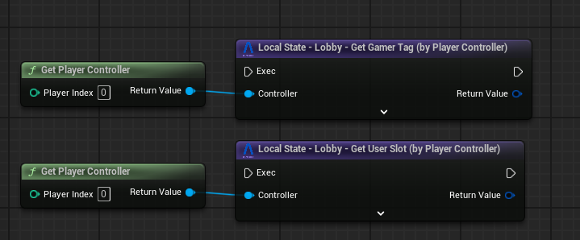
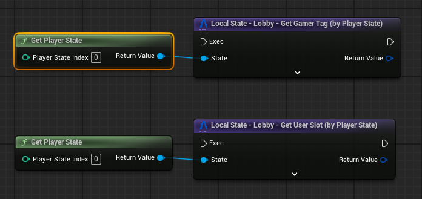
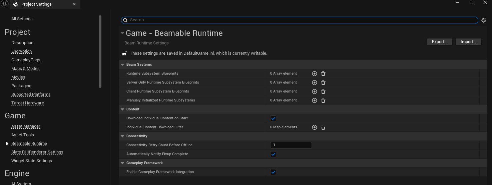

# Gameplay Framework Utilities

To streamline the integration between the Beamable SDK and the Unreal Engine Gameplay Framework, we've provided a set of utilities and helper functions. These tools are designed to simplify and accelerate your workflow when combining both systems.

Beamable introduces the concept of [User Slots](user-slots.md), which are used to manage named local players. On the Unreal side, **local players** refer to users who are directly connected to the game instance, while **remote players** are those connected via the network.

To help bridge the gap between these two models, Beamable automatically handles the mapping of local and remote players on the **client side**. However, if your game includes a **dedicated server**, some additional setup may be required to ensure this mapping works correctly on the server as well.

## Blueprint Utilities

We provide Blueprint-accessible utilities that allow you to retrieve the **User Slot** or **Gamer Tag** from Unreal’s core gameplay classes such as `PlayerController` and `PlayerState`.

### PlayerController Utility

Use this utility to access Beamable-specific player data directly from the `PlayerController`.

### PlayerState Utility

This utility enables you to access Beamable data from within the `PlayerState` class.

## Server-Side Integration

On the server side, you need to call `BeamMultiplayer::Authentication::PreLoginAsync` during the `PreLogin` phase in your custom `GameMode`. 

This step is required to correctly map Beamable users to Unreal's gameplay framework, ensuring that player identity and session data are synchronized between Beamable and the server.

> 💡 **Note:** This is only necessary if your game includes a dedicated server or uses server-authoritative logic.

## Enable/Disable the Feature

If you would like to enable/disable the automatically link between the Game Framework and Beamable, you can go to `Project Settings > Beamable Runtime > Enable Gameplay Framework Integration`. 

