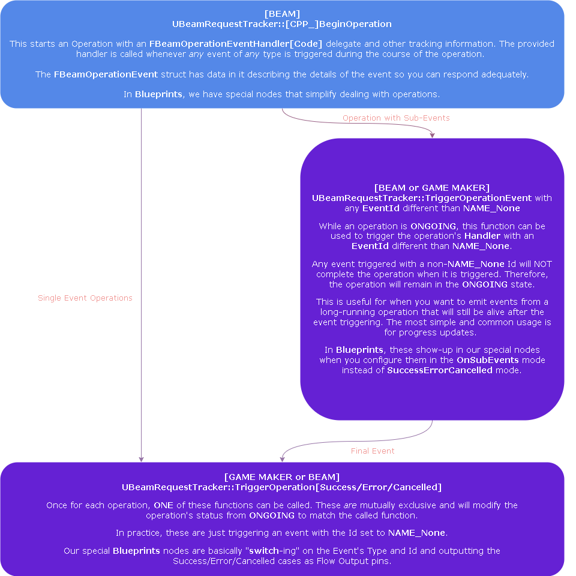
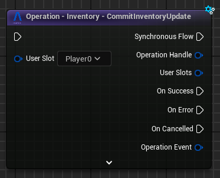

# Unreal SDK - Operations & Waits

The Beamable SDK uses a slight variation on Promises that are named Operations. These provide the same semantics as Promises, but their implementation is slightly different to allow for a BP-compatible API and "sub-events".

### How Operations Work

They wrap concurrent *operations* (mostly HTTP Requests) under a `FBeamOperationHandle` exposed to some higher-level system. Simply put:

> When you want to expose a single function that makes a bunch of async operations and emits events in the Game Thread, ultimately handling success/failure of the entire sequence of operations, use an `Operation`.

The SDK provides many Operations inside the `UBeamRuntimeSubsystem` implementations, covering most basic use cases. Understanding how to create your own operations enables you to add behavior to last-mile hooks the SDK exposes.

A couple of examples:

- "I want to go talk to a microservice to fetch additional data for a user before the SDK's `UBeamRuntime::OnUserReady` callback."
- "I want to go talk to a microservice to validate that you can actually join this matchmaking queue."

!!! warning
	While possible, avoid creating Operations as Blueprints. It's OK to do so for a quick experimentation session; but shipping with it is *not recommended*.
	**Calling *Operations* that are written in C++ is the primary way for Blueprints to interact with the Beamable SDK. The SDK even includes [special nodes](blueprints.md) for it.**

## Operation Lifecycle

Every Operation has an `int64` id called the `FBeamOperationHandle` managed by the `UBeamRequestTracker`, a `UEngineSubsystem`. The SDK uses it to track the operation's state, its emitted events, its current status and which of Beamable's requests are part of it.

The lifecycle of an operation goes as follows:



**When writing Operations, there are two ways of thinking about them:**

- **Regular Operations**: are just a "Promise".
- **Operation Hooks**: involve two operations. The first one starts and will, at a certain point, call a function that returns the second operation (either a lambda that returns an operation OR a virtual function implementation) for which the first one waits before continuing its own work.

## Writing and Exposing your Own Regular Operations
The SDK exposes all main operations in both BP and C++ flavors. If you'd like to do the same thing, this section is for you. To learn about writing hooks in C++, review the next section.

**The primary trade-off:**

- BP-Compatible versions do not allow for lambda binding and variable capturing.
- The CPP Version does allow for those things and, as they can be extremely useful for development speed and other cases, the SDK supports both flavors.

In order to easily support both flavors, the snippet below explains how you should write the actual operation logic such that it can be shared for both CPP and BP versions.

```c++
// This is the BP-Compatible Function
FBeamOperationHandle U________::__________Operation(FUserSlot UserSlot, (...OperationParams...), FBeamOperationEventHandler OnOperationEvent, UObject* CallingContext)
{
	// Start an operation using the BP-Compatible BeginOperation call
	const auto Handle = Runtime->RequestTrackerSystem->BeginOperation({UserSlot}, GetClass()->GetFName().ToString(), OnOperationEvent);

	// Call a function that takes in the operation parameters and the Handle for the operation.
	TheActualOperationLogic(UserSlot, (...OperationParams...), Handle);

	// Operation functions usually return the handle so that callers can ask questions about the state of the operation if they want to.
	return Handle;
}

// This is the CPP Function
FBeamOperationHandle U__________::CPP_________Operation(FUserSlot UserSlot, (...OperationParams...), FBeamOperationEventHandlerCode OnOperationEvent, UObject* CallingContext)
{
	// Start an operation using the BP-Compatible BeginOperation call
	const auto Handle = Runtime->RequestTrackerSystem->CPP_BeginOperation({UserSlot}, GetClass()->GetFName().ToString(), OnOperationEvent);

	// Call a function that takes in the operation parameters and the Handle for the operation.
	TheActualOperationLogic(UserSlot, Key, Value, Handle);

	// Operation functions usually return the handle so that callers can ask questions to UBeamRequestTracker about the state of the operation if they want to.
	return Handle;
}


void U__________::TheActualOperationLogic(FUserSlot Slot, (...OperationParams...), FBeamOperationHandle Op)
{
    // This is mostly an example snippet of things you can do...

    // Check the local client state and fail operations without any request ever being made.
    // For example, check if a user is authenticated or not.
    FBeamRealmUser RealmUser;
    if (!UserSlots->GetUserDataAtSlot(Slot, RealmUser, this))
    {
	RequestTracker->TriggerOperationError(Op, TEXT("NO_AUTHENTICATED_USER_AT_SLOT"));
	return;
    }

    // Prepare a request handler, capturing the "Op" Handle
    const auto SomeRequestHandler = FOn______::CreateLambda([this, Op](F______ Resp)
    {

		// If the request is being retried, do nothing.
		// A good place to update UI, for example.
		if (Resp.State == RS_Retrying) return;

		// If the request was successful, trigger the Operation as a success.
		if (Resp.State == RS_Success)
		{
			// (...) change local system's state
			RequestTracker->TriggerOperationSuccess(Op, {});
		}
		// If the request failed, trigger the Operation as an error.
		else
		{
			// (...) handle error and trigger the Operation as an error.
			RequestTracker->TriggerOperationError(Op, Resp.ErrorData.error);
		}
	});

	// Make the request passing in the "Op" Handle (this lets `UBeamBackend` know not to clean up the request until the Operation has finished)
	auto Ctx = Request____(Slot, (...ReqParams...), Op, SomeRequestHandler);
}
```

!!! warning Parameter Names and Beam Flow
	The parameter names `UserSlot`, `OnOperationEvent` and `CallingContext` are important! They allow you to write your own implementation of the Beam Flow node for your operation. Look at the [Beam Flow Nodes](#beam-flow-nodes-operations) section for more information on how to create these.

There are many examples of operations in the SDK. For guidance, look at any of the runtime subsystems such as:

- `UBeamStatsSubsystem`
- `UBeamInventorySubsystem`
- `UBeamLobbySubsystem`
- Any other sub-class of `UBeamRuntimeSubsystem`.

Feel free to copy-paste them as a template of how to implement and reason about `Operations`.

### Beam Flow Nodes - Operations
As part of the [Blueprint integration](blueprints.md), the SDK includes a few custom nodes that make invoking operations from Blueprints much simpler. These look like this:



**Beamable Operation Flow Nodes assume a few things:**

- One or more participating `UserSlots` (see [User Slots](user-slots.md) for more information).
- An event handler for handling any of the events.
- Events can be: `OET_SUCCESS`, `OET_ERROR` and `OET_CANCELLED` plus a `FName EventId`.
- Events can contain some arbitrary data associated with them (implementations of `IBeamOperationEventData`).

To create these nodes for your own operations, look at any of the SDK's nodes (inside the `UncookedOnly` module: `BeamableCoreBlueprintNodes`) and copy/paste one implementation changing the values accordingly.

**However, there are a few restrictions:**

- The function must be a `UFUNCTION` that returns a `FBeamOperationHandle` and contains the following named parameters:
	- `FUserSlot UserSlot` if a single user is involved in the operation or `TArray<FUserSlot> UserSlot` if multiple users are involved in the operation.
      - If multiple users, the `UFUNCTION` must also add `meta=(BeamOperationMultiUser)`.
	- `FBeamOperationEventHandler OnOperationEvent` to be the event handler that will handle all events raised by the operation.
    - The function can have any other parameters you want in any order as long as the above parameters are there.
- The function must be declared from inside any `UWorldSubsystem`, `UGameInstanceSubsystem`, or `UBeamRuntimeSubsystem` subclass with a `static UMySubsystem* GetSelf(const UObject* CallingContext)` `UFUNCTION` that returns the instance of itself.

**Example declaration** — the SDK source is more up to date than the docs; prefer it over this snippet.

```c++
#define LOCTEXT_NAMESPACE "K2BeamNode_Operation_CommitInventoryUpdate"

UCLASS(meta=(BeamFlowNode))
class UK2BeamNode_Operation_CommitInventoryUpdate : public UK2BeamNode_Operation
{
    GENERATED_BODY()

	// This returns the title of the node.
    virtual FText GetNodeTitle(ENodeTitleType::Type TitleType) const override { return LOCTEXT("Title", "Operation - Inventory - CommitInventoryUpdate"); }

	// This should get a static UFUNCTION that returns a valid instance of the UGameInstanceSubsystem containing the Operation function.
    virtual FName GetSubsystemSelfFunctionName() const override { return GET_FUNCTION_NAME_CHECKED(UBeamInventorySubsystem, GetSelf); }

	// This should return the UFUNCTION Operation's name.
    virtual FName GetOperationFunctionName() const override { return GET_FUNCTION_NAME_CHECKED(UBeamInventorySubsystem, CommitInventoryUpdateOperation); }

	// This should get the UGameInstanceSubsystem class
    virtual UClass* GetRuntimeSubsystemClass() const override { return UBeamInventorySubsystem::StaticClass(); }

};

#undef LOCTEXT_NAMESPACE
```

As long as you have one of these in an `UncookedOnly` module of your game, you'll be able to expose your own custom operations as BP nodes (this is compatible with Multiplayer PIE mode).

This is very useful when designing unique features leveraging [MicroServices and MicroStorages](../microservices/microservices.md) and other `FBeamOperationHandle` returning functions.

## Writing Hooks

Writing Hooks are callback points that let you customize how the SDK behaves during long-running operations.

If a Delegate or Virtual Function returns one or more `FBeamOperationHandle`, you need to create operations and return their handles. The SDK will wait on these operations before continuing its own execution. Conceptually, this lets you inject a promise into a larger long-running operation.


**There are a few flavors of this around the SDK:**

1. **Delayed Operation**: a simple callback with no parameters that returns a `FBeamOperationHandle` the SDK waits for.
	1. See `UBeamRuntime::LoginGuest` for an example of this.<br><br>

2. **Runtime Subsystem Implementation**: implementations of virtual functions in one of the SDK's base classes such as `UBeamRuntimeSubsystem`.
	1. This is for when you wish to make a system that ties into the Beamable life-cycle like the SDK's `UBeamRuntimeSubsystem` implementations do.
	2. This is rarely needed, but in unique custom use-cases it is likely to be the best way to accomplish your goals.<br><br>

3. **Hooks:** bind into delegates created via `DEFINE_BEAM_OPERATION_HOOK`.
	1. Rest assured: the Beamable Unreal SDK will never use Hooks internally. They are reserved exclusively for your extensions.
	2. You can search for `DEFINE_BEAM_OPERATION_HOOK` and find some usages of the macro to better understand these.

### Beam Operation Hooks
**Hooks** have some more context that you should know about how to use them:

1. When calling an Operation the SDK exposes, that Operation does some things and triggers the hooks at some well-known point during their execution.
	1. Since you have the source code, you can look into these functions and see the exact semantics of the trigger, but call-site comments document the exact trigger semantics.<br><br>

2. Whenever a set of hooks are triggered, what actually happens is:
	1. The returned `FBeamOperationHandles` from the hooks are fed into a `UBeamRequestTracker::WaitAll` call.
	2. The SDK operation waits for all your hooks to complete; successfully or otherwise.
	3. If registered operations fail, the errors that exist inside those operations are logged so that there is a clear trail of where the problem occurred.
	4. If your operations succeeded, the SDK continues with the operation and eventually triggers it as a success.
	5. The semantics of what happens in case of a failure change from hook to hook, but for the most part the SDK fails the operation if any hooks fail.

**Here's a "template example" of how this will typically look:**

```C++
// Synchronous hook -- no requests needed:
const U_____ SomeSystem;
SomeSystem->Hook.Add(F____::CreateLambda([this]()
{
	// (...) Does some synchronous code
	// This means that your operation is completed at the end of this function

	// Use the utility function below for synchronous hooks.
	// This creates and immediately completes an operation and returns its handle.
    return GEngine->GetEngineSubsystem<UBeamRequestTracker>()->CPP_BeginSuccessfulOperation({}, FString("MySystemName"), FString(""), FBeamOperationEventHandlerCode{});
}));

// To call a microservice as part of a hook:
// In that case you can add a hook that:
SomeSystem->Hook.Add(F____::CreateLambda([this]()
{
	// Begins an operation
    const auto Op = GEngine->GetEngineSubsystem<UBeamRequestTracker>()->CPP_BeginOperation({}, FString("MySystemName"), {});

	// Get Microservice Subsystem that exposes calls to it
    const auto MyMsApi = GEngine->GetEngineSubsystem<UMyMsApi>();
    const auto MyMsReq = UMyMsRequest::Make(GetTransientPackage(), {});

	// Create the handler for the request capturing the "Op" it is a part of.
    const auto MyMsHandler = FOnMyMsFullResponse::CreateLambda([this, Op](FMyMsFullResponse Resp)
    {
		// If the request timed out and is being retried, do nothing.
		if(Resp.State == RS_Retrying)
			return;

	    UE_LOG(LogTemp, Display, TEXT("Talked to a Microservice from a Hook!!!! Look at that, huh?"));

		// If the response from the Microservice was not a success, fail the operation.
		if(Resp.State != RS_Success)
		{
			// Trigger the operation as a success
			GEngine->GetEngineSubsystem<UBeamRequestTracker>()->TriggerOperationError(Op, Resp.ErrorData.message);
			return;
		}

		// (...) Do stuff with the Microservice's response

		// Trigger the operation as a success
       GEngine->GetEngineSubsystem<UBeamRequestTracker>()->TriggerOperationSuccess(Op, FString(""));
    });

	// Make the request
	FBeamRequestContext Ctx;
    MyMsApi->CPP_MyMs(UserSlot, MyMsReq, MyMsHandler, Ctx, Op, GetGameInstance());

	// Return the create Operation
    return Op;
}));
```

## Why not Template-based Promises?
The biggest reason is Blueprint Compatibility. The most recognizable template-based Promise-style API just won't work with BPs. The goal was an underlying system providing the same functionality while retaining BP compatibility, even without the template-based interface. The result was this `Operation` system.

!!! info
	In building the Stateful `UBeamRuntimeSubsystems` with this system, the team found the absence of template syntax and `Do().Then()` chaining to be a non-issue in practice. Chaining may be revisited eventually — perhaps as "syntactic sugar" — but template-layer additions are unlikely given the BP-Compatibility requirement.

## Waits
This is equivalent to `Promise.All` or `Task.WhenAll`, keeping with the promise analogy. It can be used to wait on a set of operations and/or requests executed concurrently whose errors and successes are handled all at once. To use this, call `UBeamRequestTracker::[CPP_]WaitAll`.

This function takes arrays of `FBeamRequestContext`, `FBeamOperationHandle` and/or `FBeamWaitHandle` and a handler function. It will wait until all provided handles are completed, gather all emitted events and request responses, and invoke your handle function, passing in a helper struct to identify successes/failures.

Examples are available in the SDK. The most common are:

- `UBeamRuntime`'s Initialization and Login's Lifecycle, defined as a multi-step operation with several wait points.
- `UBeamContentSubsystem` also has an example of fetching content updates.

---

Understanding these concepts and how to leverage them can unlock the maximum potential uses and customizability of the SDK, but superficial knowledge is sufficient for the most basic use-cases.


Take your time, read the source, and refer back to this page as you need!


