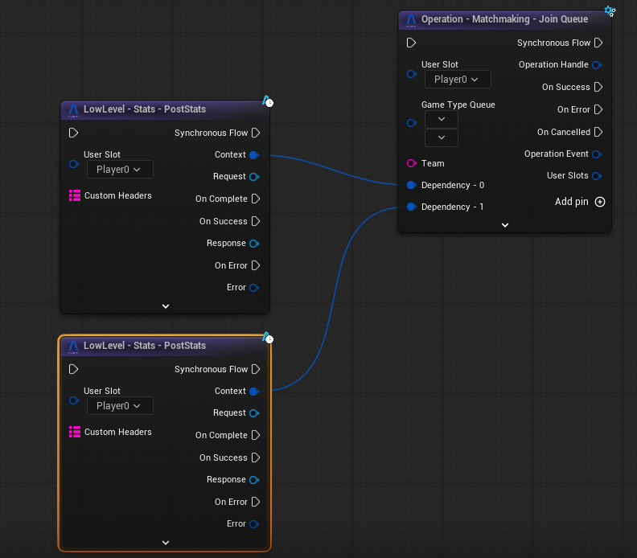

## Operations & Blueprints

To improve Blueprint usability when working with **Operations**, we introduced a built-in way to manage **dependencies between multiple operations**.  
This approach removes the need for extra “wait” nodes and simplifies execution flow.

---

## The Wait Node

Our solution provides a custom **UK2Node Wait** node that can wait on asynchronous operations, events, and similar workflows.

This node enables a clean and explicit pattern where:
- You wait for an async operation to finish
- Then continues the execution

While this works well in many scenarios, it became clear that **most usages of the Wait node existed only to Operations** before moving to the next step.

---

## Operation Dependency Pins

To solve this, each **Operation Node** now supports **Dependency Pins** via an **Add Pin** button.

Dependency pins allow an operation to explicitly depend on other operations **without requiring a separate Wait node**.

### How It Works

- Each dependency represents another operation that must complete successfully
- If **any dependency fails**, the current Operation **fails immediately**
- The failure is routed through the Operation’s **Error output pin**

---

## Execution Rules

- You can add **any number of dependencies**
- Dependencies are executed **in parallel** by default
- If you need **sequential execution**, chain operations by:
  - Adding a dependency to an operation
  - Then using that operation as a dependency for the next one or depending o the case you can just connect the output pins directly.

This gives you full control over execution order without additional nodes.

---

## Example

Below is an example showing how dependency pins are used to control execution flow between operations:

