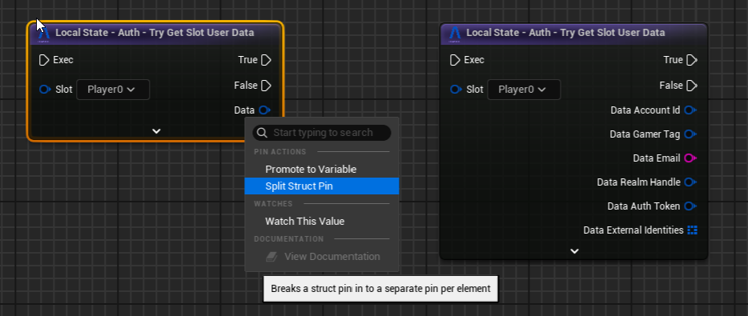

# User Slots

User Slots are at the core of how the SDK handles local users.

> Each `UserSlot` is a named slot that represents a local user.

These are defined in `UBeamCoreSettings::RuntimeUserSlots` (found in `Project Settings -> Engine`). They are used to organize local data caches for a single Beamable user. These are stored in Unreal's default `Saved` folder.

!!! note "Unreal Local Player Index"
    You can think of the `UBeamCoreSettings::RuntimeUserSlots` array as though it were indexed by Unreal's own `LocalPlayerIndex`. 

Almost all of our APIs take in a `FUserSlot` struct representing the local user making the request. Only "public" APIs do not require them (APIs that you can call after the SDK has been initialized but before any `Login` has happened).

If you're game has **no _local_ multiplayer** (just a single local player), you only need to know a few things about **UserSlots**:

- You should pass in the **Owner User Slot** (the one mapped to the "Local Player 0") to any calls taking an `FUserSlot`.
    - In C++, you can use `UBeamCoreSettings::GetOwnerPlayerSlot()` to get it.
- In Blueprints, you'll only have to manually pass in user slots if you change the default slot from `"Player0"`.
- If you're using any of our lower-level APIs (`UBeam____Api` subsystems and `Low-Level` blueprint nodes), you might see functions that take in a `UObject* ContextObject`.
    - These are there to support Unreal's Multiplayer PIE mode (for the same reason a lot of UE's own APIs also need one of these).    
    - If you're calling them from a `UGameInstanceSubsystem`, `UActorComponent` or `AActor` or `Blueprint`, you can pass itself (`this`/`Self`) to this parameter.

!!! warning "Non-Local Multiplayer Games"
    If you're game is a normal one-player-per-client multiplayer game, you might want to take a look at our [Matchmaking](../beamable-services/matchmaking.md) and [Lobbies](../beamable-services/lobbies.md) systems.

For games that do want to support multiple local players (each with their own Beamable account), the next sessions explain how this concept helps. 

## User Slots At Runtime
The `UBeamUserSlots` Engine Subsystem is responsible for:

- Storing the authentication tokens for the last account that logged into a particular slot.
    - These are kept in Unreal's default `Saved` directory.
- Enabling local co-op games to have multiple players logged in at the same time.
    - For more on login flows, see the [SDK Lifecycle](../overview.md) and various flavors described in [Identity](../beamable-services/identity.md). 
- Handles support for Multiplayer PIE-mode by namespacing each Slot (UE's `FWorldContext::WorldType` and `FWorldContext::PIEInstance`).
    - To do so, we need to find an `UWorld` to get the context from.
    - This is why, like UE, we take in a `UObject* CallingContext` in certain parts of our APIs.
    - **At runtime, this parameter is NEVER optional!**
- Assert that only slots defined in the `UBeamCoreSettings` are in use.
    - Any User Slot with `Test` in its name is exempt from this rule so you can write automated tests with arbitrary amounts of user slots by using user slots with `Test` in their names.
  
***This subsystem does not handle the actual logging in and logging out.*** That is handled by the  `UBeamRuntime` , a `GameInstanceSubsystem`, is responsible for PIE instances and packaged games.

[After logging in](../beamable-services/identity.md), you can use [these Blueprint nodes](blueprints.md) to get information about the account logged-into the given slot.

