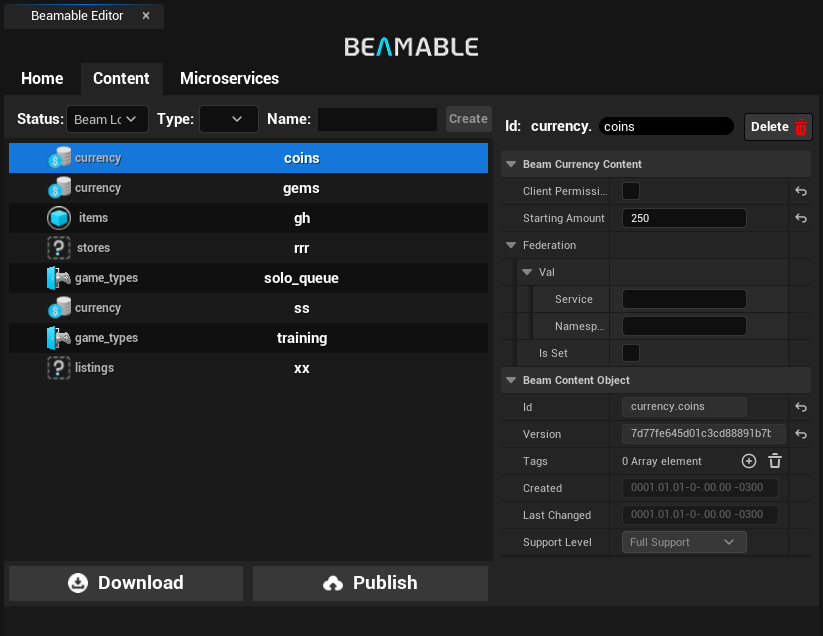
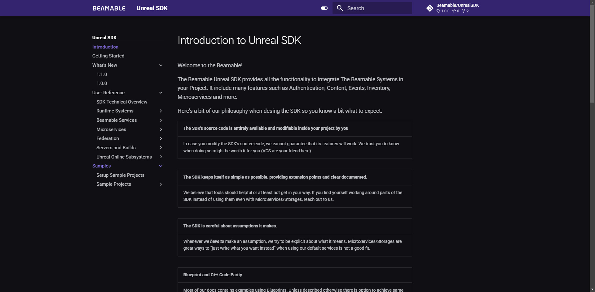
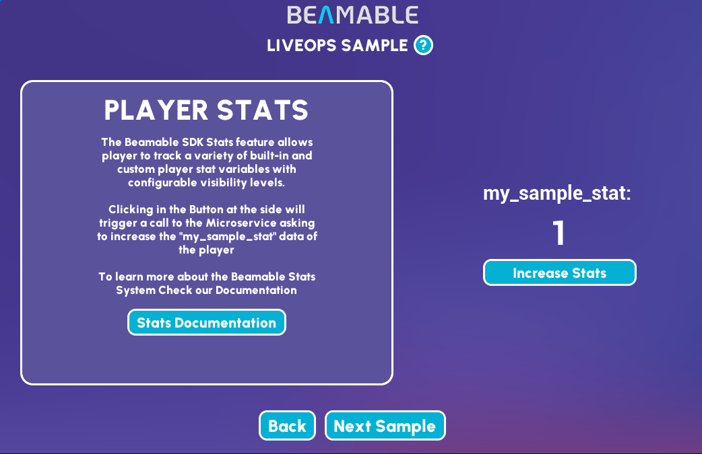

# Version 1.1.0 release notes
This is the release notes for the Beamable Unreal SDK version 1.1.0.

While it is considered a minor release in our release cycle, it brings a lot of new features and improvements to the Beamable Unreal SDK and user experience in general including many UI/UX improvements on the built-in editor window, reworked LiveOps demo, new Documentation website and many improvements on the codebase including new `OnlineSubsystemBeamable` features, and many bug fixes. You can see the full list of changes below.

## Highlights

### New Beamable editor window

The Beamable Editor Window was reworked making it easier to use the Beamable Systems in your project. Now you can easily access Home, Content and Microservices using fixed tabs on the top of the window without effort.

### New content editor

The Content Editor received a complete rework improving the usability and fixing many bugs. Now the content is presented in a list of items improving the visualization of large amounts of data; The filters were fixed on the top and the search is now a `Contains` search instead of a `StartsWith` search. Also, all changes in the data are now updated properly with real-time feedback without need to reload the window manually. You can check the new Content Editor Documentation [here](../user-reference/beamable-services/content.md)

### New connectivity management utilities
In this version, the SDK now exposes utilities to assist you in dealing with loss of connectivity to the Beamable servers. These utilities allow you to gracefully respond to connection losses and instability.
For more details, check out [this page](../user-reference/runtime-systems/connectivity.md).

### New Unreal documentation

The Unreal Documentation was reorganized and improved to better guide the users on how to use the Beamable System in your project. More improvements in the Documentation of all Beamable Products are coming soon.

### New LiveOps sample

The LiveOps Sample was improved with new UI and information. You can check the new LiveOps Sample Documentation [here](../samples/live-ops-demo.md)

## Other changes
- `OnlineSubsystemBeamable` plugin now supports Frictionless Authentication and Identity Attaching
    - This is the last feature update to this subsystem as it is now discontinued
- Samples are now selected by running `dotnet beam unreal select-sample BEAMPROJ_Name` instead of `BeamProjOverride.txt`
- `beam_init_game_maker.sh` will now try to remove any read-only flags of files inside the existing `Plugins/BeamableCore` folder
  This is needed because UE's integrations with VCSs (Git, P4) will often lock binary files at the filesystem level, which then
  leads to our CLI being unable to replace the folder with newer versions (due to "access denied" problems). If you are using a VCS that
  makes files read-only at the filesystem level, and you run into "access denied" issues when running this script, make them not read-only and try again.
- `UBeamNotifications::TrySubscribeForMessage` now also accepts any type implementing `IBeamJsonSerializableUObject` for its message type
  This enables usage of the `BeamGenerateSchema` attribute in microservice code to keep custom notification payloads in-sync between Microservice and UE code.
- Added support for serializing `FColor`, `FLinearColor`, `FVector` and `FIntVector` inside `UBeamContentObject`types
- Local Microservices started from the Unreal editor will now correctly terminate when the editor closes

## Fixes
- Fixed issue that could cause an internal engine check to fail during editor startup in very rare cases (PostObjectLoad issue)
- Fixed issue that could cause a crash when re-logging into any particular UserSlot (a cleaned up operation could be waited on; no longer possible now)
- Fixed an issue that would cause a subsystem initialized with `UBeamRuntime::ManuallyInitializeSubsystem` to not load its user's data correctly if the user signed in **after** the system was initialized
- Fixed multiple cases where the Content Screen did not update automatically after changes

## Known issues
- When creating a custom event by hand, adding a `FUserSlot` parameter pin to that event can sometimes crash the engine. This also seems to happen with _some_ Unreal types that have custom pins (the same crash happens with `bool` pins, though less frequently)
    - This does NOT happen if you create the event using the functionality in the `CreateEvent` node OR by any other means of creating a custom event with all the pins it knows it should have
    - This crash also seems less likely to happen the longer the editor stays open
