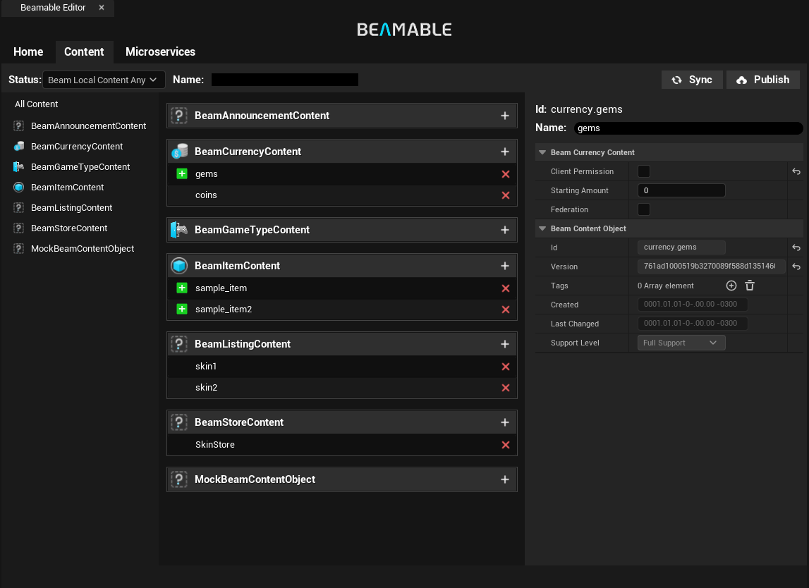
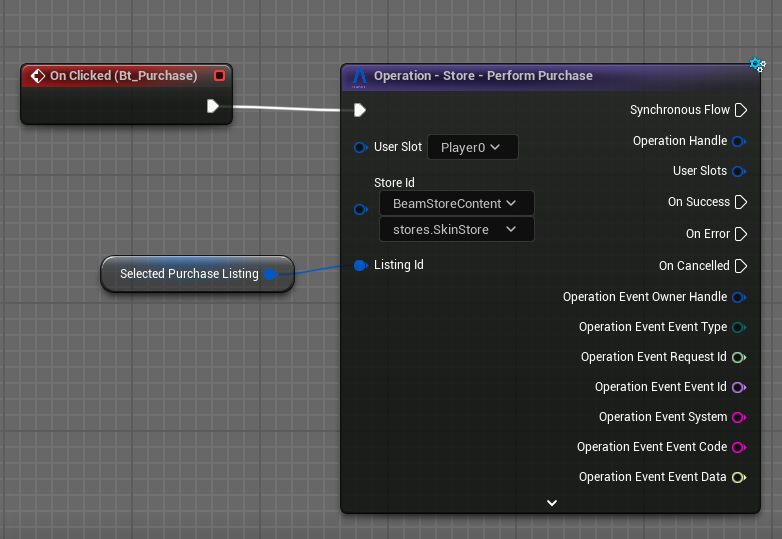

# Version 2.0.x Release Notes

## Version 2.0.1
This is the release notes for the Unreal SDK version 2.0.1.

This release has several fixes w.r.t increasing support for MacOS as a development platform, fixing certain dedicated server (linux) issues as well as updating the backing CLI version for additional fixes within the microservice code-generation pipeline.

**Follow the instructions to upgrade from [here](../getting-started/setup.md#upgrading-the-sdk)**. 

Then do the following:

- If you're upgrading from `1.X.X`, please follow any instructions in the [version 2.0.0 upgrade guide](#version-200).
- In order to fix a bug, this hotfix requires that you regenerate your microservice clients after rebuilding the microservice projects, if you have any. So you'll need to run: `dotnet beam project generate-client "."`
- Recompile your editor.


### Changes
- Added an override to the path to `dotnet` (found in `Project Settings -> Beam Editor`) so that non-default `dotnet` setups can be used.
    - In some dev's setups, `dotnet` might be installed in non-default locations --- you can now override where we look for the `dotnet` executable when invoking our CLI (from within the editor integration).
    - This changes nothing about the runtime of your program; it only affects how we use the CLI (which is not used outside the Unreal Editor integration).
    - After changing this setting, please re-open the editor.
- Added null guard to all `U[BeamJsonSerializableUObject]Library::Break` functions (change between ensure/silent-skip in `Project Settings -> Beamable Core -> bSilenceBreakGuardEnsures`).
    - This allows you to configure how `Break` nodes for this type respond to being given a null `UObject`. In most cases, however, we recommend you organize your program in a way that you can guarantee this is never null and keep the default ensure settings.

### Fixes
- Fixed linux compilation problem when compiling with stricter options.
- Fixed default `dotnet` path for MacOS.
- Fixed issue where `CallingContext` wasn't being passed along in `Authenticate` calls in certain edge-cases
- Updated Auto Generated `UBeam___Api` classes code to fix a problem that would cause multiple PIE instances to behave incorrectly when running in non-standalone process mode.


## Version 2.0.0
This is the release notes for the The Unreal SDK version 2.0.0

This is a major release in our release cycle, it brings a lot of new features and improvements to the Beamable Unreal SDK support and user experience in general including a new Content Editor, a complete overhaull of our blueprint nodes, support to Friends and Parries, new support to Android and many others.

Follow the instructions to upgrade from [here](../getting-started/setup.md#upgrading-the-sdk). Then do the following:

- Go into your `Saved/Config/WindowsEditor/EditorPerProjectUserSettings` and remove any setting referencing a `BeamEditorBootstrapper` (or `UBeamEditorBootstrapper`).
  - We changed the way the Editor environment is initialized and having this here will cause the initialization to run twice which can lead to instability. 

### Highlights

#### Unreal Engine 5.5.x Support
The Unreal SDK now supports Unreal Engine 5.5.x as it minimum version. Older versions of Unreal Engine are no longer officially supported. If you are using an older version of Unreal Engine, we recommend you upgrade to 5.5.x to take advantage of the latest features and improvements os stay in the 1.x versions of the Unreal SDK.

#### Android Support


The Unreal SDK now supports Android builds officially, allowing you to build and deploy your games on Android devices. This includes support for the Beamable services, as well as the ability to use the Unreal Engine's native Beamable features.

#### New Content Editor System
The Content Editor received yet another rework based your feedback with additional filtering capabilities and an improved CLI-based backend that is faster, handles file-system operations better and enforces less blocking operations.



The new CLI-backend also enables new [workflows for designers](../user-reference/beamable-services/content.md) that might want to share a stable realm while working directly with content. Details can be found in the updated Content documentation.

!!! warning "Detected Changes"
    Until you publish content to the realm the first time after the update, the content will show up as modified. This has to do with us standardizing the underlying hashing to solve problems that would cause content to be accused as modified with no changes done.

#### Support to Friends and Parties
The Unreal SDK now supports the [Friends](../user-reference/beamable-services/friends.md) and [Parties](../user-reference/beamable-services/parties.md) features of Beamable. This includes the ability to send and receive friend requests, manage your friends list, and create and join parties.

#### Blueprint Nodes Rework
The Blueprint nodes have undergone a comprehensive overhaul to enhance consistency and ease of use. Updates include clearer node naming, refined input and output types, and significant improvements to overall usability. Additionally, we've introduced a [dedicated section](../user-reference/runtime-systems/blueprints.md) to help users better understand how to effectively utilize Blueprints with the Unreal SDK.



As part of this overhaul, a lot of `Operations` had to be slightly renamed to aid with discoverability and API consistency. We highly recommend a few things:

- In Blueprints, replace all direct calls to `UBeamRuntimeSubsystems` with the new custom nodes that affect those systems.
- For C++, since semantics remain un-changed, the compiler is your friend. It is a simple matter of changing the function being called to the appropriate one.

#### Player Initialization Federations
A common use-case for live-services game is to define a starting state for user accounts. The way to do that within Beamable is via the [Player Init Federation](../user-reference/federation/federated-player-init.md) interface in your microservice.

This federation is guaranteed to run only once per player, whenever the player is created in the realm. At the Unreal SDK side, all SignUp functions expose the `InitProperties` parameter which is a map that will be passed along to the `IFederatedPlayerInit` in the microservice. This can be leveraged to implement custom sign-up flows and even special sign-up cases that provide players a better starting state should your game benefit from such a design.

#### Microservice Client-Code Generation
In the previous versions of the SDK, you could set `<GenerateClientCode>true</GenerateClientCode>` in the `.csproj` of your Microservices in order to generate the client code for them on every rebuild. 

This is no longer possible.

We made this change for a few reasons:

- For projects with multiple microservices, a solution-wide rebuild triggers one generation process per-project rebuild. As each code-gen must take into account ALL services due to Unreal's namespacing limitations, this is not always desireable and can cause an entire class of complex problems.
- It would trigger at inconvenient times (ie: with the UE editor open) which could sometimes cause UE-related issues.

Keep in mind that if you and your team like the old automatic post-build process, you can achieve that for your team by using IDE run configurations that run this command as a post-build/run process.

In this version of the SDK, this is a manual process. Just run the following command line from inside your Unreal project's directory whenever you wish to generate your latest client code. You can also add a run configuration in your IDE if you prefer to just press a button to trigger the regeneration.

```bash
dotnet beam project generate-client "."
```
### Other Changes
- It is now possible to use local microservices when running in from the Editor as a Standalone Game OR against a build. Useful for games that want to test their Steam/Beamable integration for example.
    - CLArg: `beamable-routing-key-map`
    - EnvVar: `BEAMABLE_ROUTING_KEY_MAP`
    - In the editor, this is automatically kept in sync with the selected microservice target and `Editor Preferences -> Play -> Play in Standalone Game -> Additional Launch Parameters` so you can use the editor's `Standalone Game` PIE-mode option (useful for when testing Steam, for example).
- All non-frictionless `SignUp` functions now have auto-login option; which will automatically try to login into the given account should the identity being signed up as be already in use.
- CLI is now optionally installed --- none of the beamable editor functionality will be available and the project will always set the TargetRealm to the branch-wise realm; not the local override.
    - Basically, if you want to have a subset of your team work without the ability to swap realms and/or interact with Beamable's editor workflows at all; you no longer need to install the CLI for that subset.
    - In most cases and for most teams, we recommend you **don't** do this and instead just have .NET and the CLI installed for everyone though.
- `UBeamContentObject` now supports `FText` usage with `StringTable`.

#### CLI/Microservices - Upgrade Instructions
If you were using the `FederatedGameServer` interface, you'll also have to do this.

```csharp
// The type in the signature was changed to use our AutoGenerated lobby type.
// This change aims to make future updates simpler and automatic (since any new fields added to our 
// backend's lobby structure will become immediately visible via our AutoGenerated API.
public async Promise<ServerInfo> CreateGameServer(Api.Autogenerated.Models.Lobby lobbyAutoGenerated)
{
    var lobby = lobbyAutoGenerated.ConvertLobbyType();

    // Your old code that does something...
}
```

We made a few changes to our authentication flow to make realm changing a faster and simpler process. In light of that, you'll need to re-authenticate with the CLI. So, run `dotnet beam login` and re-authenticate into your organization.

### Fixes
- `ENotificationMessageType` names are now prefixed by `BEAM_` to avoid enum name conflicts with user declared enums in Linux builds.
- `UBeamContentObject` serialization now correctly sorts the json's properties by name to ensure the generated JSON is deterministic and therefore the hash we use to decide whether its changed/unchanged is kept deterministic too.
- Fixed issue that caused double deletion of `UBeamContentObject` map property's entries when modifying them via the details view of the `Content Window`

### Known Issues
- When creating a custom event by hand, adding a `FUserSlot` parameter pin to that event can sometimes crash the engine. This also seems to happen with _some_ Unreal types that have custom pins (the same crash happens with `bool` pins, though less frequently).
    - This does NOT happen if you create the event using the functionality in the `CreateEvent` node OR by any other means of creating a custom event with all the pins it knows it should have.
    - This crash also seems less likely to happen the longer the editor stays open. 