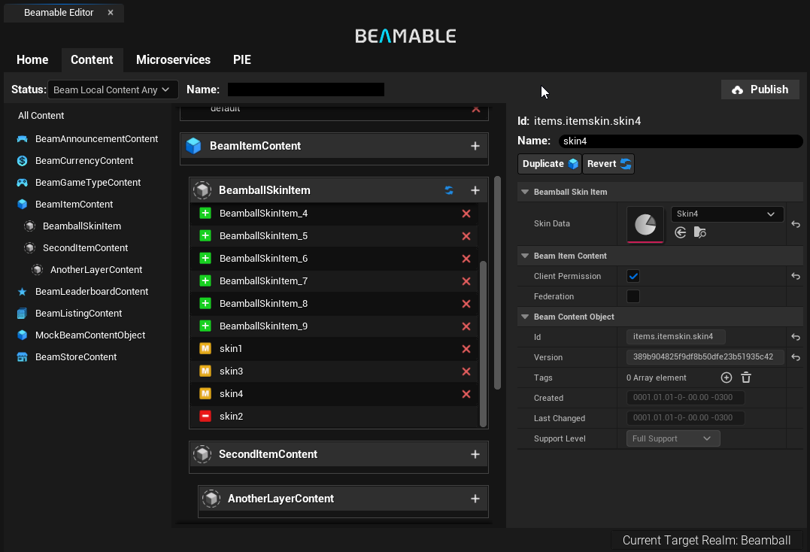

# Version 2.1.0
This is the release notes for the The Unreal SDK version 2.1.0

Despise this being a minor version, it contains a lot of changes and improvements to the Unreal SDK. Including more **improvements on the Content Editor**, a **Full Featured Game Sample** and the new **Beamable PIE Settings** and **Runtime Multiplayer Workflows**.

# Highlights

## Beamball - Full Featured Game Sample

Beamball is a full featured 1x1 Multiplayer game sample that showcases the Beamable Unreal SDK and its features. It includes a complete game loop, from the main menu to the gameplay, with a fully functional multiplayer system, hatora integration, inventory, stores, and more. The Beamball game sample is designed to be a reference implementation of a game using the Beamable Unreal SDK, and it can be used as a starting point or reference material for your own games.

## PIE Settings and Runtime Multiplayer Workflows
The new Beamable PIE Settings provide a more flexible way to configure your game for Play In Editor (PIE). With this system, you can create, capture, and save player profiles for use at runtime, as well as define custom play presets directly within your Unreal projects. This makes it possible to test your game across different configurations and entry points without constantly adjusting your project settings. You can even simulate custom lobbies inside gameplay scenes by overriding both per-player and global settings.

PIE User Settings UI

PIE Play Settings UI

We made available two ways to implement this system in your project. In "Blueprint Mode", you can enable it by simply adding a single node to your Level Blueprint, making it quick and accessible. In C++ Mode, you gain access to the full power of Beamable PIE Settings, offering enhanced stability, performance, and advanced workflow options.

This system is totally optional and marked as "Experimental" in the Beam Core Settings, You can still use the default Unreal workflows if you prefer. However, we recommend using the Beamable PIE Settings and Workflows to take advantage of the new features and improvements.

The complete documentation for the Beamable PIE Settings can be found in the [PIE Settings](../user-reference/editor-systems/pie-settings.md) page alongside the new [Beamble Realtime Mulplayer Systems](../user-reference/realtime-multiplayer/realtime-multiplayer-overview.md) documentation

## Content Editor Improvements

We continue working on the Content Editor to make it more powerful and flexible. In this version, we implement contextual scroll views on the Content List and an operator to revert all modified contents of a specific type. This allows you to easily navigate and manage your content in the Content Editor, and to revert changes made to your content if needed.

# Other Changes

# Fixes
- Fixed issue that, when running PIE in separate processes, the RoutingKeyMap would not be accessible to those PIE instances consistently. This would prevent local microservices from being reached. 