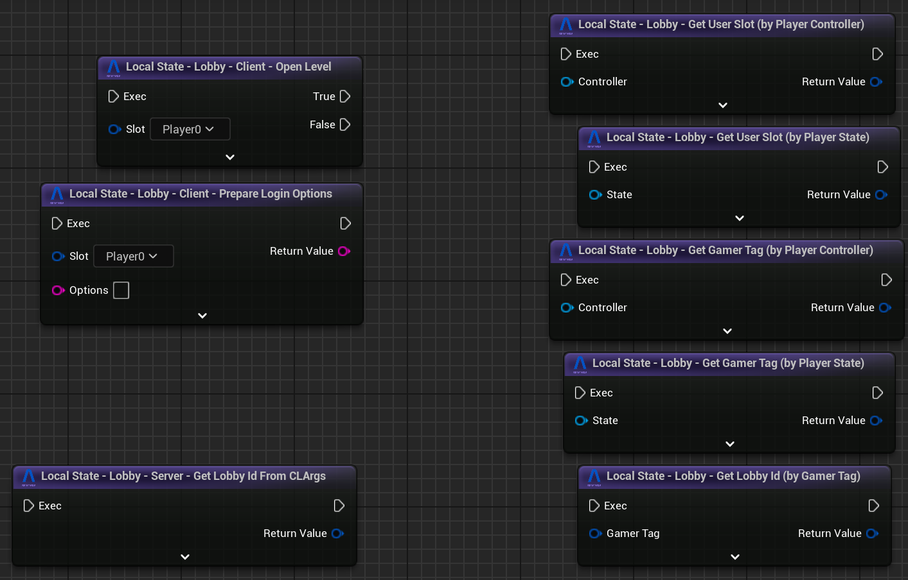
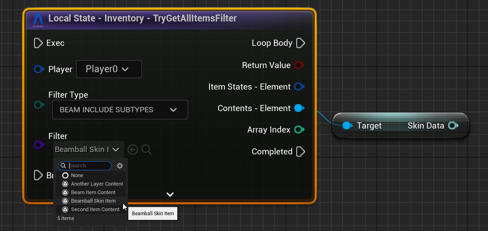
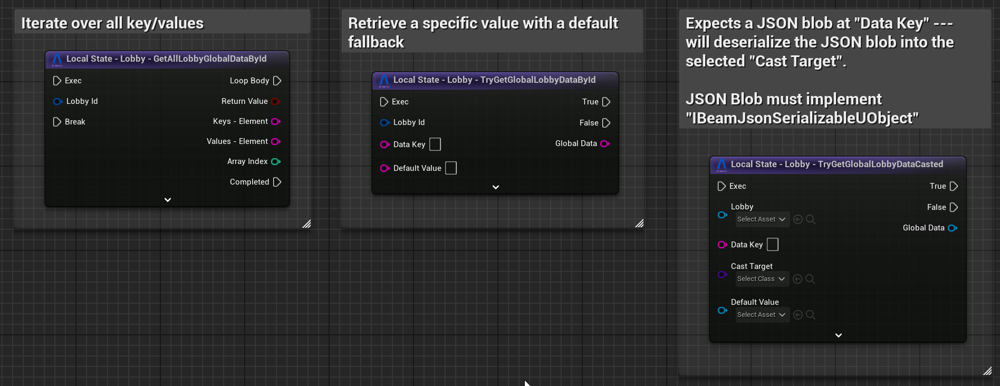
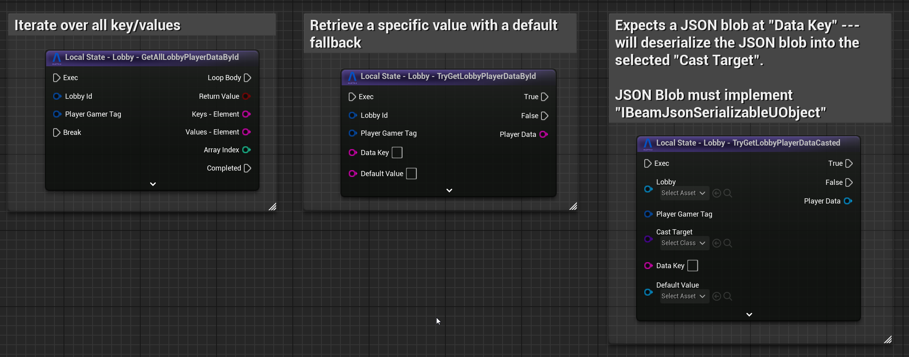

# Version 2.1.0
This is the release notes for the Unreal SDK version 2.1.0.

Despite this being a minor version, it contains a lot of changes and improvements to the Unreal SDK. Including more **improvements to the Content Editor**, a **Fully-Featured Game Sample**, the new **Beamable PIE Settings** and brand-new **Real-Time Multiplayer Workflows**.

**To upgrade to 2.1.0, please follow the instructions to upgrade from [here](../getting-started/setup.md#upgrading-the-sdk)**.

Then do the following:

- If you're upgrading from any older version, please also look at the **What's New**/**Upgrade Guide** for the versions in between.
- In order to enable much better integration with PIE and Real-Time Multiplayer games, this release requires that you regenerate your microservice clients after rebuilding the microservice projects, if you have any. So you'll need to run: `dotnet beam project generate-client "."`
- Recompile your editor.

# Highlights

## Beamball - Full Featured Game Sample

Beamball is a full featured 1x1 Multiplayer game sample that showcases the Beamable Unreal SDK and its features. It includes a complete game loop, from the main menu to the gameplay, with a fully functional multiplayer system, hatora integration, inventory, stores, and more. The Beamball game sample is designed to be a reference implementation of a game using the Beamable Unreal SDK, and it can be used as a starting point or reference material for your own games.

## PIE Settings and Real-Time Multiplayer Workflows
The new Beamable PIE Settings provide a more flexible way to configure your game for Play In Editor (PIE). With this system, you can create, capture, and save player profiles for use at runtime, as well as define custom play presets directly within your Unreal projects. This makes it possible to test your game across different configurations and entry points without constantly adjusting your project settings. You can even simulate custom lobbies inside gameplay scenes by overriding both per-player and global settings.

PIE User Settings UI

PIE Play Settings UI

We made available two ways to implement this system in your project. In "Blueprint Mode", you can enable it by simply adding a single node to your Level Blueprint, making it quick and accessible. In C++ Mode, you gain access to the full power of Beamable PIE Settings, offering enhanced stability, performance, and advanced workflow options.

This system is totally optional and marked as "Experimental" in the Beam Core Settings, You can still use the default Unreal workflows if you prefer. However, we recommend using the Beamable PIE Settings and Workflows to take advantage of the new features and improvements.

The complete documentation for the Beamable PIE Settings can be found in the [PIE Settings](../user-reference/editor-systems/pie-settings.md) page alongside the new [Beamble Realtime Mulplayer Systems](../user-reference/realtime-multiplayer/realtime-multiplayer-overview.md) documentation.

### Better Integration with UE Gameplay Framework Classes
We also added an several mapping utilities that help, both clients and servers, map UE constructs like `Player Controllers`, `Player State` and `Local Player Index` to Beamable constructs such as `GamerTags` and `User Slots`.
For non-RT-multiplayer games, these were added to the `UBeamRuntime` subsystem. Please refer to our [Beamble Realtime Mulplayer Systems](../user-reference/realtime-multiplayer/realtime-multiplayer-overview.md) and our [Lobby](../user-reference/beamable-services/lobbies.md#utilities-for-dedicated-server-games) for more information on how this works for RT Multiplayer games.

## Content Editor Improvements

We continue working on the Content Editor to make it more powerful and flexible. In this version, we implement contextual scroll views on the Content List and an operator to revert all modified contents of a specific type. This allows you to easily navigate and manage your content in the Content Editor, and to revert changes made to your content if needed. We also added ways to easily duplicate content objects. 

## More Blueprint Improvements

As part of our continuous effort to improve usability of the SDK in Blueprints, we've added several casting-based utilities when dealing with content, stats, inventory and lobbies. These utilities are meant to reduce the number of nodes you need to accomplish certain common patterns like, for example, casting a content object when you are iterating over items of the same type.

In this first one, we infer from the content id what the UBeamContentType subclass is and automatically cast for you. If the pin is connected, _only automatic cast to the highest level subclass in the content hierarchy_. For example, if you know the content ids passed into that pin are all subtypes of `UBeamItemContent` you'll be able to cast it. 

For inventory, you can now iterate over all types (exact match or sub-types included) more easily --- the node will also provide you with an already-cast `UBeamContentObject` pin since most of the time you need to access both the item properties as well as the item content itself.

Finally, it is very common to store custom JSON blobs inside a Lobby's Global Data or Player Data maps. If you have any `UObject` that implements `IBeamJsonSerializableUObject`, you can use these nodes to automatically cast the JSON to it. Today, we don't do any cache-ing of the deserialized objects --- so please keep that in mind. Also, if you are using Microservices to put these custom JSON blobs into the lobby in the first place, you can use the `BeamGenerateSchema` attribute on the C# type in order to generate the C++ code for that custom JSON blob the Microservice is writing to the Lobby.

There are more of these nodes but those are the 3 types of improvements we've made. You can expect more of these utilities to appear in all stateful subsystems of the SDK in the future. 

# Other Changes

## Added
- Added auto-conversion between `FUniqueNetIdRepl` and `FBeamGamerTag` (only valid when using `UBeamRuntimeSettings::bEnableGameplayFrameworkIntegration` --- default is `true`)
- Added `UpdateGlobalDataOperation` to `UBeamLobbySubsystem` so we can just commit simple updates/removes with a single operation node.
- Added new utilities to the `UBeamFriendsSubsystem` to help getting information (`TryGetUserReceivedInvites`, `TryGetUserSentInvites`, `TryGetUserBlockedFriends` and `FBeamGamerTag`-based variations of these)
- Added utility Cpp-only functions for `FBeamOperationEvent::CompletedWith____` and `FBeamOperationEvent::Is____SubEvent(FName)`.
- Added ability to override a few request headers for special cases inside dedicated game servers (`UBeamBackend::OverrideRequestGamerTag` and `UBeamBackend::OverrideRequestAuthorization`).

## Changes
- `federations.json` file of each microservice is no longer required --- you can remove this file safely after upgrading.
- All Sign Up flows in the SDK now use dedicated endpoints instead of being a Login Guest wrapper --- this should have NO semantic differences in your client code, but it may affect your `Login` federations depending on what you are doing in them.
- `UBeamStatsSubsystem` now fetches the `client.private` stats. (This is only fetched for authenticated users).
- We've modified the internals of the code-generation and regenerated all our `UBeam____Api` subsystems. This change also means you'll need to regenerate your Microservice Clients with `beam project generate-client "."`.
- Operation node's sub-event flow pins now appear BEFORE any of the final events in the list of pins.
- `ENotificationMessageType` was missing the `BEAM_` prefix on its members which could cause naming conflicts --- added the `BEAM_` prefixes to prevent that.
- The content window now displays the content type list sorted alphabetically.
- (Editor) The CLI is now an semi-optional dependency to the Beamable SDK. Without the CLI, the SDK will ONLY work in PIE --- none of the Beamable Window features are accessible and you'll be locked into the target realm set in your `ini` file. Because of that, we strongly recommend you have the CLI installed for every developer doing work inside the Unreal Editor.
- We revamped the internals of how you log into the Editor (via the Beamable Window). Now, the Beamable Window provides better error messages during its initialization process and the current in-editor Target Realm is kept in-sync with the CLI automatically.

## Fixes
- Replaced `checkf` with `ensureAlwaysMsgf` in `UBeamStatsSubsystem`.
- Fixed issue that caused Operation nodes with sub-events to trigger the `Success` callback multiple times when the node was set in `Success_Error_Cancelled` mode.
- Fixed issue in `UBeamStatsTypeLibrary::BreakStatsType` that could cause the `GamerTag` to be incorrectly set.
- Fixed issue in `UBeamUserSlot::GetUserDataWithGamerTag` that would cause it to return incorrect Slots when running in PIE multiplayer.
- Fixed rare crash issue that could happen during a user's authentication flow during PIE.
- Fixed issue in notification deserialization that caused it to have no set OuterOwner field (which, in some cases, could lead to downstream crashes inside user-code).
- Fixed rare issue that could cause `UBeamConnectivityManager` to mistake a login attempt for a reconnection attempt which would result in a crash.
- (Editor) Deleted content items in the no longer show the Delete button (X) in the Content Window
- (Editor) Deleted content items no longer allow renaming (disables the name field)
- (Editor) Fixed very rare editor crash issue that was caused by the CLI emitting events a message during a GC pass.
- (Editor) Fixed issue that, when running PIE in separate processes, the RoutingKeyMap would not be accessible to those PIE instances consistently. This would prevent local microservices from being reached.
- (Editor) Fixed issue that caused deleted content files not to be correctly re-downloaded whenever you reverted.
- (Editor) Fixed issue that caused errors that happened during a content publish not to be displayed in the error dialog.
- (Editor) Fixed issue that would cause "Goto Definition" on custom beam nodes to not link correctly to code.