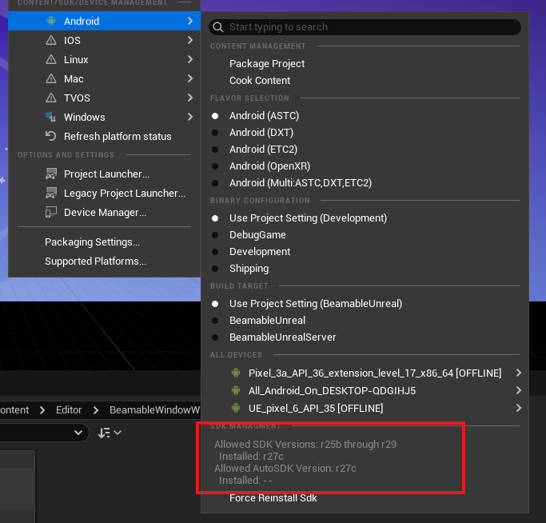

# Version 2.2.0 Release Notes
This is the release notes for the Unreal SDK version 2.2.0.

## Highlights

## Other Changes
- "Fake Lobby" now is called "PIE Lobby" in the UI.
- Ignore Temporary Maps in the List of Available Maps and Server Override Map of the Play Preset.


## Support to UE 5.6

### Fix: Unreal Engine Android Not Working 

If you're experiencing issues with Android packaging or deployment in Unreal Engine 5.6, follow these steps to resolve it:

Error Log: `error: undefined symbol: std::__ndk1::__libcpp_verbose_abort when packaging APK`

#### Steps to Fix:

1. **Close your Unreal project completely.**

2. **Delete the following folders from your project directory:**
   - `Intermediate`
   - `Saved`
   - `DerivedDataCache`
   - `Binaries`
   - `Build`

3. **Run the Android setup script:**
   - Navigate to:
     ```
     C:\Program Files\Epic Games\UE5.6\Engine\Extras\Android\
     ```
   - Run the file:  
     ```
     SetupAndroid.bat
     ```
   - Wait for the script to finish unzipping and installing dependencies.
   - Once prompted, press `Enter` to complete the process.

4. **Reopen your project in Unreal Engine.**
   - The Android functionality should now be restored.
 
**Reference how it should looks like.**

 