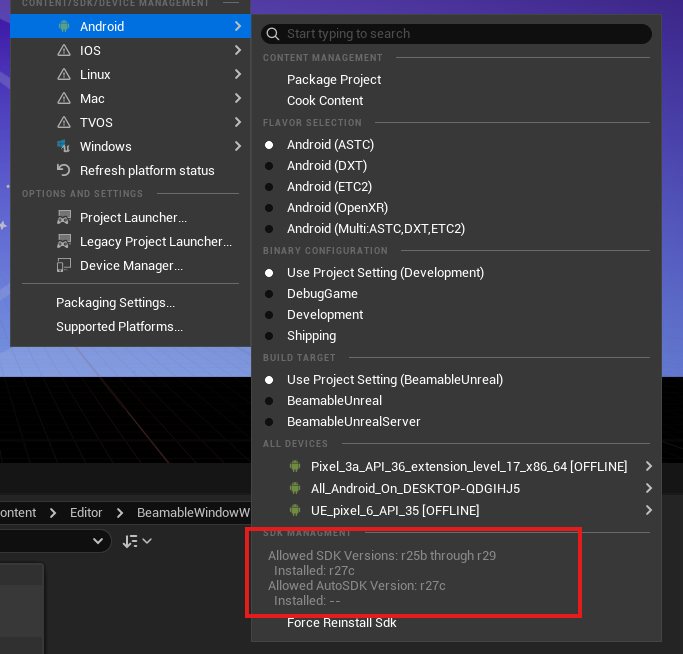

# Version 2.2.X release notes

## Version 2.2.1

This is a patch release for the Beamable Unreal SDK version 2.2.1.

### Other changes:

- C# Microservices Code Gen - Fixed an issue in the **code generation pipeline** that affected both **microservices** and **low-level services** in the latest release
- SDK - Fixed a race condition that could cause the `BeamMultiplayer::Authentication::PreLoginAsync` reject a user that was in the lobby

### Upgrading

If you are upgrading from version 2.2.0, the upgrade process is very simple:

- Follow the [Upgrade Guide](../getting-started/setup.md#upgrading-the-sdk)
- This release requires that you regenerate your microservice clients after rebuilding the microservice projects, if you have any. So you'll need to run: `dotnet beam project generate-client "."`
- Recompile your editor

If you are upgrading from any older version, also see the **What's New**/**Upgrade Guide** for the versions in between.

## Version 2.2.0

This is the release notes for the Beamable Unreal SDK version 2.2.0.

This is a minor release that includes support for Unreal Engine 5.6 and some other fixes and small improvements.

### Highlights

#### Support for Unreal Engine 5.6

The Beamable Unreal SDK now supports Unreal Engine 5.6 officially, allowing you to take advantage of the latest features and improvements in the engine.

### Other changes
- Unreal Editor - Ignore Temporary Maps in the List of Available Maps and Server Override Map of the Play Preset
- Unreal Editor - Filters out players with CID different from the actual project
- Unreal Editor - "Fake Lobby" now is called "PIE Lobby" in the UI
- Unreal Editor - Implemented Delete Cached Content Button in the UI
- Unreal Editor - When duplicating a content item, it automatically selects the created item and sets the focus to the Name Text Field

### Upgrading

If you are upgrading from version 2.0.1, the upgrade process is very simple:

- Follow the [Upgrade Guide](../getting-started/setup.md#upgrading-the-sdk)
- This release requires that you regenerate your microservice clients after rebuilding the microservice projects, if you have any. So you'll need to run: `dotnet beam project generate-client "."`
- Recompile your editor

If you are upgrading from any older version, also see the **What's New**/**Upgrade Guide** for the versions in between.

#### Fixing Android Packaging/Deployment issues in UE 5.6

In Unreal Engine 5.6, you can find Android packaging and deployment [issues](https://dev.epicgames.com/community/learning/tutorials/d6ne/how-to-fix-unreal-engine-5-6-1-error-undefined-symbol-std-__ndk1-__libcpp_verbose_abort-when-packaging-apk) occurring due to a conflict between Unreal and certain internal Android NDK libraries. This problem affects projects using NDK versions 28 or above. The root cause is the mismatch introduced in how UE 5.6 interacts with the newer NDK libraries, and resolving it requires adjusting your setup following these steps:

1. Close your Unreal project completely
2. Delete the following folders from your project directory: `Intermediate`, `Saved`, `DerivedDataCache`, `Binaries`, `Build`
3. Run the Android setup script:
      1. Navigate to: `C:\Program Files\Epic Games\UE5.6\Engine\Extras\Android\`
      2. Run the file: `SetupAndroid.bat`
      3. Wait for the script to finish unzipping and installing dependencies
      4. Once prompted, press `Enter` to complete the process

4. Reopen your project in Unreal Engine
      1. The Android functionality should now be restored

Now it would look like this in your project:
 

#### Changes to `.ini` files in the new Unreal version

Previously, our custom configurations were included in Unreal’s default configuration files, Now, these settings have been moved into separate files with the **"Beam"** prefix, allowing for a clearer separation between base project settings and Beam-specific settings.

If you have customized the default Beamable settings, copy them into the corresponding new files according to the table below:

| Old File             | New File               |
|----------------------|------------------------|
| `DefaultGame.ini`    | `DefaultBeamGame.ini`  |
| `DefaultEngine.ini`  | `DefaultBeamEngine.ini`|
| `DefaultEditor.ini`  | `DefaultBeamEditor.ini`|
