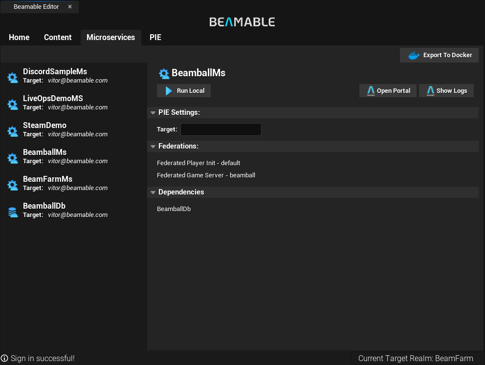
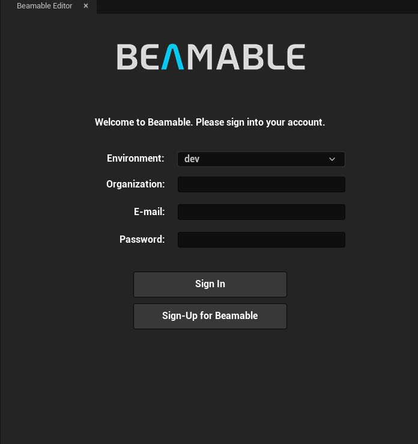

# Version 2.3.0 Release Notes
This is the release notes for the Unreal SDK version 2.3.0.

## Highlights

### IOS Support
We are excited to announce that Beamable Unreal SDK now supports iOS platform! You can now build and deploy your Beamable-powered games on iOS devices, expanding your reach to a wider audience.

{width="400"}

### New Microservice Editor
The Microservice Screen was reworked from scratch improving the experience of manage and deploy your Beamable microservices directly from the Unreal Editor. You can now easily see the list of Federations and Microstorage Dependencies for each microservice, as well as deploy and manage them with just a few clicks.

{width="800"}

### Improved Login Screen
We have revamped the login screens to provide a more intuitive and user-friendly experience. Now you can select the Environment, Game and initial Realm directly from the login interface, making it easier to connect to your desired Beamable services.

{width="600"}

### Build-in Notifications
The Beamable Editor expand the usage of the built-in Unreal notifications to inform you about important events, updates, and actions. This enhancement ensures that you stay informed without disrupting your workflow.

### Samples Rework
We have reworked our samples to better demonstrate the capabilities of the Beamable SDK. The new samples are more comprehensive and easier to follow, helping you get started quickly with Beamable features.

## Other Changes

## Upgrading