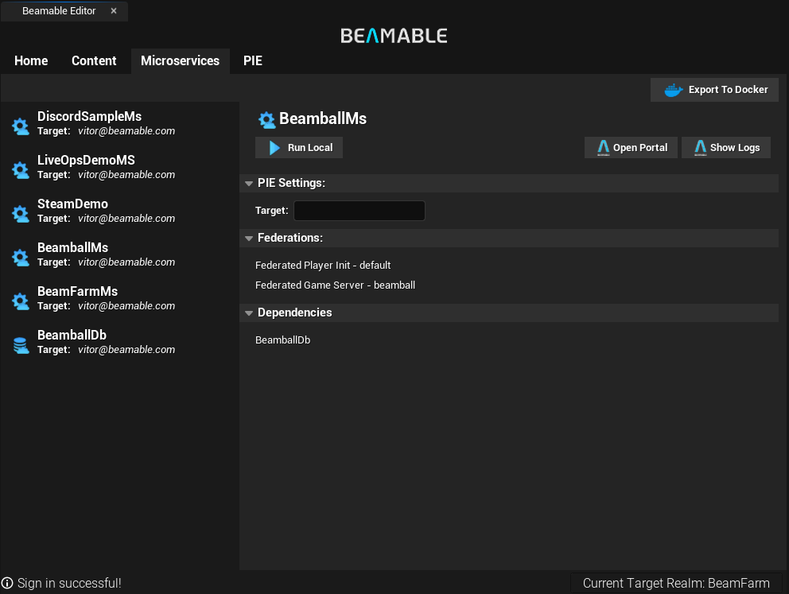
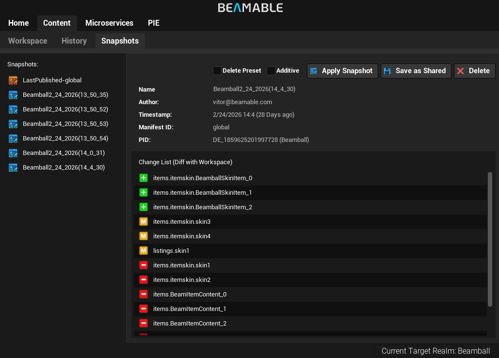
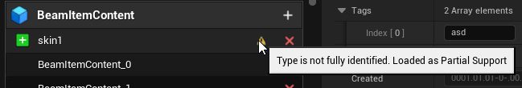
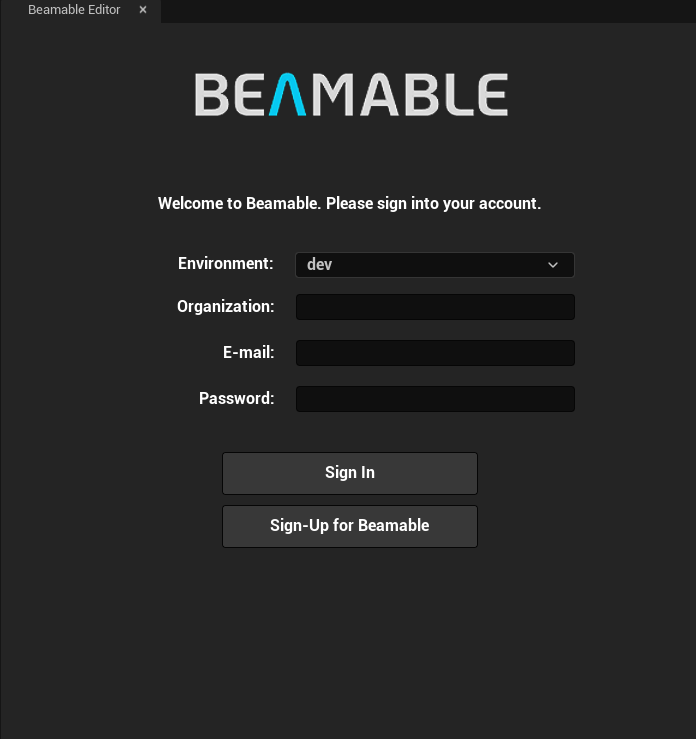

# Version 2.3.0 Release Notes
This is the release notes for the Unreal SDK version 2.3.0. This release includes several new features, improvements, and bug fixes to enhance your experience with the Beamable Unreal SDK. Below are the highlights of this release:

## Highlights

### IOS Support
We are excited to announce that Beamable Unreal SDK now supports iOS platform! You can now build and deploy your Beamable-powered games on iOS devices, expanding your reach to a wider audience.

{width="400"}

### New Microservice Editor
The Microservice Screen was reworked from scratch improving the experience of manage and deploy your Beamable microservices directly from the Unreal Editor. You can now easily see the list of Federations and Microstorage Dependencies for each microservice, as well as deploy and manage them with just a few clicks. 

It's now also integrated with direct links for the new Log system at the portal, making it easier to debug and monitor your microservices.

{width="800"}

### Improved Content Editor with Snapshots and History
The Content Editor has been enhanced with new features to make it easier to manage your game content. You can now take snapshots of your content, allowing you to save and restore different versions of your content. Additionally, the history feature lets you track changes and revert to previous versions if needed.

#### History Editor
The History Editor provides a visual representation of the changes made to your content over time. You can see a list of the published versions and easily revert single files or the whole state. This feature is particularly useful for tracking changes and ensuring that you can always go back to a previous state if something goes wrong.

#### Snapshots Editor
The Snapshots Editor allows you to create and manage snapshots of your content. You can take a snapshot at any point in time, giving you a backup of your content that you can restore later if needed. This is particularly useful for testing changes or experimenting with new ideas without the risk of losing your current work.

{width="800"}

#### Minor UI Improvements
In addition to the major improvements, we have also made several minor UI enhancements to improve the overall user experience. These include many small tweaks to the layout, more areas where you can copy IDs with a single click, and quick information about content support level

### Improved Login Screen
We have revamped the login screens to provide a more intuitive and user-friendly experience. Now you can select the Environment, Game and initial Realm directly from the login interface, making it easier to connect to your desired Beamable services.

{width="600"}

### Build-in Notifications
The Beamable Editor expand the usage of the built-in Unreal notifications to inform you about important events, updates, and actions. This enhancement ensures that you stay informed without disrupting your workflow.

### Team Support in PIE Settings
The Play In Editor (PIE) settings now include support for teams, allowing you to test multiplayer features more effectively and making it easier to simulate multiplayer scenarios during development.

### Samples
We have reworked our samples to better demonstrate the capabilities of the Beamable SDK. The new samples are more comprehensive and easier to follow, helping you get started quickly with Beamable features.

The Beamball sample was improved to add new functionalities such as Match Timer and Team Support fully integrated with the new PIE Settings.

<video controls preload="metadata" playsinline style="display:block; width:70%; margin:0 auto;">
  <source src="../../../media/vids/beamball-team.mp4" type="video/mp4">
</video>

 Beamball Team Match

## Other Changes

## Upgrading